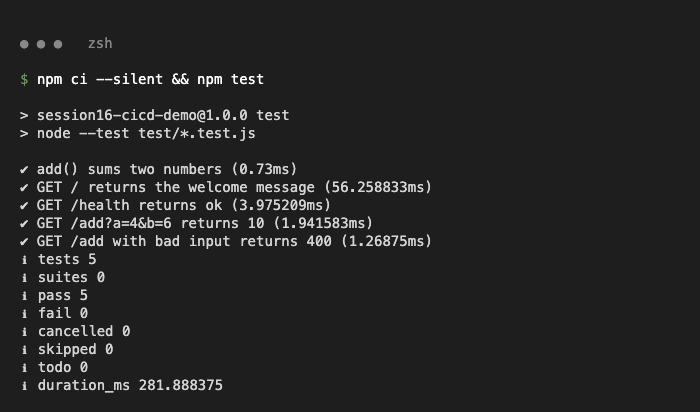
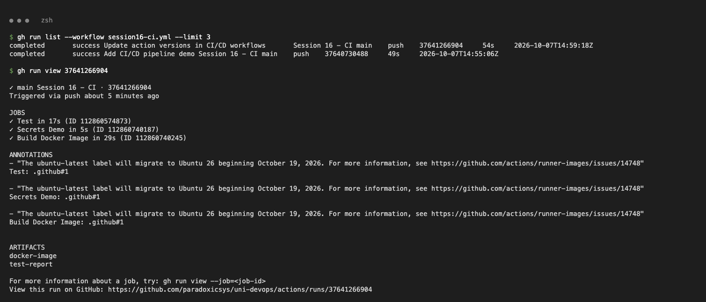
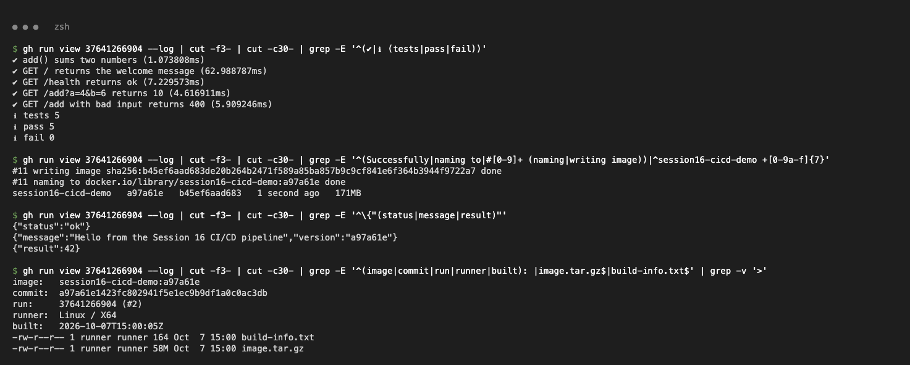
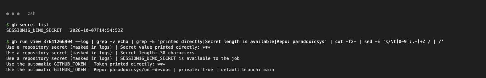
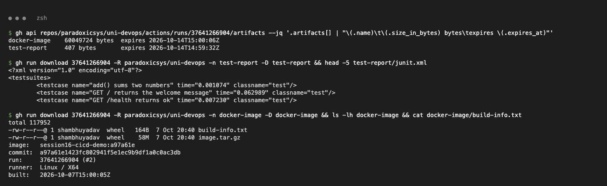
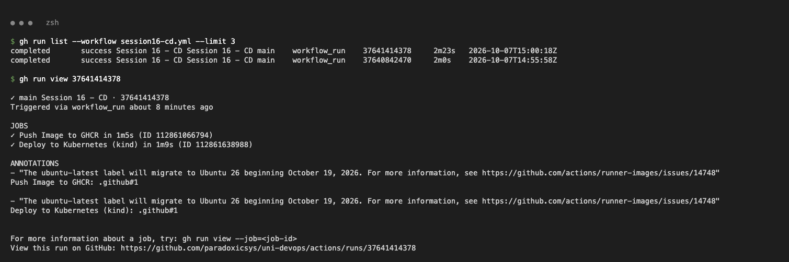
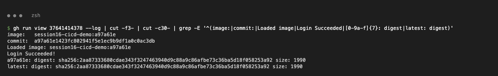
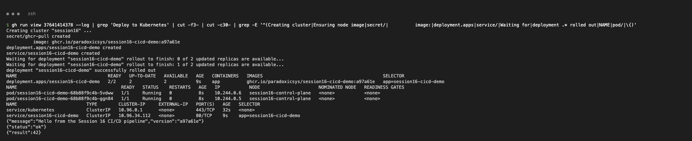

# CI/CD with GitHub Actions (Session 16)

A small Node.js (Express) API, built, tested, packaged as a Docker image, pushed to GHCR and deployed to Kubernetes, all by GitHub Actions.

```text
CICD-GitHub-Actions-Assignment/
├── app/
│   ├── src/app.js, src/server.js   # Express API: /, /health, /add?a=&b=
│   ├── test/app.test.js            # unit tests (node:test)
│   ├── package.json, package-lock.json
│   └── Dockerfile
├── k8s/deployment.yaml, service.yaml
└── screenshots/
.github/workflows/session16-ci.yml  # CI pipeline
.github/workflows/session16-cd.yml  # CD pipeline
```

## Concepts

| Term | Meaning (in this project) |
|---|---|
| CI | Every push/PR is built and tested automatically (`session16-ci.yml`) |
| CD | Code that passed CI is released automatically: image pushed to GHCR and deployed (`session16-cd.yml`) |
| Pipeline | The full chain: push → test → build → push image → deploy |
| Workflow | A YAML file in `.github/workflows/`, started by an event (`push`, `pull_request`, `workflow_dispatch`, `workflow_run`) |
| Job | A group of steps on one runner. Jobs run in parallel unless `needs:` sets an order (`build` needs `test`) |
| Step | One command (`run:`) or action (`uses:`) inside a job |
| Runner | The VM that runs a job, here `ubuntu-latest` (GitHub-hosted) |
| Secret | Encrypted value (`SESSION16_DEMO_SECRET`, `GITHUB_TOKEN`), always masked as `***` in logs |
| Artifact | A file kept after the run: `test-report` (JUnit XML) and `docker-image` (image tar + build info) |

## Pipeline

```text
push to main (CICD-GitHub-Actions-Assignment/**)
  └─ Session 16 - CI
       ├─ Test ──┬─ Build Docker Image  → artifact: docker-image
       │         └─ Secrets Demo
       └─ artifact: test-report
            └─ (on success) Session 16 - CD   [workflow_run]
                 ├─ Push Image to GHCR  (the exact image CI built, from the artifact)
                 └─ Deploy to Kubernetes (kind cluster on the runner)
```

## 1. Run the tests locally

```bash
cd app && npm ci && npm test
```



## 2. CI pipeline (`session16-ci.yml`)

Checkout → setup-node 22 (npm cache) → `npm ci` → `npm run test:report` → upload report → `docker build` → smoke test the container → save image → upload artifact. `build` and `secrets-demo` both have `needs: test`, so they run in parallel only after tests pass.

```text
✓ Test in 17s
✓ Secrets Demo in 5s
✓ Build Docker Image in 29s
ARTIFACTS: docker-image, test-report
```




## 3. Secrets

```bash
gh secret set SESSION16_DEMO_SECRET --body <dummy value>
```

Both the repo secret and the automatic `GITHUB_TOKEN` print as `***`; the token is used by `gh api` (and later to log in to GHCR).

```text
Secret value printed directly: ***
Token printed directly: ***
Repo: paradoxicsys/uni-devops | private: true | default branch: main
```



## 4. Artifacts

```bash
gh run download <run-id> -n test-report
gh run download <run-id> -n docker-image
```



## 5. CD pipeline (`session16-cd.yml`)

Starts when CI completes successfully on `main` (`workflow_run`). It downloads the `docker-image` artifact from that CI run, pushes it to `ghcr.io/paradoxicsys/session16-cicd-demo:<sha>` and `:latest` using `GITHUB_TOKEN` (`packages: write`), then creates a kind cluster on the runner, applies `k8s/`, waits for the rollout and curls the service.

```text
a97a61e: digest: sha256:2aa87333...  latest: digest: sha256:2aa87333...
deployment "session16-cicd-demo" successfully rolled out
pod/session16-cicd-demo-...-5vdww   1/1   Running
{"message":"Hello from the Session 16 CI/CD pipeline","version":"a97a61e"}
{"status":"ok"}
{"result":42}
```





## Runs

- CI: https://github.com/paradoxicsys/uni-devops/actions/runs/37641266904
- CD: https://github.com/paradoxicsys/uni-devops/actions/runs/37641414378
