# Cloud Terraform Assignment (Session 19)

End-to-end Terraform project on AWS (`ap-south-1`): VPC -> public subnet -> IGW + route table -> security group -> EC2 (`t3.micro`, nginx via `user_data`) -> S3 bucket. Applied, verified in browser, then destroyed.

## Architecture

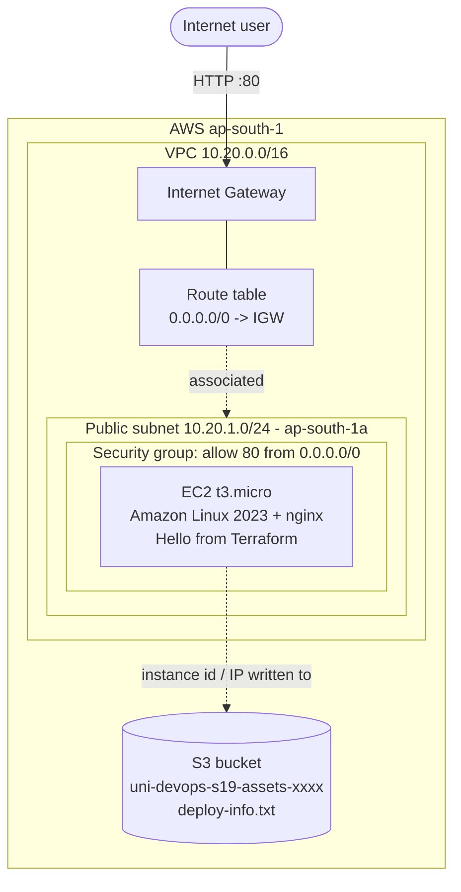

## Project files

| File | Purpose |
|------|---------|
| `versions.tf` | **Providers**: `hashicorp/aws ~> 6.0`, `hashicorp/random`; AWS provider with `default_tags` |
| `variables.tf` / `terraform.tfvars` | **Variables**: region, name prefix, CIDRs, instance type, tags |
| `main.tf` | **Resources** + data sources (AZs, latest AL2023 AMI) |
| `user_data.sh` | Boot script: installs nginx, writes the "Hello from Terraform" page |
| `outputs.tf` | **Outputs**: VPC/subnet/SG/instance IDs, public IP, URL, bucket name |

**Dependencies**
- Implicit (by reference): `aws_subnet.public` -> `aws_vpc.main.id`, `aws_route_table` -> `aws_internet_gateway.main.id`, `aws_instance.web` -> subnet + SG, `aws_s3_object` -> `aws_instance.web.public_ip`.
- Explicit: `aws_instance.web` has `depends_on = [aws_route_table_association.public]` so the subnet has internet access before `user_data` runs `dnf install nginx`.

## 1. Init

```bash
terraform init
```
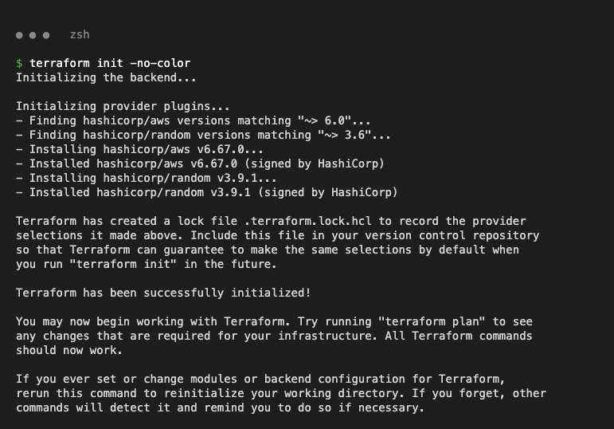

Downloads the aws + random providers.

## 2. Format and validate

```bash
terraform fmt -check
terraform validate
```
```text
Success! The configuration is valid.
```
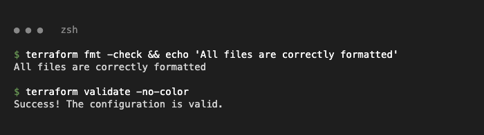

## 3. Plan

```bash
terraform plan -out=tfplan
```
```text
Plan: 11 to add, 0 to change, 0 to destroy.
```
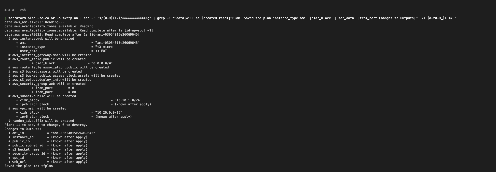

Data sources resolve the AZ and the latest Amazon Linux 2023 AMI; 11 resources to create (output trimmed with grep).

## 4. Apply

```bash
terraform apply tfplan
```
```text
aws_route_table_association.public: Creation complete after 0s
aws_instance.web: Creating...
aws_instance.web: Creation complete after 13s [id=i-0f66e09a6b7dfe2d1]
Apply complete! Resources: 11 added, 0 changed, 0 destroyed.
```
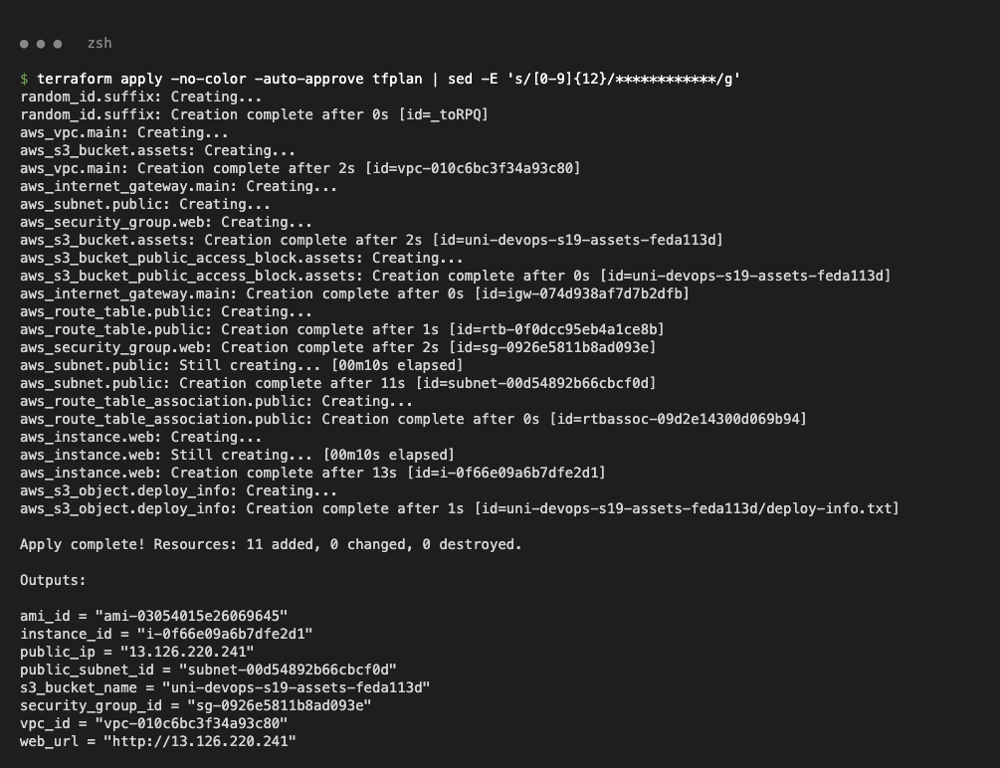

The order follows the dependency graph: VPC -> subnet/IGW/SG -> route table -> association -> EC2 -> S3 object.

## 5. Outputs

```bash
terraform output
```
```text
instance_id = "i-0f66e09a6b7dfe2d1"
public_ip = "13.126.220.241"
s3_bucket_name = "uni-devops-s19-assets-feda113d"
web_url = "http://13.126.220.241"
```
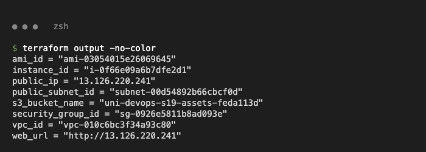

## 6. Terraform state

```bash
terraform state list
terraform state show aws_instance.web
terraform state show aws_route_table.public
terraform state show aws_security_group.web
```
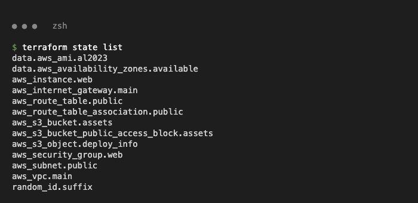
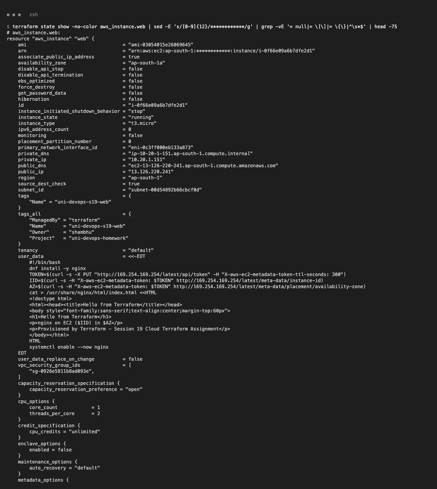
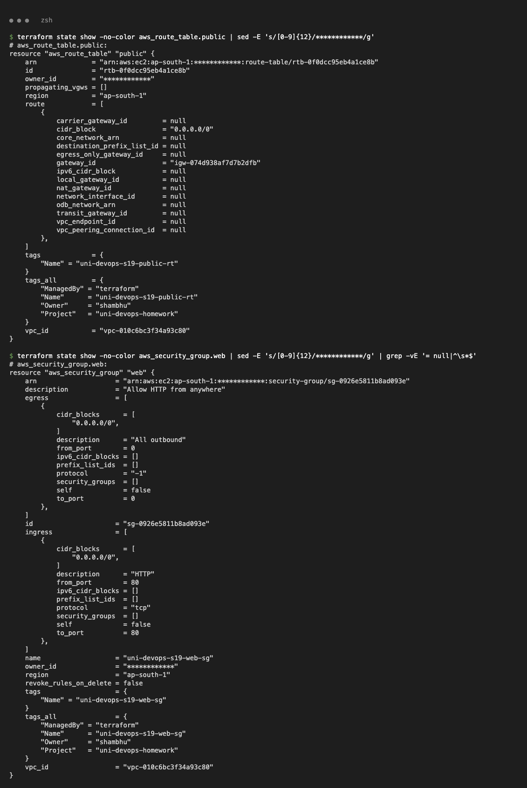

State maps each resource address to the real AWS object (account ID masked).

## 7. Verify the web server

```bash
curl -i $(terraform output -raw web_url)
```
```text
HTTP/1.1 200 OK
Server: nginx/1.30.5
<h1>Hello from Terraform</h1>
```
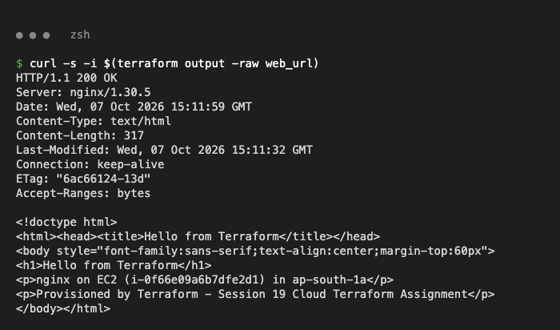

Browser (headless Chrome) on `http://13.126.220.241`:

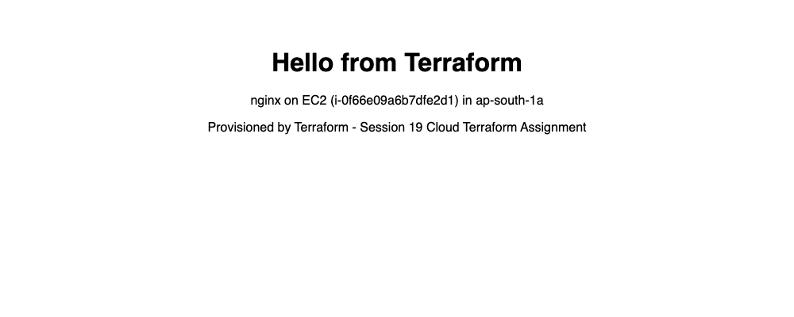

## 8. Verify with AWS CLI

```bash
aws ec2 describe-instances --filters Name=tag:Project,Values=uni-devops-homework Name=instance-state-name,Values=running \
  --query 'Reservations[].Instances[].[InstanceId,InstanceType,State.Name,PublicIpAddress,SubnetId]' --output table
aws ec2 describe-vpcs --filters Name=tag:Project,Values=uni-devops-homework --output table
aws s3 cp s3://$(terraform output -raw s3_bucket_name)/deploy-info.txt -
```
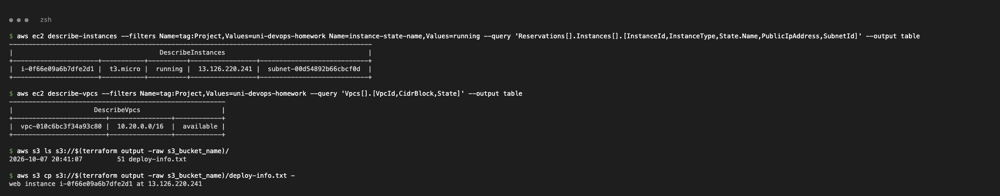

## 9. Destroy

```bash
terraform destroy
```
```text
Plan: 0 to add, 0 to change, 11 to destroy.
Destroy complete! Resources: 11 destroyed.
```
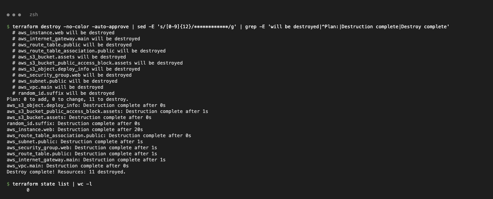

Destroy runs in reverse dependency order (EC2 before subnet/SG, VPC last).

## 10. Cleanup verification

```bash
aws ec2 describe-instances --instance-ids i-0f66e09a6b7dfe2d1 --query 'Reservations[].Instances[].State.Name'
aws ec2 describe-vpcs --filters Name=tag:Project,Values=uni-devops-homework
aws s3 ls | grep uni-devops
```
```text
i-0f66e09a6b7dfe2d1   terminated
No VPCs with Project=uni-devops-homework
No uni-devops S3 buckets
```
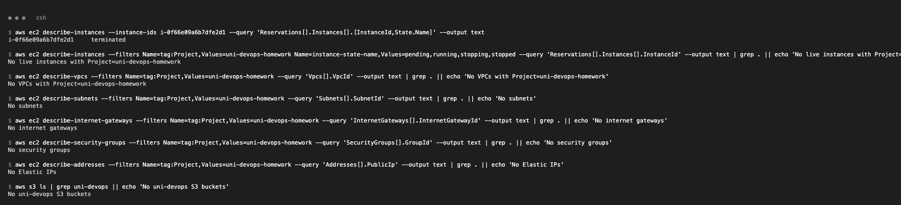

The EC2 instance ran for about 2 minutes; nothing tagged `Project=uni-devops-homework` remains.
