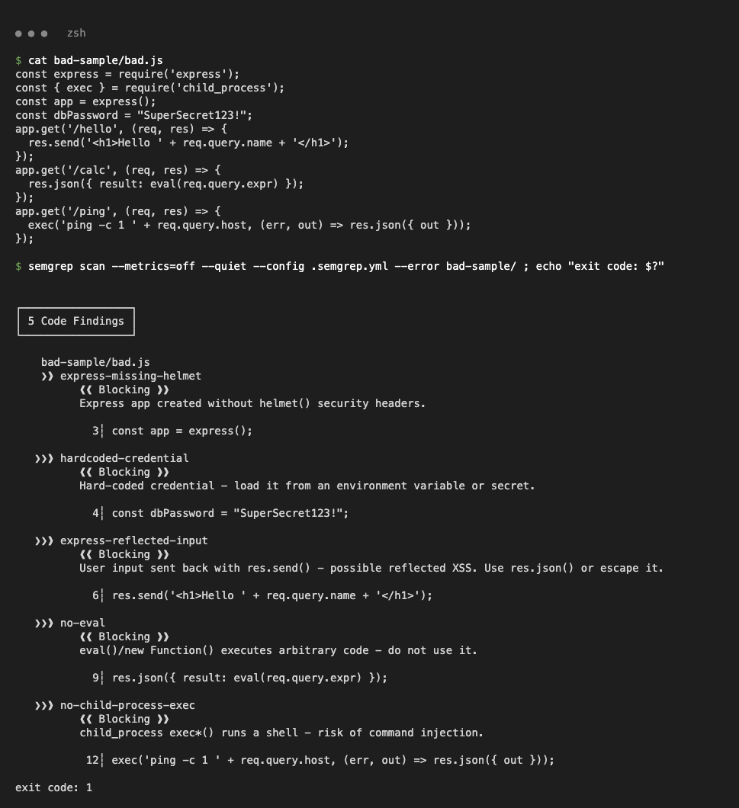
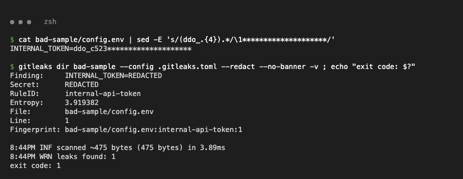
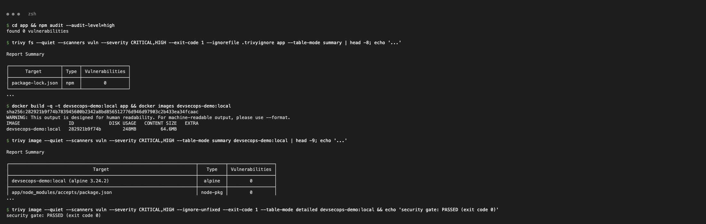
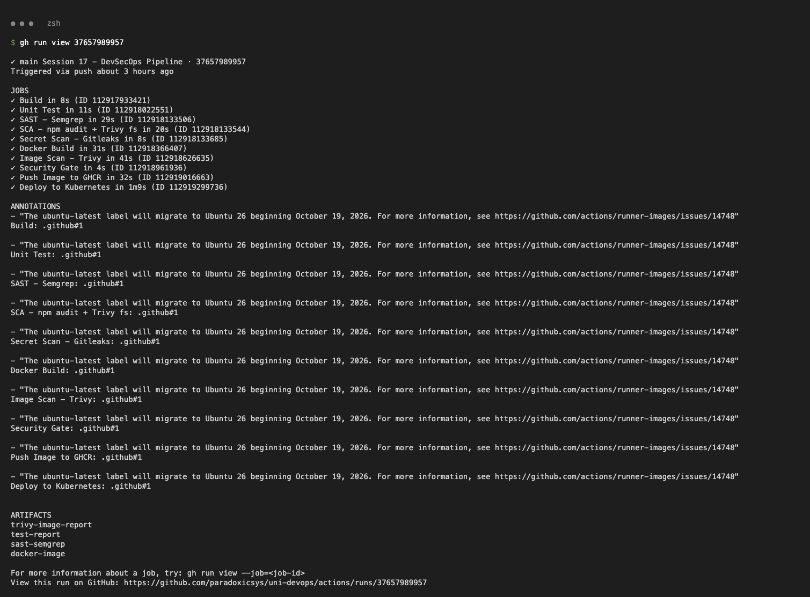
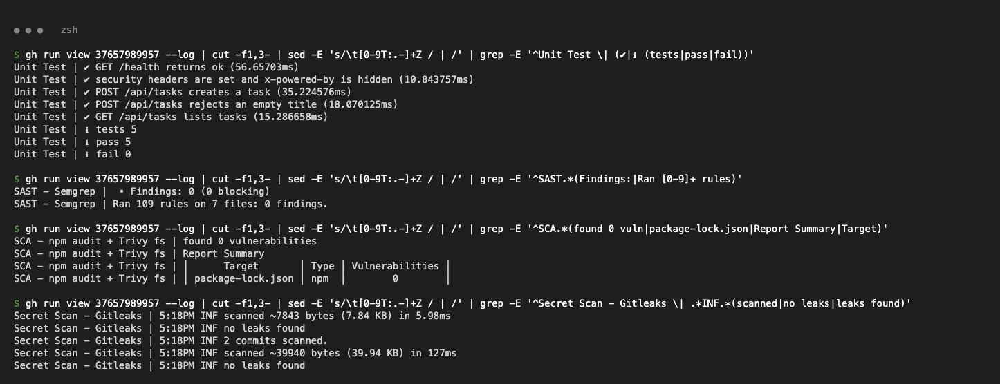
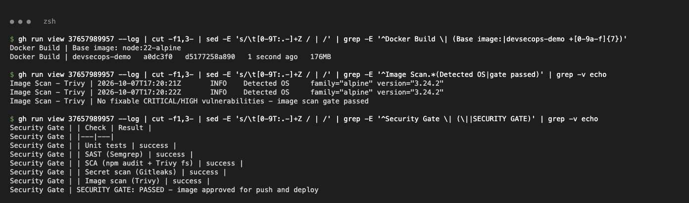
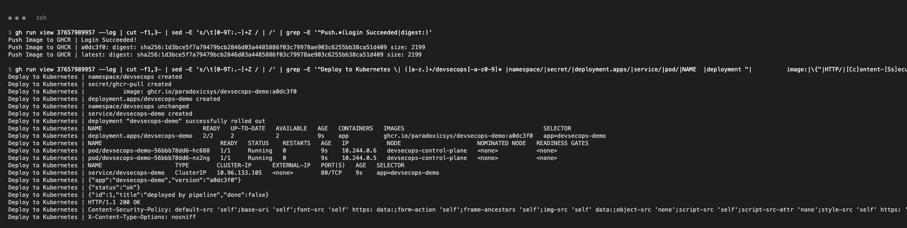
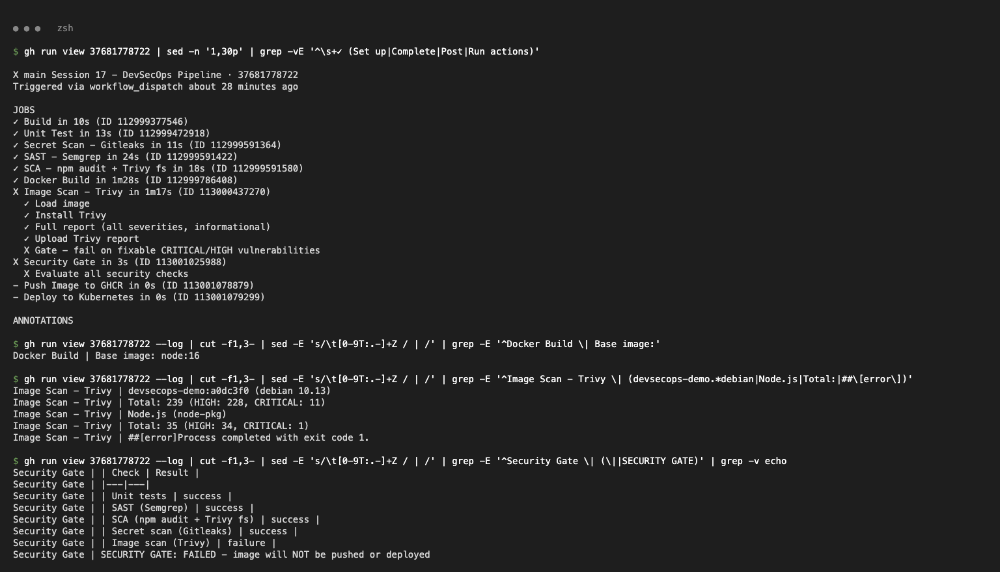

# Complete CI/CD with DevSecOps (Session 17)

A small Node.js (Express + helmet) task API that goes through a security-first pipeline before it is pushed to GHCR and deployed to Kubernetes.

```text
Code → Build → Unit Test → SAST → SCA → Secret Scan → Docker Build
     → Container Image Scan → Security Gate → Push Image → Deploy to Kubernetes
```

```text
DevSecOps-Assignment/
├── app/                      # src/app.js, src/server.js, test/app.test.js, Dockerfile, package*.json
├── k8s/                      # namespace.yaml (PSS restricted), deployment.yaml, service.yaml
├── .semgrep.yml              # SAST: 5 custom rules
├── .gitleaks.toml            # secret scan: default rules + 1 custom rule + allowlist
├── .trivyignore              # accepted CVEs (empty - nothing ignored)
└── screenshots/
.github/workflows/session17-devsecops.yml
```

## Tools

| Stage | Tool | Fails the pipeline when |
|---|---|---|
| Build | `npm ci` + `node --check` | dependencies or syntax are broken |
| Unit Test | `node:test` (JUnit report artifact) | any test fails |
| SAST | Semgrep: `.semgrep.yml` + `p/javascript`, `p/nodejs`, `p/secrets` | any finding (`--error`) |
| SCA | `npm audit --audit-level=high` + `trivy fs` | HIGH/CRITICAL in dependencies |
| Secret Scan | Gitleaks CLI (`dir` + `git` history of this folder) | any leak |
| Docker Build | multi-stage, `node:22-alpine`, `apk upgrade`, npm removed, non-root `node` user | build error |
| Image Scan | Trivy `--severity CRITICAL,HIGH --ignore-unfixed --exit-code 1` | fixable HIGH/CRITICAL in the image |
| Security Gate | job with `needs:` on all checks + `if: always()` | any check is not `success` |
| Push | GHCR with `GITHUB_TOKEN` (`packages: write`) | only on `main`, only after the gate |
| Deploy | kind cluster on the runner, `kubectl apply -f k8s/` | rollout or curl fails |

## 1. SAST with Semgrep

Custom rules: `no-eval`, `no-child-process-exec`, `express-reflected-input`, `express-missing-helmet`, `hardcoded-credential`. Tested locally on a deliberately bad file (not part of the repo):

```bash
semgrep scan --metrics=off --config .semgrep.yml --error bad-sample/
```



## 2. Secret scanning with Gitleaks

`.gitleaks.toml` extends the default rules and adds `internal-api-token` (`ddo_` + 32 hex). A fake token planted in a scratch file is caught:

```bash
gitleaks dir bad-sample --config .gitleaks.toml --redact -v
```



## 3. SCA and image scan (local)

```bash
npm audit --audit-level=high
trivy fs --severity CRITICAL,HIGH --exit-code 1 app
docker build -t devsecops-demo:local app
trivy image --severity CRITICAL,HIGH --ignore-unfixed --exit-code 1 devsecops-demo:local
```



## 4. Pipeline run (all green)

`push` to `main` → every stage passes → image pushed to `ghcr.io/paradoxicsys/devsecops-demo:<sha>` → deployed to kind.



```text
Unit Test  | ℹ pass 5  ℹ fail 0
SAST       | Ran 109 rules on 7 files: 0 findings.
SCA        | found 0 vulnerabilities   (trivy fs: package-lock.json 0)
Gitleaks   | no leaks found (dir + 2 commits of history)
```



```text
Image Scan    | No fixable CRITICAL/HIGH vulnerabilities - image scan gate passed
Security Gate | SECURITY GATE: PASSED - image approved for push and deploy
```



The deploy job creates a kind cluster, a `ghcr-pull` secret from `GITHUB_TOKEN`, applies `k8s/` (restricted Pod Security, non-root, read-only root FS, all capabilities dropped) and curls the service.

```text
deployment "devsecops-demo" successfully rolled out
{"app":"devsecops-demo","version":"a0dc3f0"}
{"id":1,"title":"deployed by pipeline","done":false}
Content-Security-Policy: default-src 'self';...   X-Content-Type-Options: nosniff
```



## 5. Security gate blocking a bad image

Manual run with an old base image (`gh workflow run session17-devsecops.yml -f base_image=node:16`). Trivy finds fixable HIGH/CRITICAL CVEs, the gate fails and **Push** and **Deploy** are skipped. The fix is the default `node:22-alpine` base with `apk upgrade` (run in section 4).

```text
devsecops-demo:a0dc3f0 (debian 10.13)   Total: 239 (HIGH: 228, CRITICAL: 11)
Node.js (node-pkg)                      Total: 35 (HIGH: 34, CRITICAL: 1)
SECURITY GATE: FAILED - image will NOT be pushed or deployed
```



## Runs

- Green pipeline: https://github.com/paradoxicsys/uni-devops/actions/runs/37657989957
- Gate blocking `node:16`: https://github.com/paradoxicsys/uni-devops/actions/runs/37681778722
