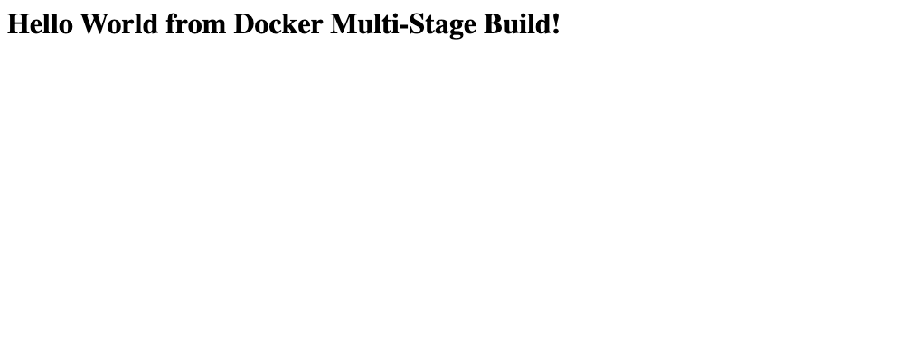
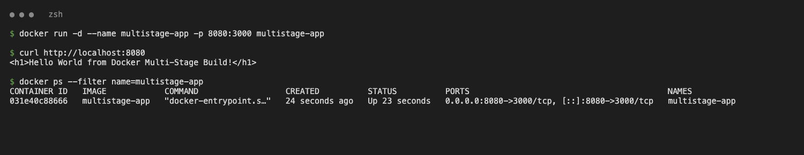
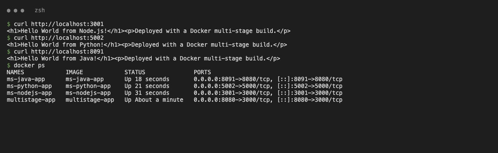
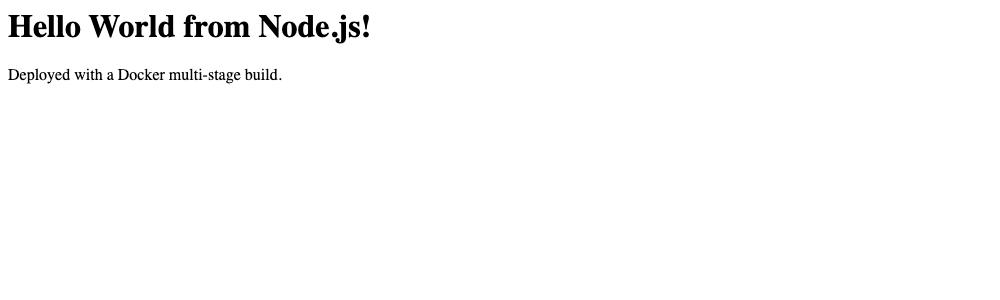
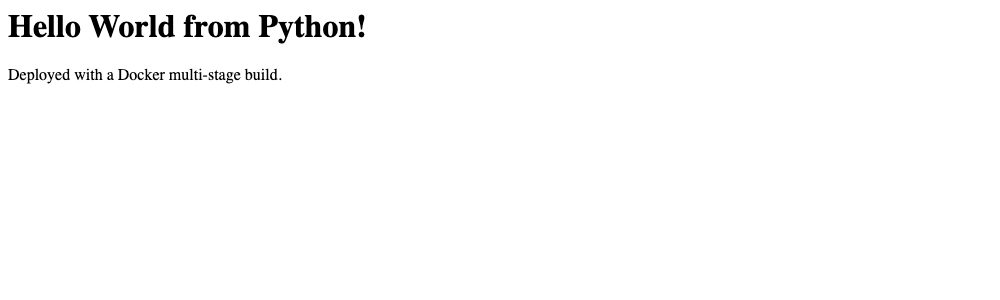
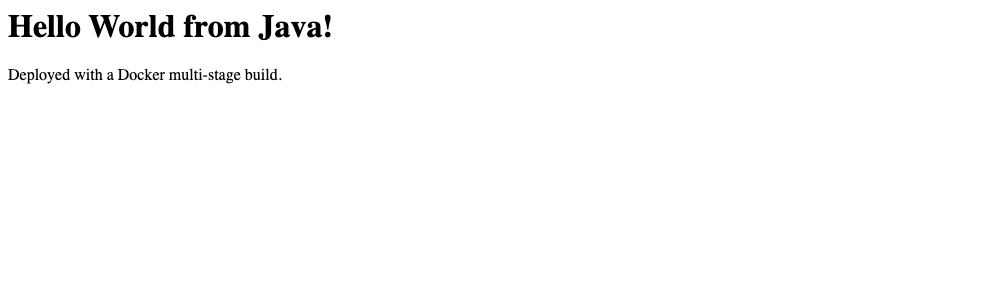

# Docker Multi-Stage Build Homework

| | |
|---|---|
| **Name** | Shambhu Yadav |
| **Enrollment number** | 24bcs10356 |

Environment: macOS (Apple Silicon), Docker Desktop 4.61.0, Docker Engine 29.2.1.

---

## Task 1: Run the multi-stage Dockerfile

Source: [`Nency-Ravaliya/devops-heros`](https://github.com/Nency-Ravaliya/devops-heros), folder `session6-7-docker/multi-stage-dockerfile`. A copy is in [`task1-multistage-app/`](task1-multistage-app).

The `builder` stage installs all dependencies; the `production` stage starts from a clean image, installs only prod dependencies and copies `server.js` with `COPY --from=builder`.

```bash
git clone https://github.com/Nency-Ravaliya/devops-heros.git
cd devops-heros/session6-7-docker/multi-stage-dockerfile
docker build -t multistage-app .
docker run -d --name multistage-app -p 8080:3000 multistage-app
curl http://localhost:8080
docker ps
```

```
$ curl http://localhost:8080
<h1>Hello World from Docker Multi-Stage Build!</h1>
```





---

## Task 3: Deploy 3 different types of applications

All three apps are in [`task3-apps/`](task3-apps), each with a multi-stage Dockerfile.

| App | Folder | Stage 1 (build) | Stage 2 (runtime) | Container port | Host port | Image size |
|---|---|---|---|---|---|---|
| Node.js (Express) | [`nodejs-app`](task3-apps/nodejs-app) | `node:24-alpine`, `npm install --omit=dev` | `node:24-alpine` + copied `node_modules`, runs as non-root `node` user | 3000 | 3001 | 243 MB |
| Python (Flask) | [`python-app`](task3-apps/python-app) | `python:3.12-slim`, pip install into a venv | `python:3.12-slim` + copied `/opt/venv` | 5000 | 5002 | 239 MB |
| Java 21 | [`java-app`](task3-apps/java-app) | `eclipse-temurin:21-jdk-alpine`, `javac` | `eclipse-temurin:21-jre-alpine` + `.class` file | 8080 | 8091 | 286 MB |

```bash
cd Docker-MultiStage-Assignment/task3-apps
docker build -t ms-nodejs-app ./nodejs-app && docker run -d --name ms-nodejs-app -p 3001:3000 ms-nodejs-app
docker build -t ms-python-app ./python-app && docker run -d --name ms-python-app -p 5002:5000 ms-python-app
docker build -t ms-java-app   ./java-app   && docker run -d --name ms-java-app   -p 8091:8080 ms-java-app
```

```
$ curl http://localhost:3001
<h1>Hello World from Node.js!</h1><p>Deployed with a Docker multi-stage build.</p>
$ curl http://localhost:5002
<h1>Hello World from Python!</h1><p>Deployed with a Docker multi-stage build.</p>
$ curl http://localhost:8091
<h1>Hello World from Java!</h1><p>Deployed with a Docker multi-stage build.</p>
```



| Node.js | Python | Java |
|---|---|---|
|  |  |  |

## Cleanup

```bash
docker rm -f multistage-app ms-nodejs-app ms-python-app ms-java-app
```
