# Docker Networking & Volumes Homework

> Note on images: `docker pull` from `docker.io` failed on this machine with a TLS "certificate is not yet valid" error (the laptop clock was behind). The official Docker Hub images were therefore pulled through `mirror.gcr.io` (Google's pull-through cache of Docker Hub, same image digests) and tagged with their normal Docker Hub names (`httpd`, `nginx:alpine`, `mysql:8.4`, `alpine`, `curlimages/curl`).

---

## Task 1: Container networking with user-defined bridge networks

### Design

```
             dn-frontend-net              dn-backend-net               dn-db-net
           (172.20.0.0/16)              (172.21.0.0/16)             (172.22.0.0/16)
  ┌─────────────┐     ┌─────────────┐              ┌─────────────┐        ┌──────────────────┐
  │ dn-frontend │ ─── │ dn-backend  │ ──────────── │ dn-database │ ────── │ DB admin/backup  │
  │ nginx:alpine│     │ nginx:alpine│              │  mysql:8.4  │        │ (one-off client) │
  └─────────────┘     └─────────────┘              └─────────────┘        └──────────────────┘
```

| Container | Image | Networks |
|---|---|---|
| `dn-frontend` | `nginx:alpine` | `dn-frontend-net` |
| `dn-backend` | `nginx:alpine` | `dn-frontend-net` + `dn-backend-net` (2 networks) |
| `dn-database` | `mysql:8.4` | `dn-backend-net` + `dn-db-net` |

- **dn-frontend-net**: public tier. The frontend can only talk to the backend.
- **dn-backend-net**: application tier. The backend is the only service that talks to the database.
- **dn-db-net**: private database tier, used for admin and backup jobs (for example a `mysql` client container that runs `mysqladmin` or `mysqldump`). These jobs reach the database without being on the frontend or backend networks.

The backend sits on two networks and acts as the bridge between tiers. The frontend has no route to the database at all, so a compromised frontend cannot reach MySQL directly.

### Commands

```bash
docker network create dn-frontend-net
docker network create dn-backend-net
docker network create dn-db-net

docker run -d --name dn-frontend --network dn-frontend-net nginx:alpine
docker run -d --name dn-backend  --network dn-frontend-net nginx:alpine
docker network connect dn-backend-net dn-backend          # backend joins a 2nd network

docker run -d --name dn-database --network dn-backend-net -e MYSQL_ROOT_PASSWORD=root mysql:8.4
docker network connect dn-db-net dn-database
```

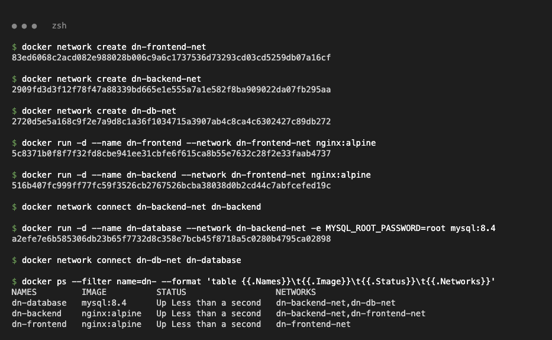

### `docker network ls` and `docker network inspect` (containers section)

```bash
docker network ls --filter name=dn-
docker network inspect dn-backend-net --format '{{json .Containers}}'
```

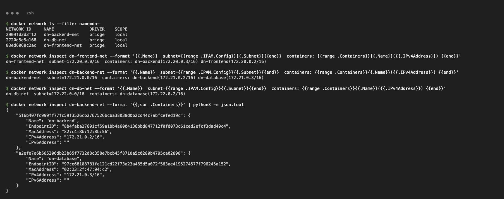

### `docker inspect` of the backend: attached to 2 networks

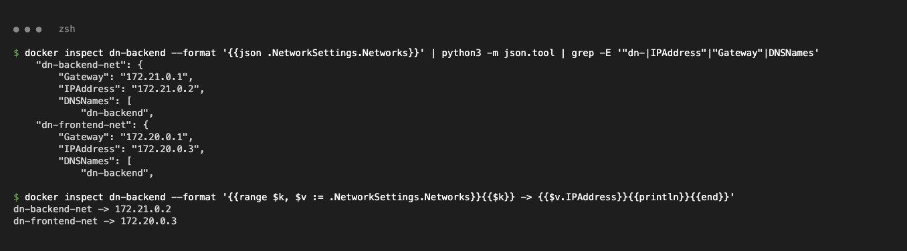

### Connectivity checks: allowed paths

Containers on the same user-defined bridge network resolve each other by name through Docker's embedded DNS (127.0.0.11).

```bash
docker exec dn-frontend ping -c 2 dn-backend
docker exec dn-frontend wget -qO- http://dn-backend
docker exec dn-backend  ping -c 2 dn-database
docker exec dn-backend  nc -zv -w 3 dn-database 3306
docker run --rm --network dn-db-net mysql:8.4 mysqladmin -h dn-database -uroot -proot ping
```

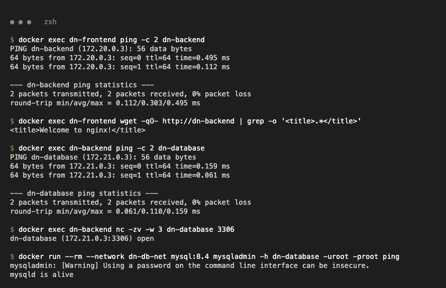

### Connectivity checks: blocked paths

```bash
docker exec dn-frontend ping -c 2 -W 2 dn-database          # name does not resolve
docker exec dn-frontend nc -zv -w 3 dn-database 3306         # name does not resolve
docker exec dn-frontend ping -c 2 -W 2 172.21.0.3            # database IP: 100% packet loss
docker exec dn-database bash -c 'echo > /dev/tcp/dn-frontend/80'
docker run --rm --network dn-db-net alpine ping -c 2 -W 2 dn-backend
```

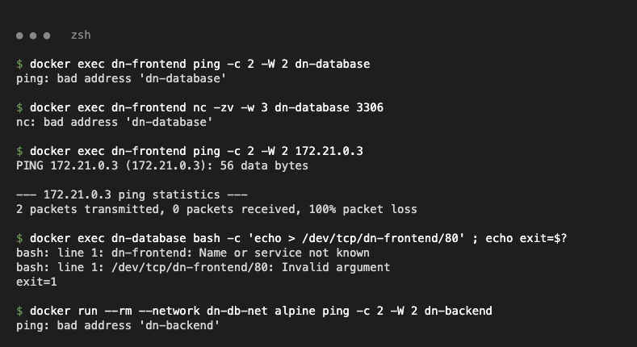

### Result

| From → To | Result | Reason |
|---|---|---|
| frontend → backend | ✅ ping + HTTP OK | both on `dn-frontend-net` |
| backend → database (3306) | ✅ ping + port 3306 open | both on `dn-backend-net` |
| db-net client → database | ✅ `mysqld is alive` | both on `dn-db-net` |
| frontend → database | ❌ name not resolved, IP unreachable | no shared network |
| database → frontend | ❌ name not resolved | no shared network |
| db-net client → backend | ❌ name not resolved | backend is not on `dn-db-net` |

---

## Task 2: Apache (httpd) on the host network

```bash
docker pull httpd            # pulled via mirror.gcr.io/library/httpd, see note at the top
docker run --rm --network host alpine sh -c 'netstat -tln | grep ":80 " || echo port 80 is free'
docker run -d --name dn-apache-host --network host httpd
docker ps --filter name=dn-apache-host
docker inspect dn-apache-host --format '{{.HostConfig.NetworkMode}}'
docker run --rm --network host curlimages/curl -si http://localhost:80
```

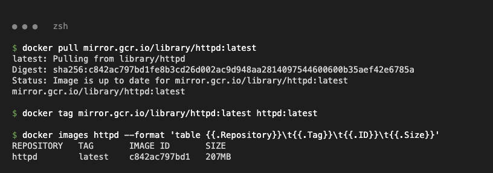

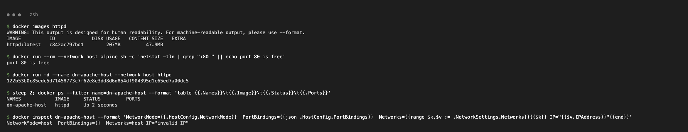

- `PORTS` is empty in `docker ps`. With `--network host` there is no NAT and no `-p` mapping.
- `NetworkMode=host`, no port bindings, and the container gets no IP of its own.

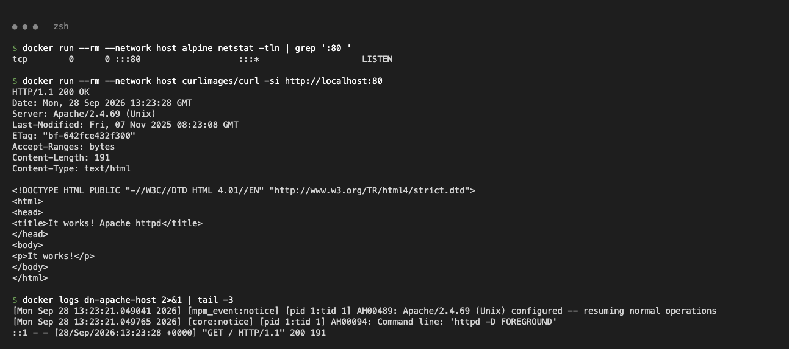

Apache listens directly on port 80 of the Docker host's network stack, and `http://localhost:80` returns **"It works!"**.

**macOS note:** on Docker Desktop for Mac the "Docker host" is the Linux VM that Docker Desktop runs, so `--network host` shares the VM's network stack, not the Mac's. The site therefore answers on `localhost:80` inside the VM (shown above with a host-network curl container), while a plain `curl localhost:80` from macOS gets no answer. On a Linux host the same command would make the site available directly at `http://localhost`.

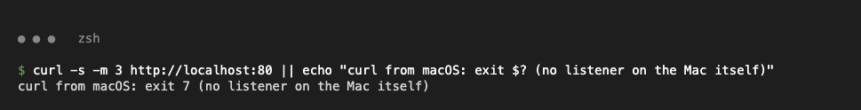

---

## Task 3: Bind mount

Folder: [`bind-mount-site/`](bind-mount-site), which contains `index.html` with "Hello students".

```bash
docker run -d --name dn-nginx-bind -p 8095:80 \
  -v "$PWD/bind-mount-site":/usr/share/nginx/html nginx:alpine
curl -s http://localhost:8095
```

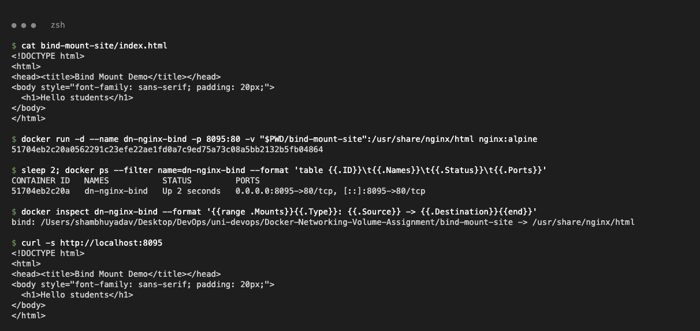

Browser at `http://localhost:8095` (before the change):


### Modify the file on the host without restarting the container

A new line was added to `bind-mount-site/index.html` on the host. The file inside the container changes immediately, and nginx serves the new content. The container ID (`51704eb2c20a`), `StartedAt` and `RestartCount=0` show that the container was not restarted.

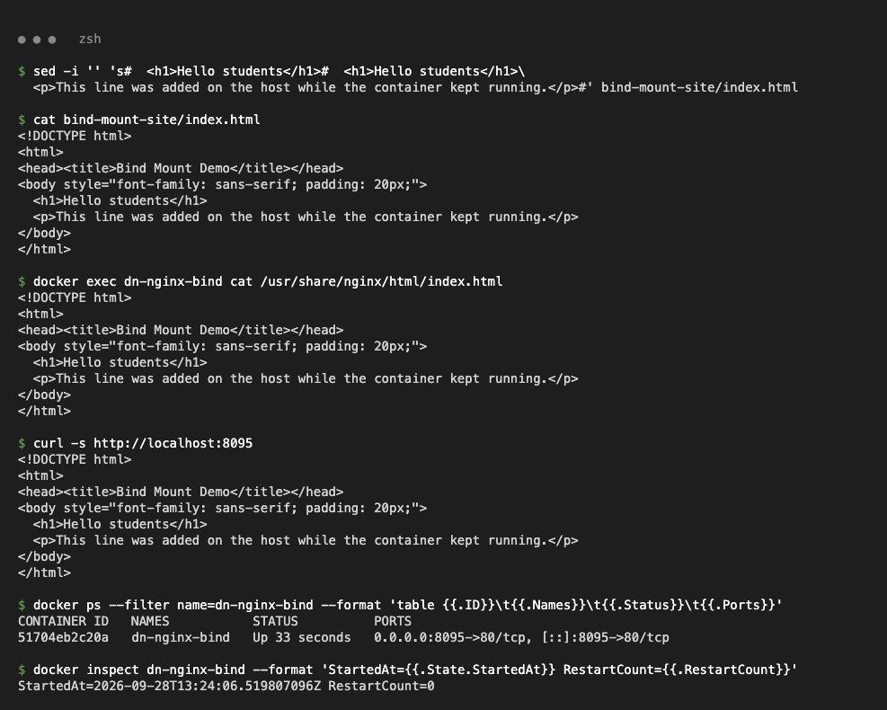

Browser at `http://localhost:8095` (after the change, same container):

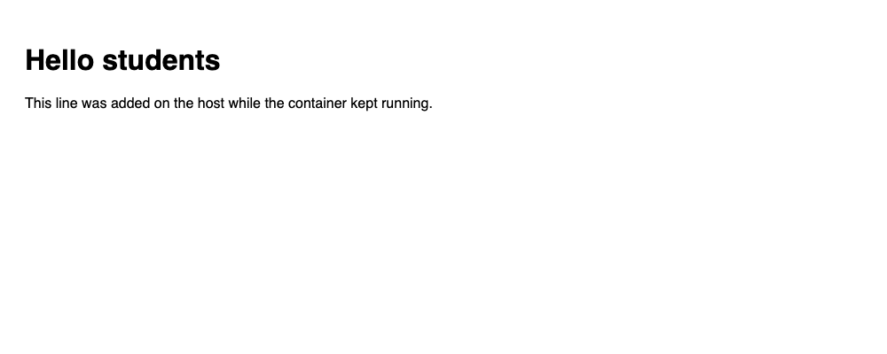

---

## Task 4: Overlay networks (research)

### What is an overlay network?

An **overlay** network is a Docker network driver (`-d overlay`) that creates one virtual Layer-2 network **spanning several Docker hosts**. Containers on different machines get IPs from the same subnet and talk to each other as if they were on one switch. They also resolve each other by service or container name, just like on a single-host bridge network.

A bridge network only exists on one host. An overlay network exists on every node of a **Docker Swarm** cluster that runs a task attached to it.

### Use cases

- **Swarm services**: replicas of a service spread across many nodes communicate over an overlay network (for example web → api → db stacks deployed with `docker stack deploy`).
- **Multi-host communication**: containers on different VMs or servers talk to each other privately without publishing ports on the host.
- **Isolation between stacks**: each application stack gets its own overlay network, so stacks cannot see each other.
- **Standalone containers across hosts**: with `--attachable`, normal `docker run` containers can join the overlay as well (useful for debugging or one-off jobs).

### How it works across hosts

1. **Swarm control plane**: overlay networks need Swarm mode (`docker swarm init` / `docker swarm join`). Managers store the network definition in the Raft store, and nodes exchange endpoint information (which container IP or MAC lives on which host) using a **gossip protocol** (TCP/UDP **7946**).
2. **VXLAN data plane**: each node creates a Linux bridge plus a VXLAN tunnel endpoint (VTEP) for the network. When a container sends a packet to a container on another host, the kernel wraps the Ethernet frame in a **VXLAN header inside a UDP packet** (UDP **4789**) addressed to the other host's real IP. The receiving host unwraps it and delivers it to the target container. Each overlay network has its own VXLAN ID (VNI), which keeps networks isolated.
3. **Service discovery and load balancing**: Docker's embedded DNS resolves a service name to a **virtual IP (VIP)**, and IPVS load-balances connections across all healthy replicas on any node.
4. **Ingress routing mesh**: Swarm creates a special overlay network called `ingress`. A port published by a service (`-p 8080:80`) is opened on **every** node. A request to any node is routed through the ingress network to a node that runs a replica.
5. **Encryption (optional)**: `--opt encrypted` encrypts VXLAN traffic between nodes with IPsec (AES-GCM). Swarm management traffic is always TLS-encrypted, but application data on overlays is not encrypted unless this option is set.
6. **docker_gwbridge**: on each node a local bridge network gives overlay containers outbound access to the outside world.

**Ports that must be open between nodes:**

| Port | Protocol | Purpose |
|---|---|---|
| 2377 | TCP | Swarm cluster management (manager communication) |
| 7946 | TCP + UDP | Node gossip and network discovery (control plane) |
| 4789 | UDP | VXLAN overlay data traffic |
| (ESP, IP protocol 50) | - | only when `--opt encrypted` is used |

### Commands

```bash
# on the manager
docker swarm init --advertise-addr <MANAGER-IP>
# on each worker (token printed by the command above)
docker swarm join --token <TOKEN> <MANAGER-IP>:2377

# create an overlay network (attachable so plain containers can join, encrypted traffic)
docker network create -d overlay --attachable --opt encrypted my-overlay
docker network ls --filter driver=overlay
docker network inspect my-overlay

# services on the overlay: replicas on different nodes reach each other by name
docker service create --name api --network my-overlay --replicas 3 nginx:alpine
docker service create --name web --network my-overlay -p 8080:80 nginx:alpine   # published via the ingress routing mesh
docker service ps api

# standalone container joining the attachable overlay
docker run -it --rm --network my-overlay alpine ping api

# cleanup
docker service rm web api
docker network rm my-overlay
docker swarm leave --force
```

### Bridge vs overlay vs host

| | bridge | host | overlay |
|---|---|---|---|
| Scope | single host | single host | multi-host (Swarm) |
| Isolation | own network namespace + NAT | none (shares host stack) | own namespace, VXLAN tunnel |
| DNS by name | yes (user-defined) | n/a | yes (+ service VIP) |
| Typical use | apps on one machine | max performance, no port mapping | Swarm services, cross-host apps |

---

## Extra exercise: named volume persistence

A named volume is managed by Docker (`/var/lib/docker/volumes/...`) and outlives any container that uses it. The class `docker-compose.yml` uses the same idea for MySQL with `db_data:/var/lib/mysql`.

```bash
docker volume create dn-data
docker run --rm --name dn-writer -v dn-data:/data alpine sh -c 'echo "saved ..." > /data/note.txt'
# dn-writer is removed (--rm), then a brand-new container reads the same volume:
docker run --rm --name dn-reader -v dn-data:/data alpine cat /data/note.txt
docker volume inspect dn-data
```

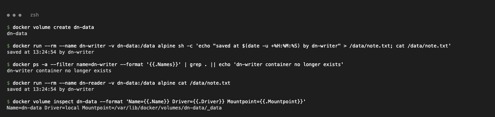

The data written by the first container is still there after that container is gone.

---

## Cleanup

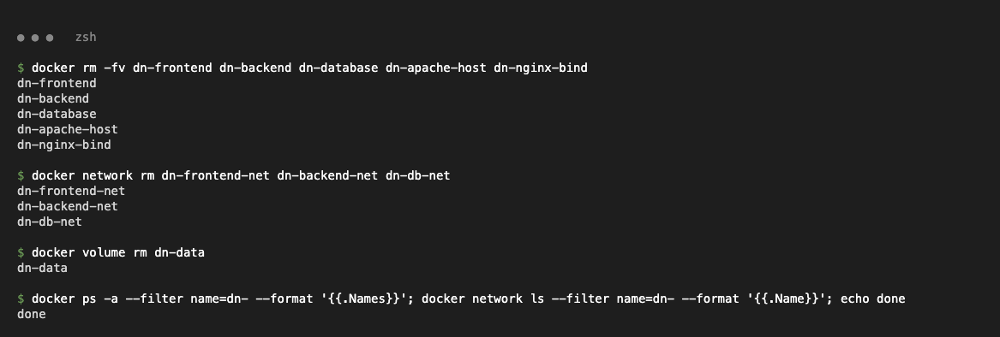
