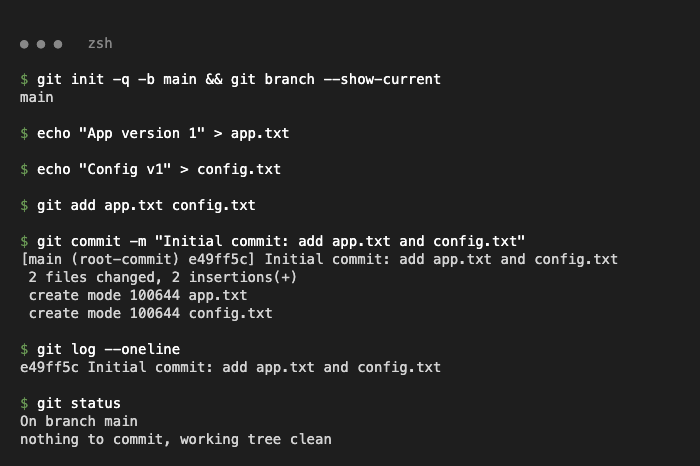
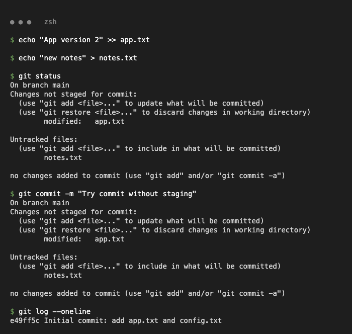
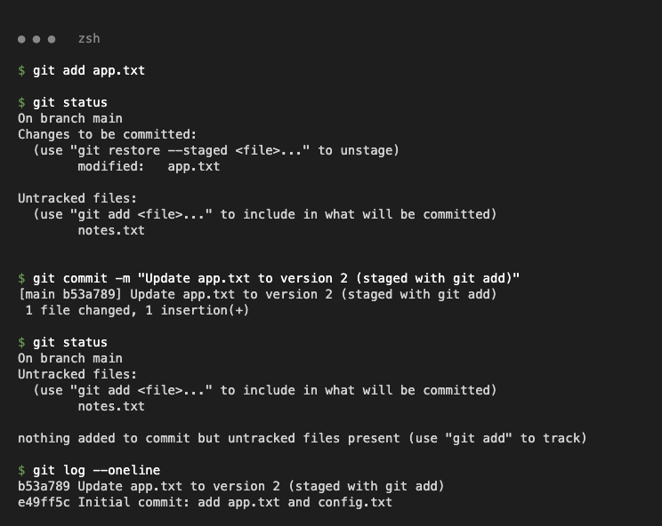
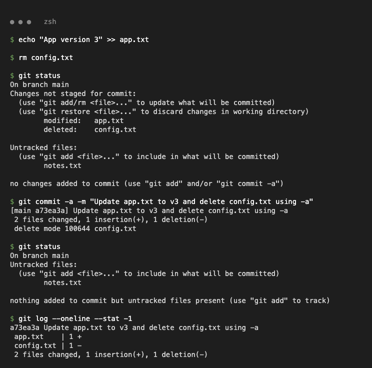
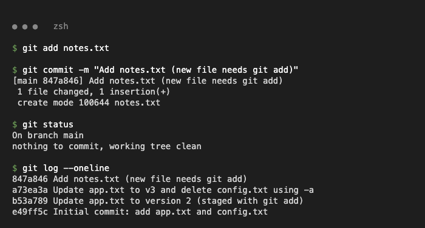
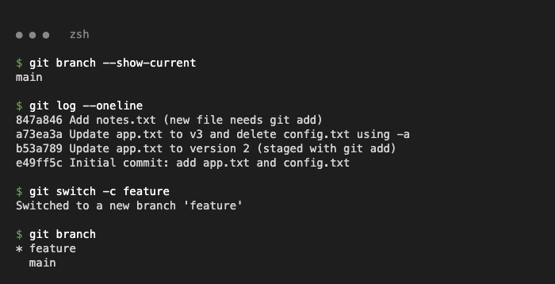
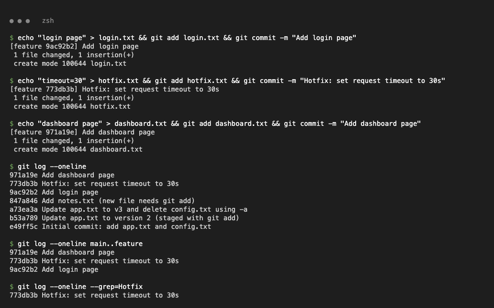
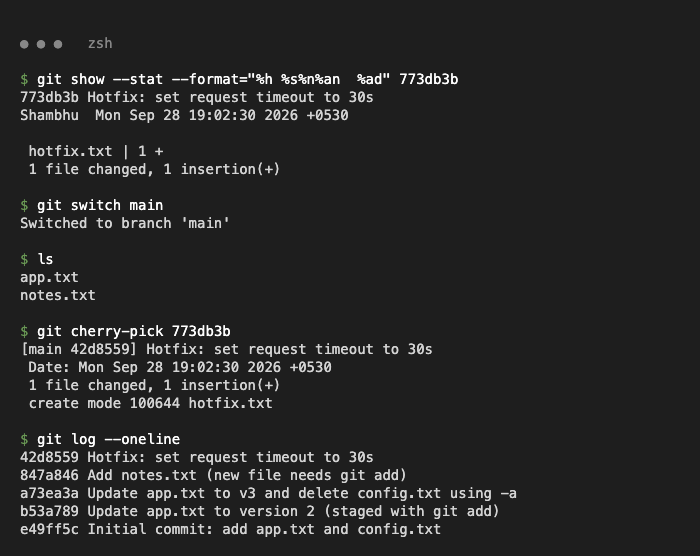
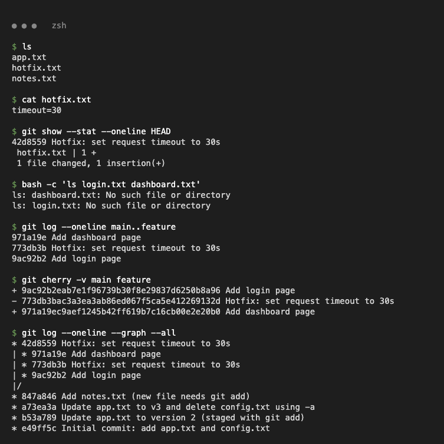

# Git Assignment

All commands were run in a local practice repository (`git-practice`).

## Task 1 – `git commit -m` vs `git commit -a -m`

| | `git commit -m "msg"` | `git commit -a -m "msg"` |
|---|---|---|
| What gets committed | Only what is already staged (`git add`) | Auto-stages all **modified and deleted tracked** files, then commits |
| Needs `git add` first? | Yes, else `no changes added to commit` | No, for tracked files |
| **New (untracked) files** | Only if staged | **Never included** – still need `git add` |

### Step 1 – Create the repository and the first commit

```bash
git init -q -b main
echo "App version 1" > app.txt && echo "Config v1" > config.txt
git add app.txt config.txt
git commit -m "Initial commit: add app.txt and config.txt"
```



### Step 2 – `git commit -m` with nothing staged

```bash
$ echo "App version 2" >> app.txt && echo "new notes" > notes.txt
$ git commit -m "Try commit without staging"
no changes added to commit (use "git add" and/or "git commit -a")
```



### Step 3 – `git add` + `git commit -m` → only the staged file is committed

```bash
$ git add app.txt
$ git commit -m "Update app.txt to version 2 (staged with git add)"
[main b53a789] Update app.txt to version 2 (staged with git add)
 1 file changed, 1 insertion(+)
```



### Step 4 – `git commit -a -m` → modified + deleted files committed, untracked file not

```bash
$ echo "App version 3" >> app.txt && rm config.txt
$ git commit -a -m "Update app.txt to v3 and delete config.txt using -a"
[main a73ea3a] Update app.txt to v3 and delete config.txt using -a
 2 files changed, 1 insertion(+), 1 deletion(-)
 delete mode 100644 config.txt
```



### Step 5 – New files always need `git add`

```bash
git add notes.txt
git commit -m "Add notes.txt (new file needs git add)"
```



## Task 2 – `git cherry-pick`

`git cherry-pick <commit>` applies the changes of one specific commit from another branch as a new commit on the current branch.

### Step 1 – Create a branch from `main`

```bash
git switch -c feature
```



### Step 2 – Make 3 commits on `feature`

```bash
$ echo "login page" > login.txt && git add login.txt && git commit -m "Add login page"
$ echo "timeout=30" > hotfix.txt && git add hotfix.txt && git commit -m "Hotfix: set request timeout to 30s"
$ echo "dashboard page" > dashboard.txt && git add dashboard.txt && git commit -m "Add dashboard page"
$ git log --oneline main..feature
971a19e Add dashboard page
773db3b Hotfix: set request timeout to 30s
9ac92b2 Add login page
```



### Step 3 – Cherry-pick the hotfix onto `main`

```bash
$ git switch main
$ git cherry-pick 773db3b
[main 42d8559] Hotfix: set request timeout to 30s
 1 file changed, 1 insertion(+)
 create mode 100644 hotfix.txt
```



### Step 4 – Verify

```bash
$ cat hotfix.txt
timeout=30
$ ls login.txt dashboard.txt
ls: dashboard.txt: No such file or directory
ls: login.txt: No such file or directory
```



Only the hotfix reached `main` as a new commit (`42d8559`, different hash); the login and dashboard commits did not.
