# Helm – Assignment

Helm v4.3.0 against minikube (Kubernetes v1.37).

| Task | Location |
| :--- | :--- |
| 1 – Helm commands | this file; chart generated by `helm create` in `task1-helm-commands/demo-chart/` |
| 2 – Rollback workflow | [`task2-rollback/README.md`](task2-rollback/README.md) |
| 3 – Mini project (notes-chart) | [`mini-project/README.md`](mini-project/README.md) |

---

## Task 1 – Helm commands

### `helm create`: scaffold a chart (Chart.yaml, values.yaml, templates, _helpers.tpl, NOTES.txt, tests)

```text
$ helm create demo-chart
Creating demo-chart
$ find demo-chart -type f | sort
demo-chart/.helmignore
demo-chart/Chart.yaml
demo-chart/templates/_helpers.tpl
demo-chart/templates/deployment.yaml
demo-chart/templates/hpa.yaml
demo-chart/templates/httproute.yaml
demo-chart/templates/ingress.yaml
demo-chart/templates/NOTES.txt
demo-chart/templates/service.yaml
demo-chart/templates/serviceaccount.yaml
demo-chart/templates/tests/test-connection.yaml
demo-chart/values.yaml
```

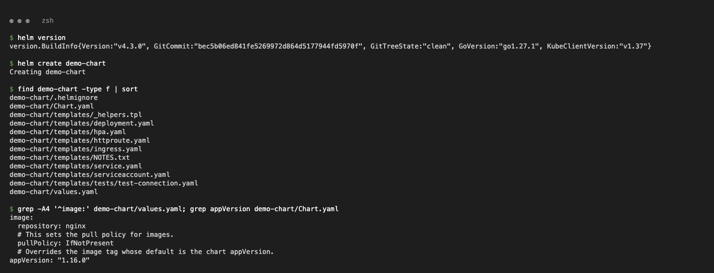

### `helm install`: render the chart and create release `demo`, revision 1

```text
$ helm install demo ./demo-chart --wait
NAME: demo
STATUS: deployed
REVISION: 1
DESCRIPTION: Install complete
$ kubectl get deploy,svc -l app.kubernetes.io/instance=demo
deployment.apps/demo-demo-chart   1/1     1            1           1s
service/demo-demo-chart   ClusterIP   10.110.28.84   <none>        80/TCP    1s
```

In Helm 4 `--wait` defaults to `hookOnly`, so `--wait` is passed to block until the Pods are ready.

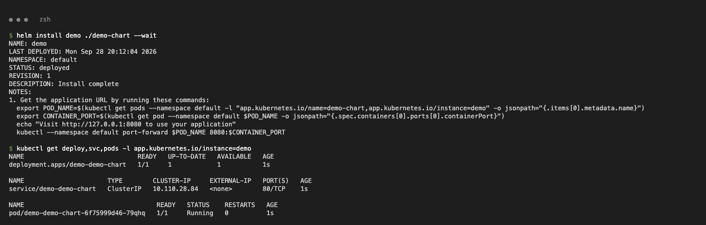

### `helm list` / `helm status`: list releases; show one release's state, resources and NOTES

```text
$ helm list
NAME	NAMESPACE	REVISION	UPDATED                             	STATUS  	CHART           	APP VERSION
demo	default  	1       	2026-09-28 20:12:04.271239 +0530 IST	deployed	demo-chart-0.1.0	1.16.0
$ helm status demo
STATUS: deployed
REVISION: 1
RESOURCES:
==> v1/Deployment
NAME              READY   UP-TO-DATE   AVAILABLE   AGE
demo-demo-chart   1/1     1            1           3s
```

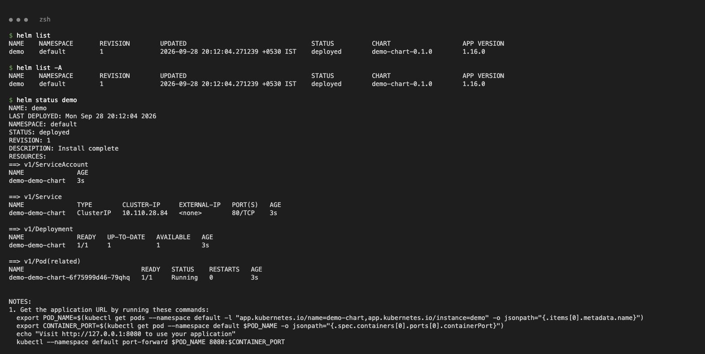

### `helm get values | notes | manifest | all | metadata`: inspect what a release was deployed with

```text
$ helm get values demo
USER-SUPPLIED VALUES:
null
$ helm get manifest demo | head -8
---
# Source: demo-chart/templates/serviceaccount.yaml
apiVersion: v1
kind: ServiceAccount
metadata:
  name: demo-demo-chart
$ helm get metadata demo
NAME: demo
CHART: demo-chart
VERSION: 0.1.0
APP_VERSION: 1.16.0
REVISION: 1
STATUS: deployed
```

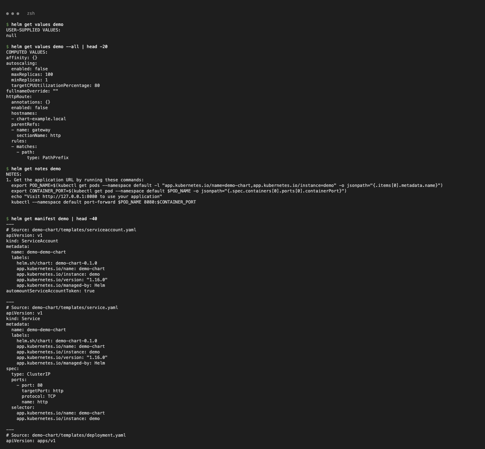
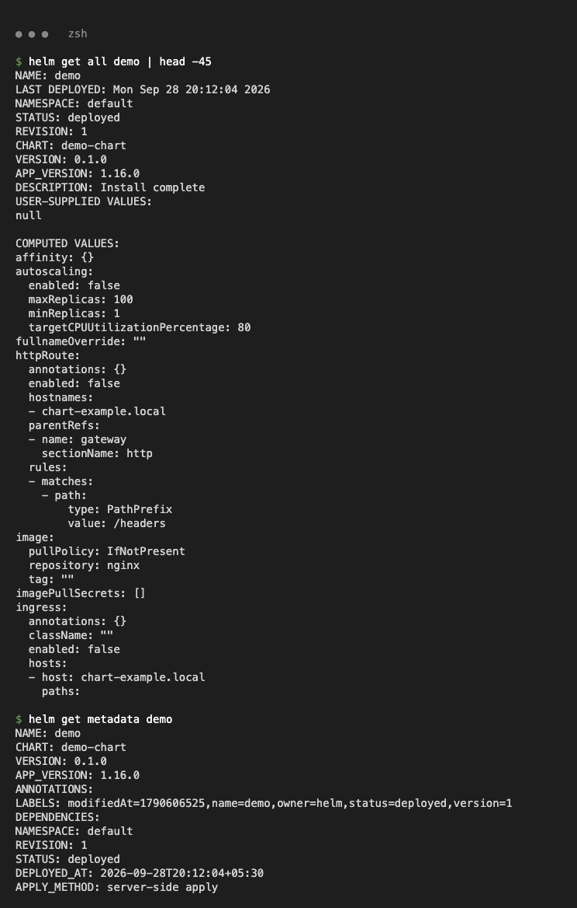

### `helm upgrade` / `helm history`: apply new values as a new revision; list revisions

```text
$ helm upgrade demo ./demo-chart --set replicaCount=3 --set image.tag=1.27 --wait
Release "demo" has been upgraded. Happy Helming!
REVISION: 2
$ kubectl get deploy demo-demo-chart -o wide
NAME              READY   UP-TO-DATE   AVAILABLE   AGE   CONTAINERS   IMAGES
demo-demo-chart   3/3     3            3           18s   demo-chart   nginx:1.27
$ helm history demo
REVISION	STATUS    	CHART           	DESCRIPTION
1       	superseded	demo-chart-0.1.0	Install complete
2       	deployed  	demo-chart-0.1.0	Upgrade complete
```

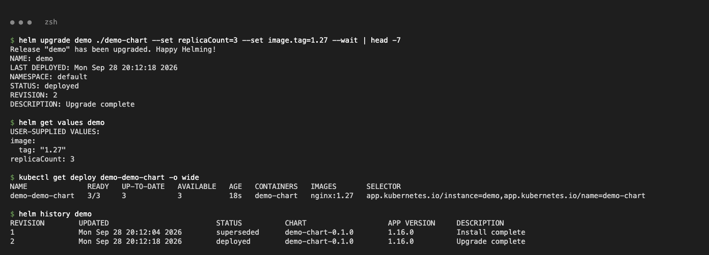

### `helm rollback`: redeploy an old revision as a new revision

```text
$ helm rollback demo 1 --wait
Rollback was a success! Happy Helming!
$ helm history demo
3       	deployed  	demo-chart-0.1.0	Rollback to 1
$ kubectl get deploy demo-demo-chart -o wide
demo-demo-chart   1/1     1            1           22s   demo-chart   nginx:1.16.0
```

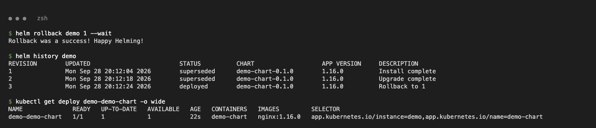

### `helm uninstall`: delete the release and all its resources

```text
$ helm uninstall demo
release "demo" uninstalled
$ helm list
NAME	NAMESPACE	REVISION	UPDATED	STATUS	CHART	APP VERSION
```

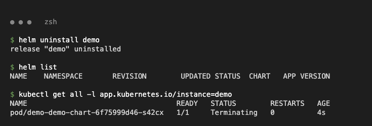

### `helm repo add | list | update | remove`: manage chart repositories

```text
$ helm repo add bitnami https://charts.bitnami.com/bitnami
"bitnami" has been added to your repositories
$ helm repo add prometheus-community https://prometheus-community.github.io/helm-charts
"prometheus-community" has been added to your repositories
$ helm repo update
...Successfully got an update from the "prometheus-community" chart repository
...Successfully got an update from the "bitnami" chart repository
Update Complete. ⎈Happy Helming!⎈
$ helm repo remove prometheus-community
"prometheus-community" has been removed from your repositories
$ helm repo list
NAME   	URL
bitnami	https://charts.bitnami.com/bitnami
```

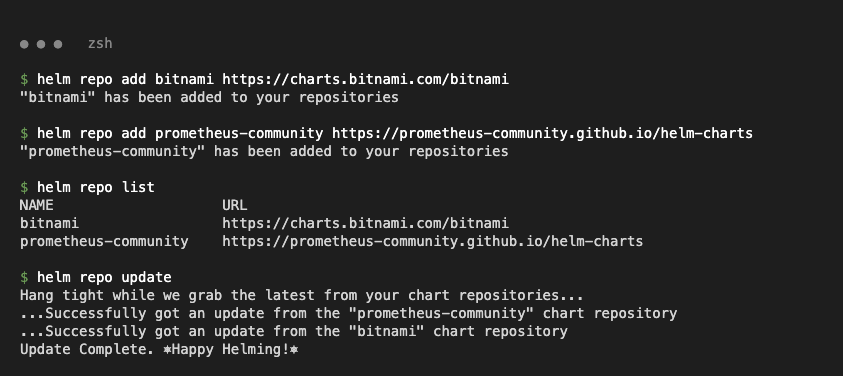
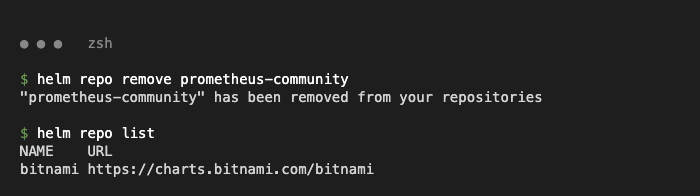

### `helm search repo` / `helm search hub`: search added repos / Artifact Hub

```text
$ helm search repo nginx | head -3
NAME                                          	CHART VERSION	APP VERSION	DESCRIPTION
bitnami/nginx                                 	25.2.1       	1.31.6     	NGINX Open Source is a web server that can be a...
bitnami/nginx-ingress-controller              	12.0.7       	1.13.1     	NGINX Ingress Controller is an Ingress controll...
$ helm search hub nginx --max-col-width 60 | head -3
URL                                                         	CHART VERSION  	APP VERSION	DESCRIPTION
https://artifacthub.io/packages/helm/cloudpirates-nginx/n...	0.16.12        	1.31.6     	Nginx is a high-performance HTTP server and reverse proxy.
https://artifacthub.io/packages/helm/quench-nginx/nginx     	0.0.15         	1.30.5     	High-performance web server, reverse proxy, and load bala...
```

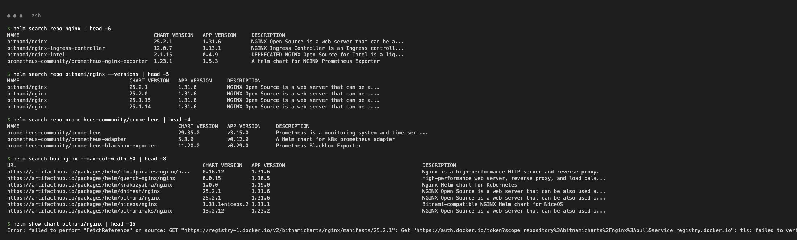

### `helm show` / `helm pull`

```text
$ helm show chart bitnami/nginx
Error: failed to perform "FetchReference" on source: GET "https://registry-1.docker.io/v2/bitnamicharts/nginx/manifests/25.2.1": ... tls: failed to verify certificate: x509: certificate has expired or is not yet valid: "auth.docker.io" certificate is expired
$ helm show chart prometheus-community/prometheus-nginx-exporter | tail -3
name: prometheus-nginx-exporter
type: application
version: 1.23.1
$ helm pull prometheus-community/prometheus-nginx-exporter -d /tmp
/tmp/prometheus-nginx-exporter-1.23.1.tgz
```

Bitnami chart packages are OCI artifacts on Docker Hub, and Docker Hub's `auth.docker.io` TLS check fails on this machine (the local clock is behind the certificate's validity window). So `show`/`pull`/`install` of Bitnami charts fails, while the repo index (`charts.bitnami.com`) and other repositories work.

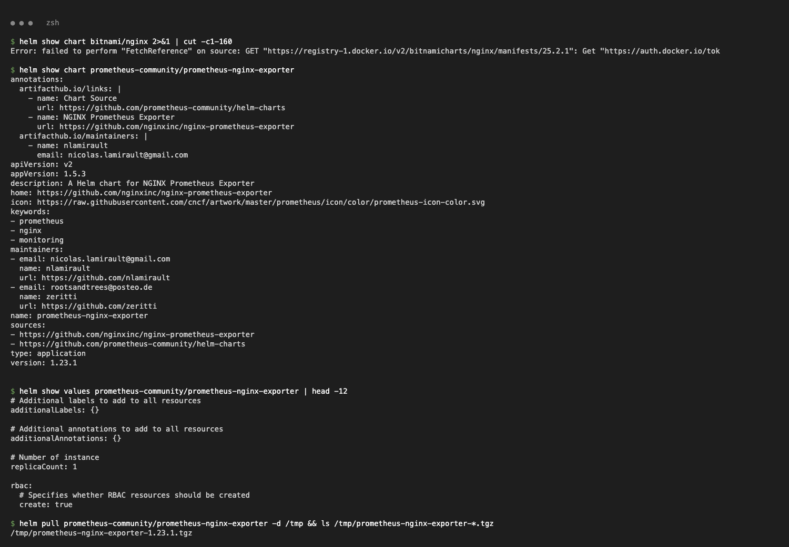
