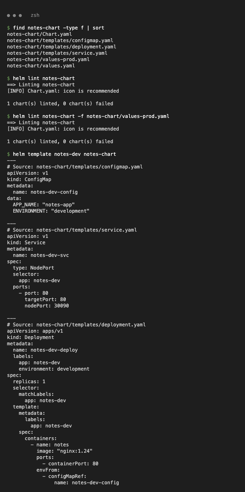
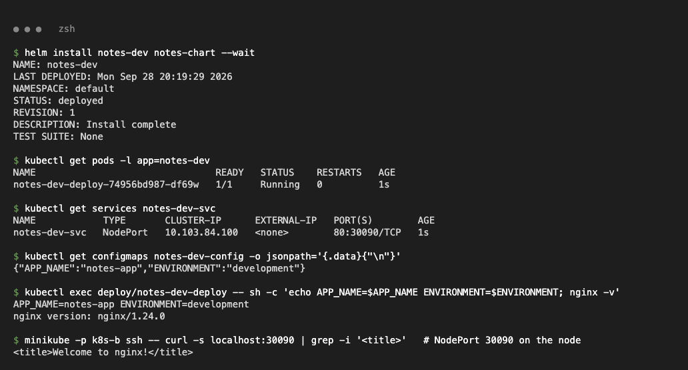
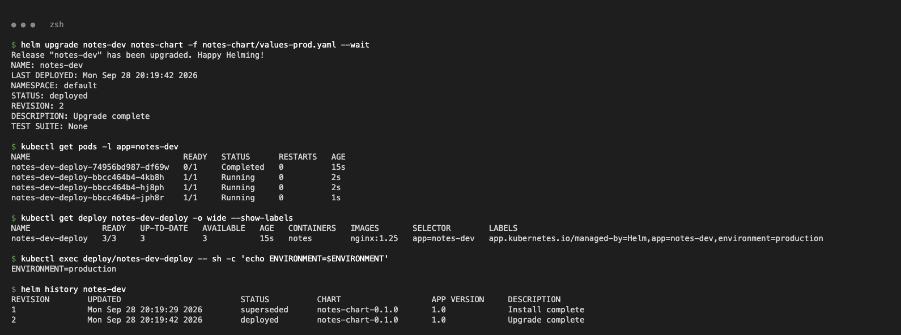
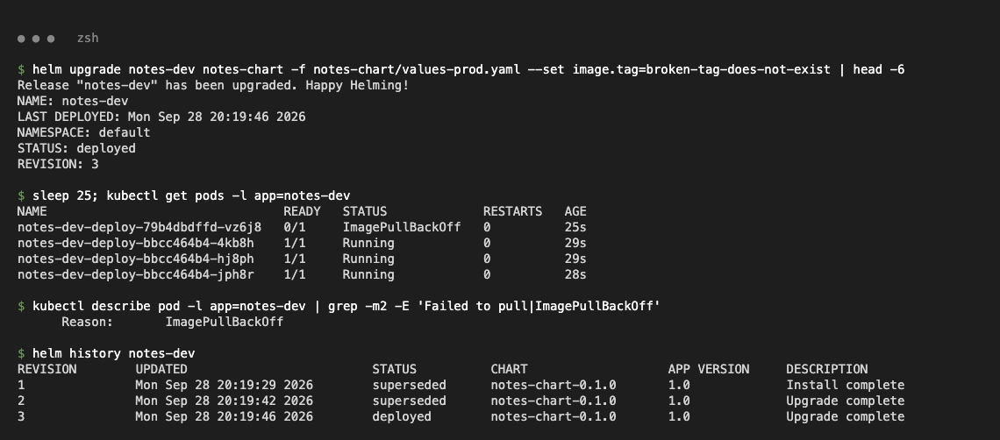
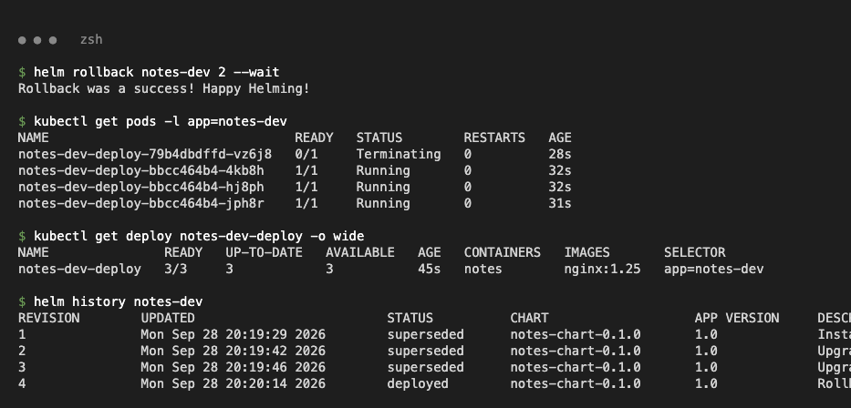
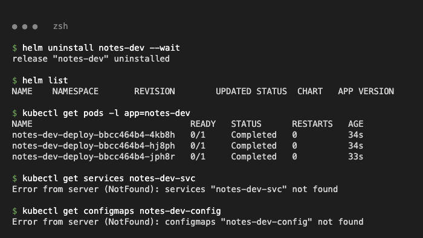

# Task 3 – Mini Project: Notes App Helm Chart

Chart `notes-chart/` (class mini-project, used as-is): `Chart.yaml`, `values.yaml` (development: 1 replica, nginx 1.24), `values-prod.yaml` (production: 3 replicas, nginx 1.25), and `templates/` with `configmap.yaml` (APP_NAME, ENVIRONMENT), `deployment.yaml` (envFrom the ConfigMap) and `service.yaml` (NodePort 30090).

## Lint and template

```text
$ helm lint notes-chart
==> Linting notes-chart
[INFO] Chart.yaml: icon is recommended

1 chart(s) linted, 0 chart(s) failed

$ helm template notes-dev notes-chart
# Source: notes-chart/templates/configmap.yaml   -> notes-dev-config  APP_NAME "notes-app", ENVIRONMENT "development"
# Source: notes-chart/templates/service.yaml     -> notes-dev-svc     NodePort 80:30090
# Source: notes-chart/templates/deployment.yaml  -> notes-dev-deploy  replicas 1, image "nginx:1.24"
```



## Install (development)

```text
$ helm install notes-dev notes-chart --wait
STATUS: deployed
REVISION: 1
$ kubectl get services notes-dev-svc
NAME            TYPE       CLUSTER-IP      EXTERNAL-IP   PORT(S)        AGE
notes-dev-svc   NodePort   10.103.84.100   <none>        80:30090/TCP   1s
$ kubectl exec deploy/notes-dev-deploy -- sh -c 'echo APP_NAME=$APP_NAME ENVIRONMENT=$ENVIRONMENT; nginx -v'
APP_NAME=notes-app ENVIRONMENT=development
nginx version: nginx/1.24.0
$ minikube -p k8s-b ssh -- curl -s localhost:30090 | grep -i '<title>'
<title>Welcome to nginx!</title>
```



## Upgrade to production values

```text
$ helm upgrade notes-dev notes-chart -f notes-chart/values-prod.yaml --wait
REVISION: 2
$ kubectl get deploy notes-dev-deploy -o wide --show-labels
NAME               READY   UP-TO-DATE   AVAILABLE   IMAGES       LABELS
notes-dev-deploy   3/3     3            3           nginx:1.25   app.kubernetes.io/managed-by=Helm,app=notes-dev,environment=production
$ kubectl exec deploy/notes-dev-deploy -- sh -c 'echo ENVIRONMENT=$ENVIRONMENT'
ENVIRONMENT=production
```



## Bad upgrade → rollback to revision 2

```text
$ helm upgrade notes-dev notes-chart -f notes-chart/values-prod.yaml --set image.tag=broken-tag-does-not-exist
REVISION: 3
$ kubectl get pods -l app=notes-dev
NAME                                READY   STATUS             RESTARTS   AGE
notes-dev-deploy-79b4dbdffd-vz6j8   0/1     ImagePullBackOff   0          25s
notes-dev-deploy-bbcc464b4-4kb8h    1/1     Running            0          29s
notes-dev-deploy-bbcc464b4-hj8ph    1/1     Running            0          29s
notes-dev-deploy-bbcc464b4-jph8r    1/1     Running            0          28s

$ helm rollback notes-dev 2 --wait
Rollback was a success! Happy Helming!
$ helm history notes-dev
1       	superseded	notes-chart-0.1.0	Install complete
2       	superseded	notes-chart-0.1.0	Upgrade complete
3       	superseded	notes-chart-0.1.0	Upgrade complete
4       	deployed  	notes-chart-0.1.0	Rollback to 2
$ kubectl get deploy notes-dev-deploy -o wide
notes-dev-deploy   3/3     3            3           45s   notes   nginx:1.25   app=notes-dev
```

Without `--wait`, Helm marked revision 3 `deployed` straight away. The RollingUpdate kept the three old Pods serving while the new Pod was stuck in `ImagePullBackOff`.




## Clean up

```text
$ helm uninstall notes-dev --wait
release "notes-dev" uninstalled
$ kubectl get services notes-dev-svc
Error from server (NotFound): services "notes-dev-svc" not found
$ kubectl get configmaps notes-dev-config
Error from server (NotFound): configmaps "notes-dev-config" not found
```


