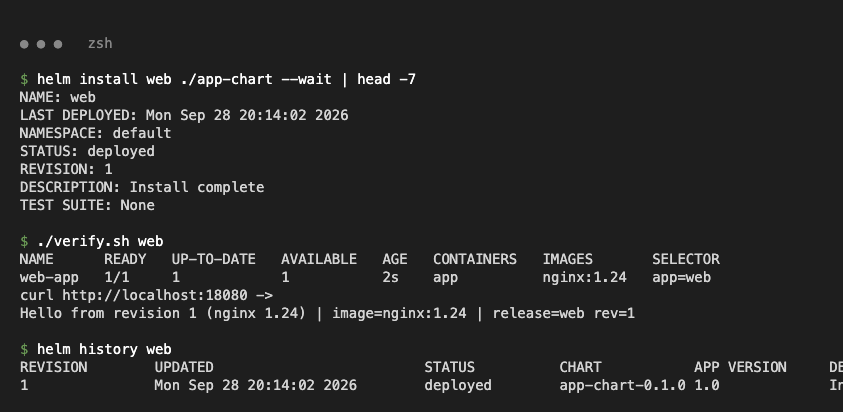
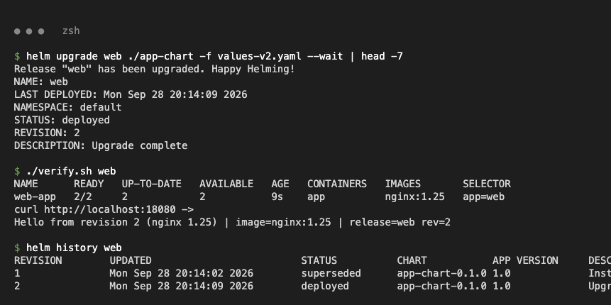
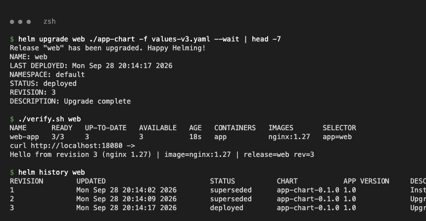
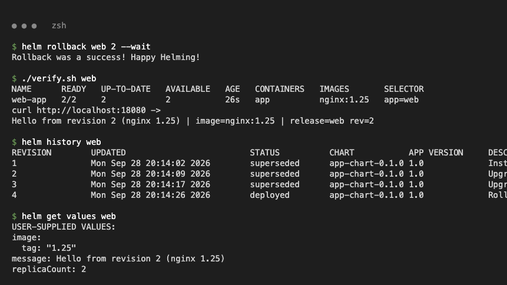
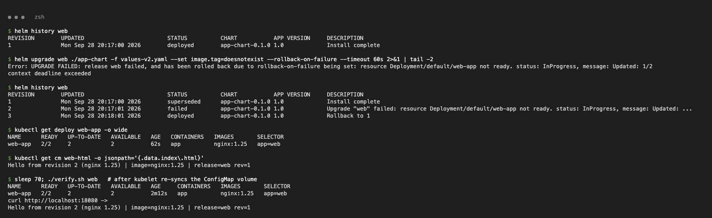

# Task 2 – Rollback Workflow

Chart: class `07-install-upgrade/app-chart`, extended with `service.yaml`, `configmap.yaml` (the `index.html` shows `message`, image and revision) and a `checksum/config` annotation so Pods roll when the page changes.

| Revision | Values | Image | Replicas | Message |
| :--- | :--- | :--- | :--- | :--- |
| 1 | `values.yaml` | nginx:1.24 | 1 | Hello from revision 1 |
| 2 | `-f values-v2.yaml` | nginx:1.25 | 2 | Hello from revision 2 |
| 3 | `-f values-v3.yaml` | nginx:1.27 | 3 | Hello from revision 3 |
| 4 | `helm rollback web 2` | nginx:1.25 | 2 | Hello from revision 2 |

`verify.sh` runs `kubectl get deploy -o wide`, then curls the Service through `kubectl port-forward`.

## Install → verify

```text
$ helm install web ./app-chart --wait
REVISION: 1
$ ./verify.sh web
NAME      READY   UP-TO-DATE   AVAILABLE   AGE   CONTAINERS   IMAGES       SELECTOR
web-app   1/1     1            1           2s    app          nginx:1.24   app=web
curl http://localhost:18080 ->
Hello from revision 1 (nginx 1.24) | image=nginx:1.24 | release=web rev=1
```



## Upgrade → verify

```text
$ helm upgrade web ./app-chart -f values-v2.yaml --wait
REVISION: 2
web-app   2/2     2            2           9s    app          nginx:1.25   app=web
Hello from revision 2 (nginx 1.25) | image=nginx:1.25 | release=web rev=2
```



## Upgrade again → verify

```text
$ helm upgrade web ./app-chart -f values-v3.yaml --wait
REVISION: 3
web-app   3/3     3            3           18s   app          nginx:1.27   app=web
Hello from revision 3 (nginx 1.27) | image=nginx:1.27 | release=web rev=3
```



## Rollback → verify

```text
$ helm rollback web 2 --wait
Rollback was a success! Happy Helming!
$ ./verify.sh web
web-app   2/2     2            2           26s   app          nginx:1.25   app=web
Hello from revision 2 (nginx 1.25) | image=nginx:1.25 | release=web rev=2
$ helm history web
REVISION	UPDATED                 	STATUS    	CHART          	APP VERSION	DESCRIPTION
1       	Mon Sep 28 20:14:02 2026	superseded	app-chart-0.1.0	1.0        	Install complete
2       	Mon Sep 28 20:14:09 2026	superseded	app-chart-0.1.0	1.0        	Upgrade complete
3       	Mon Sep 28 20:14:17 2026	superseded	app-chart-0.1.0	1.0        	Upgrade complete
4       	Mon Sep 28 20:14:26 2026	deployed  	app-chart-0.1.0	1.0        	Rollback to 2
```

The rollback creates **revision 4** with revision 2's stored manifest, so the page still says `rev=2`.



## Automatic rollback on a failed upgrade (class `08-rollback`)

Helm 4 renamed `--atomic` to `--rollback-on-failure`; `--atomic` is still accepted.

```text
$ helm upgrade web ./app-chart -f values-v2.yaml --set image.tag=doesnotexist --rollback-on-failure --timeout 60s
Error: UPGRADE FAILED: release web failed, and has been rolled back due to rollback-on-failure being set: resource Deployment/default/web-app not ready. status: InProgress, message: Updated: 1/2
$ helm history web
1       	superseded	Install complete
2       	failed    	Upgrade "web" failed: resource Deployment/default/web-app not ready...
3       	deployed  	Rollback to 1
$ kubectl get deploy web-app -o wide
web-app   2/2     2            2           62s   app          nginx:1.25   app=web
```


