# Kubernetes Deployments Assignment (Session 10)

Cluster: minikube profile `k8s-a` (Kubernetes v1.37.0). YAMLs are the class files from `session10-k8s-core-objects` (unchanged): `01-rolling-update/`, `02-blue-green/`, `03-canary/`, `04-recreate/`, `pod-lifecycle/`.
Services were tested from a client pod: `kubectl run curl --image=curlimages/curl:8.6.0 --command -- sleep 36000`.

# Task 1 — Deployment strategies

## Rolling update

```bash
kubectl apply -f 01-rolling-update/deployment-v1.yaml -f 01-rolling-update/service.yaml
kubectl rollout status deployment/app-rolling
kubectl apply -f 01-rolling-update/deployment-v2.yaml && kubectl get pods -l app=app-rolling -w
kubectl get rs -l app=app-rolling
kubectl rollout undo deployment/app-rolling
```

```text
{"rollingUpdate":{"maxSurge":1,"maxUnavailable":0},"type":"RollingUpdate"}
app-rolling-56bff6d88c-cc6kj   0/1     ContainerCreating   0          0s     <- 1 new v2 pod (surge)
app-rolling-56bff6d88c-cc6kj   1/1     Running             0          7s     <- ready
app-rolling-86d7d44d5b-d7m7s   1/1     Terminating         0          17s    <- only then 1 v1 pod removed
...
NAME                     DESIRED   CURRENT   READY
app-rolling-56bff6d88c   4         4         4       <- v2
app-rolling-86d7d44d5b   0         0         0       <- v1 kept for rollback
VERSION: v2

# 4 s into the rollback:
app-rolling-56bff6d88c   4         4         4
app-rolling-86d7d44d5b   1         1         0
20 VERSION: v2     <- 20 requests during rollout, 0 failures
```

Old and new ReplicaSets coexist; one pod is replaced at a time, so capacity never drops below 4.

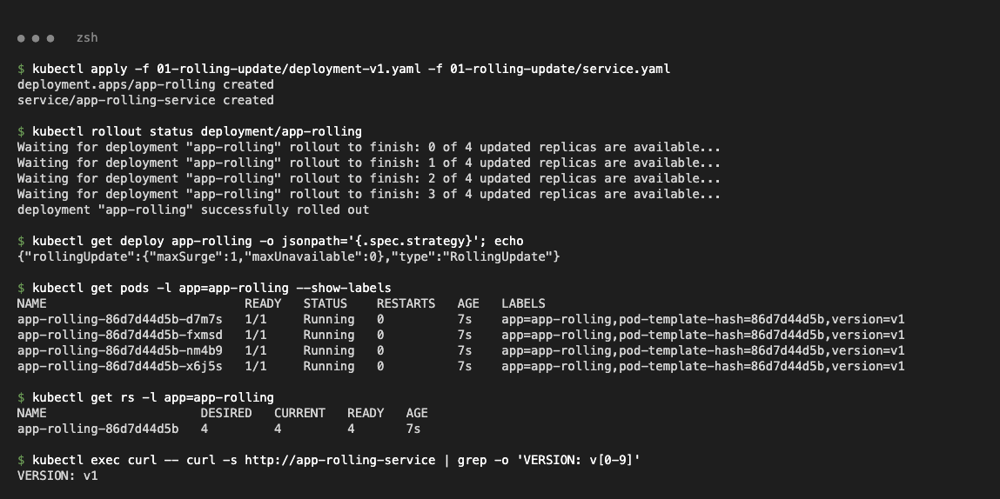
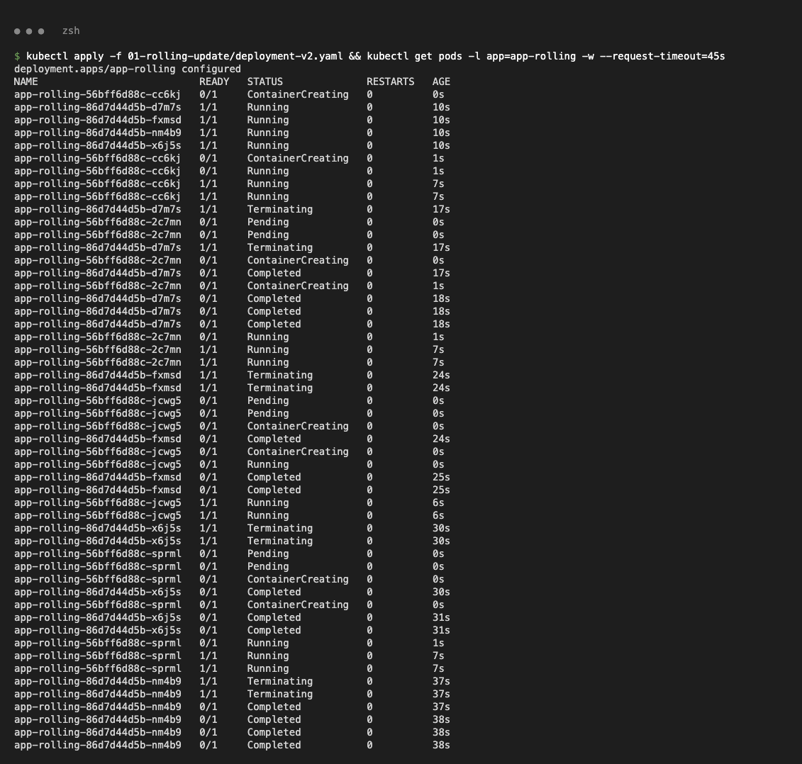
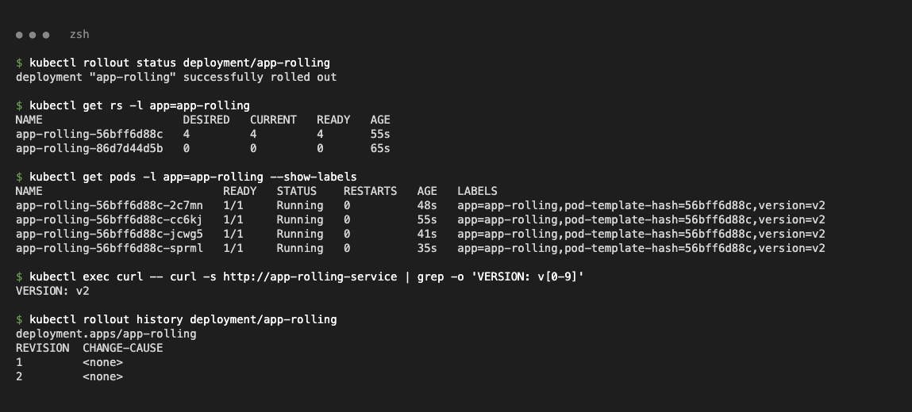
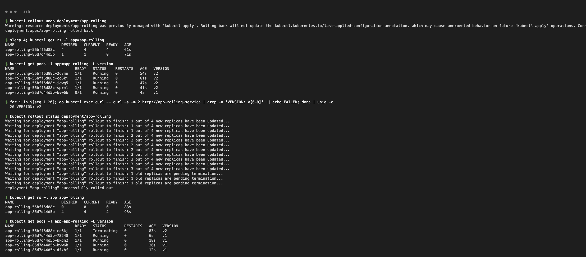

## Blue-green

```bash
kubectl apply -f 02-blue-green/deployment-blue.yaml -f 02-blue-green/deployment-green.yaml
kubectl apply -f 02-blue-green/service-blue.yaml      # live = blue
kubectl apply -f 02-blue-green/service-green.yaml     # switch to green
kubectl apply -f 02-blue-green/service-blue.yaml      # rollback
```

```text
Selector:  app=myapp,slot=blue   endpoints 10.244.0.31-33   -> BLUE ENVIRONMENT Version: v1
Selector:  app=myapp,slot=green  endpoints 10.244.0.34-36   -> GREEN ENVIRONMENT Version: v2
Selector:  app=myapp,slot=blue   endpoints 10.244.0.31-33   -> BLUE ENVIRONMENT Version: v1
```

Only the Service selector changes; all traffic moves at once with no pod restarts.

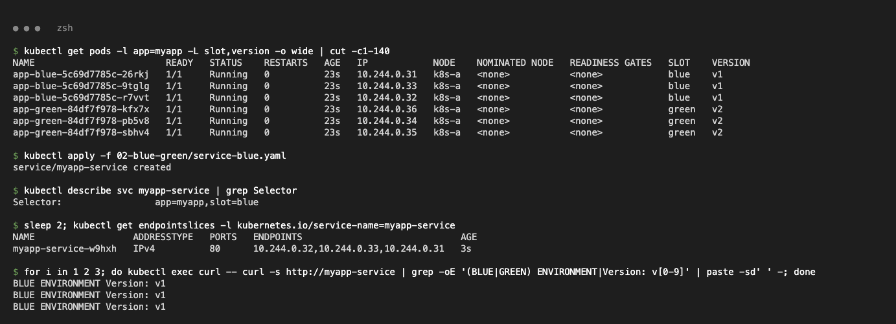
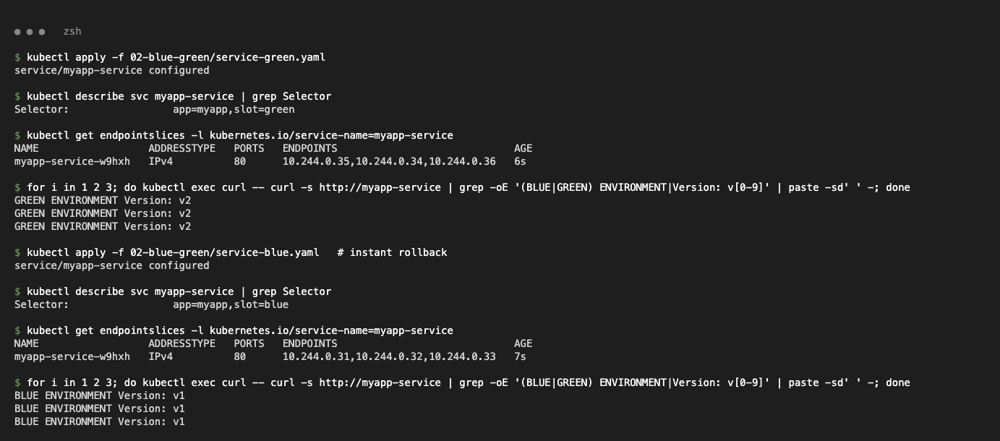

## Canary

```bash
kubectl apply -f 03-canary/deployment-stable.yaml -f 03-canary/service.yaml   # 9 x v1
kubectl apply -f 03-canary/deployment-canary.yaml                             # 1 x v2
for i in $(seq 1 100); do kubectl exec curl -- curl -s http://myapp-canary-service | grep -oE 'STABLE v1|CANARY v2'; done | sort | uniq -c
kubectl scale deployment app-canary --replicas=3; kubectl scale deployment app-stable --replicas=7
kubectl scale deployment app-canary --replicas=0; kubectl scale deployment app-stable --replicas=9   # rollback
```

```text
9:1  ->   8 CANARY v2 / 92 STABLE v1
7:3  ->  31 CANARY v2 / 69 STABLE v1
0:9  ->  20 STABLE v1
```

Traffic split follows the pod ratio because one Service selects both Deployments.

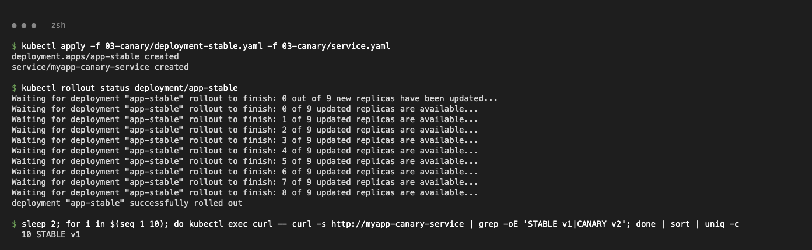
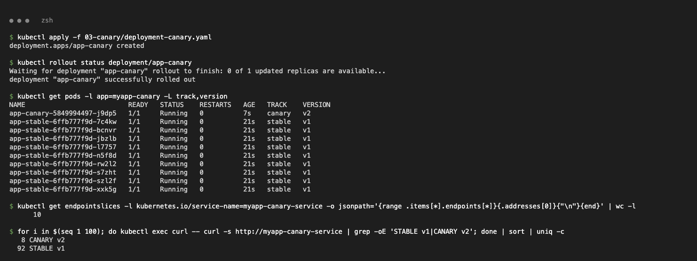
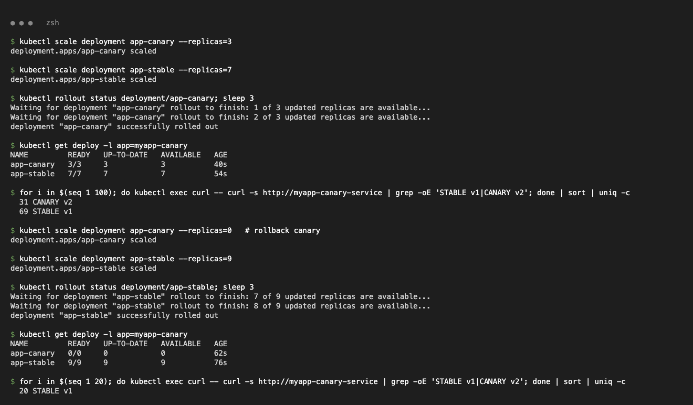

## Recreate

```bash
kubectl apply -f 04-recreate/deployment-v1.yaml -f 04-recreate/service.yaml
kubectl apply -f 04-recreate/deployment-v2.yaml && kubectl get pods -l app=app-recreate -L version -w
kubectl rollout undo deployment/app-recreate      # with a request loop
```

```text
app-recreate-6c78cb55bb-66bhg   1/1     Terminating   0          6s    v1   <- all v1 pods terminate first
app-recreate-6c78cb55bb-95xtl   1/1     Terminating   0          6s    v1
app-recreate-6c78cb55bb-d7hlf   1/1     Terminating   0          6s    v1
app-recreate-7bd8d89b8b-6jgwd   0/1     Pending       0          0s    v2   <- v2 created only afterwards
...
[OUTAGE] connection failed   (x6)
VERSION: v1                  (x6)
```

All old pods are killed before new ones start, causing a short outage.

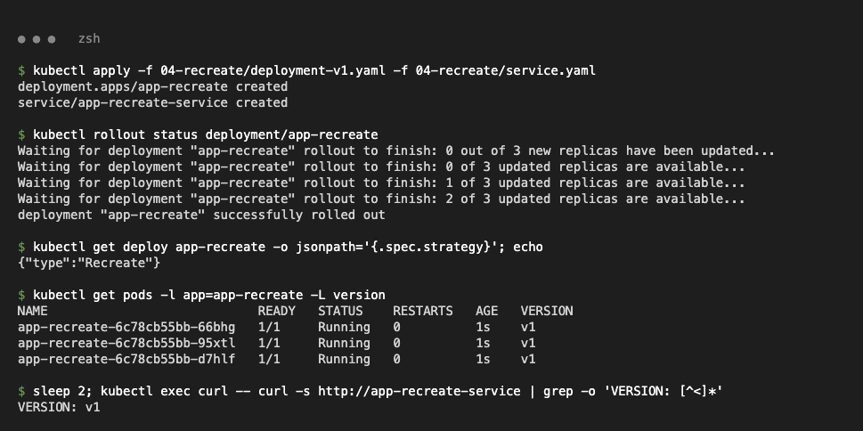
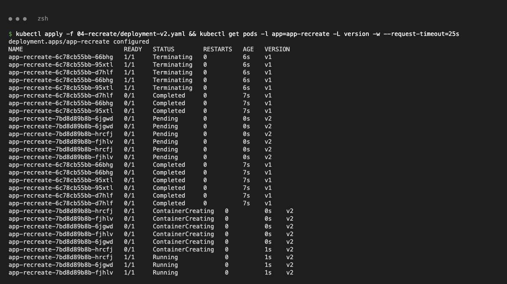
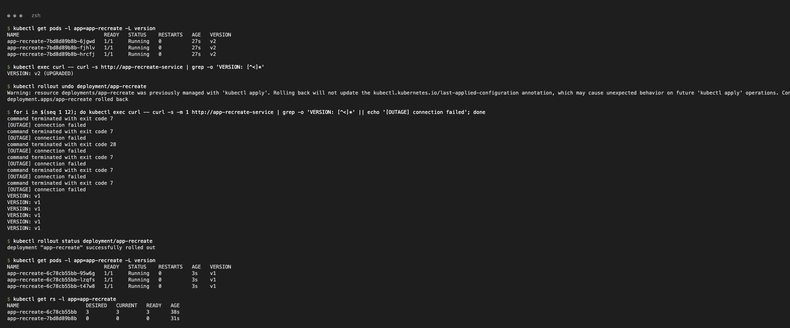

# Task 2 — Pod lifecycle

For each file: `kubectl apply -f pod-lifecycle/<file>`, `kubectl get pod -w`, `kubectl describe pod`, `kubectl logs`.

| File | Observed | Explanation |
| --- | --- | --- |
| 01-running | `1/1 Running`, all conditions True | Normal scheduled → pulled → started |
| 02-pending | `Pending`, `FailedScheduling: 0/1 nodes are available: 1 Insufficient memory` | Requests 9Gi; node has ~7.6Gi allocatable |
| 03-succeeded | `Completed`, phase `Succeeded`, exit 0 | `restartPolicy: Never`, task finished |
| 04-failed | `Error`, phase `Failed`, exit 1 | `restartPolicy: Never`, non-zero exit |
| 05-crashloopbackoff | `CrashLoopBackOff`, restarts 5, `Back-off restarting failed container` | Exits 1 repeatedly; kubelet waits longer each restart |
| 06-imagepullbackoff | `ErrImagePull` → `ImagePullBackOff`, `NotFound` | Image `jakwehrgkaejw:kahsdfgkhj` doesn't exist |
| 07-readiness | `0/1 Running` → `1/1` at 6 s | Not Ready (no traffic) until HTTP probe passes |
| 08-liveness | `Liveness probe failed` → `Killing`, exit 137, restarts 2 | `/tmp/healthy` removed after 20 s → container restarted |
| 09-startup | `Startup probe failed` x6, Ready at 36 s, 0 restarts | Startup probe allows 10×5 s for slow start |
| 10-init-container | `Init:0/1` → `PodInitializing` → `Running` (12 s) | Init container must finish before the app starts |
| 11-multi-container | `2/2 Running`; sidecar `wget localhost:80` → nginx page | Containers share the pod network |
| 12-termination | `SIGTERM received; cleaning up...` → `Cleanup complete`, delete took 10 s | Graceful shutdown inside `terminationGracePeriodSeconds: 20` |

Key outputs:

```text
02  Warning  FailedScheduling  default-scheduler  0/1 nodes are available: 1 Insufficient memory.
03  State: Terminated  Reason: Completed  Exit Code: 0        phase: Succeeded
04  State: Terminated  Reason: Error      Exit Code: 1        phase: Failed
05  lifecycle-crashloop   0/1   CrashLoopBackOff   5 (98s ago)   4m39s
    logs: Application started / Application crashed
06  Failed to pull image "jakwehrgkaejw:kahsdfgkhj": rpc error: code = NotFound ...
07  lifecycle-readiness   0/1   Running   0   1s  ->  1/1   Running   0   6s
08  Last State: Terminated  Reason: Error  Exit Code: 137   Restart Count: 2
09  Warning  Unhealthy  10s (x6 over 35s)  Startup probe failed:   -> 1/1 Running at 36s, Restart Count 0
10  lifecycle-init   0/1   Init:0/1   ->  PodInitializing 12s  ->  1/1 Running
11  app  nginx:1.27 ready=true / sidecar busybox:1.36 ready=true
12  19:13:59 delete -> SIGTERM received; cleaning up... -> Cleanup complete -> 19:14:09
```

(In the first 05/08 captures `logs --previous` was not available yet — container already cleaned up / not yet restarted; the follow-up captures 05b/08b show it.)

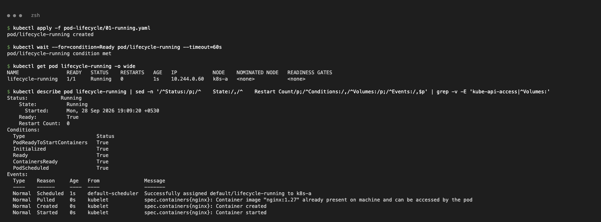
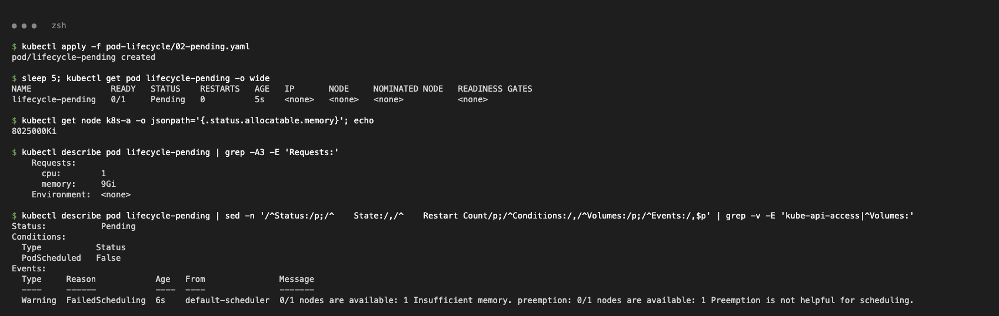
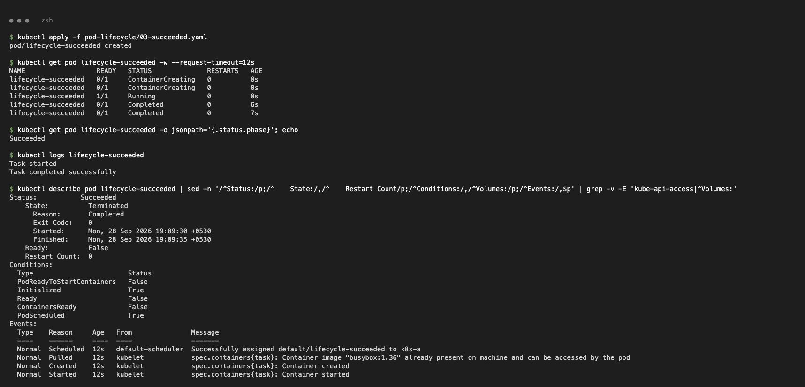
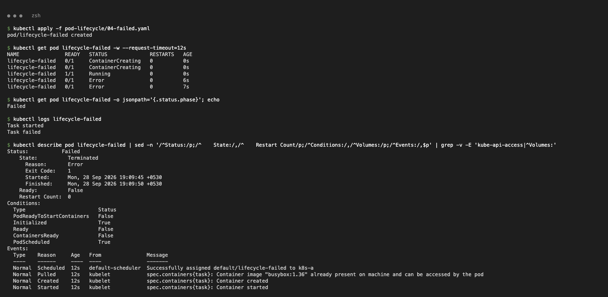
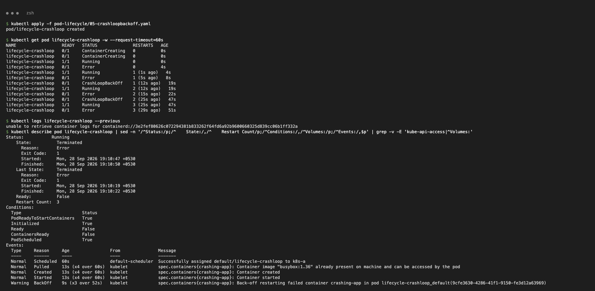
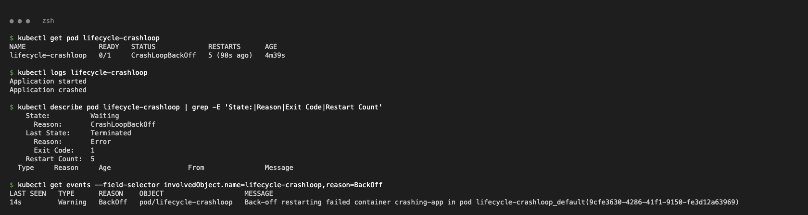
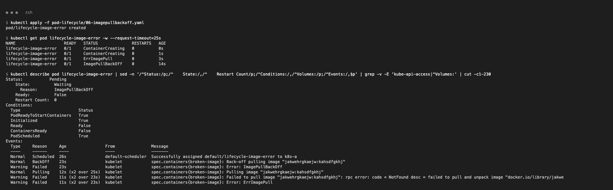
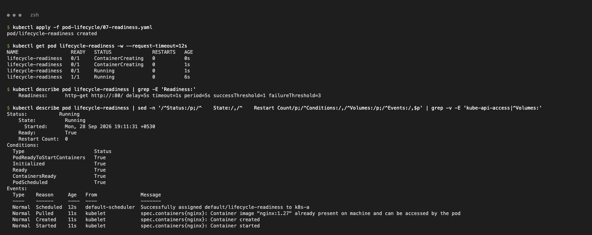
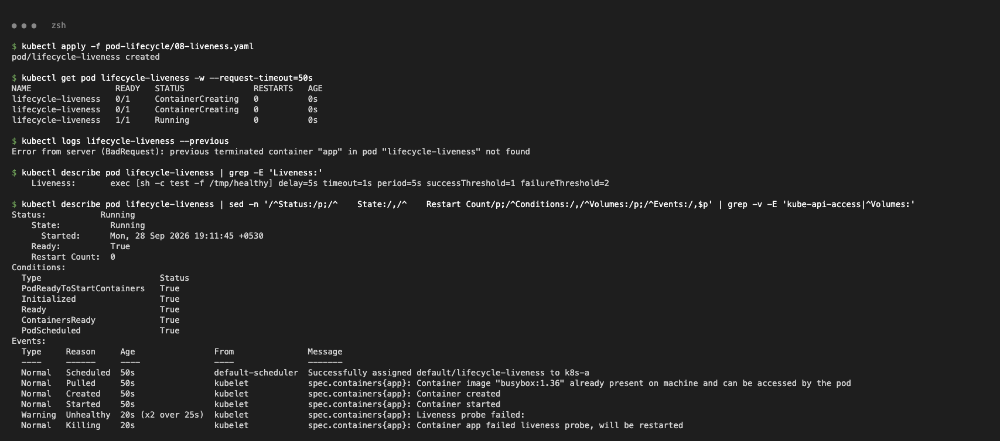
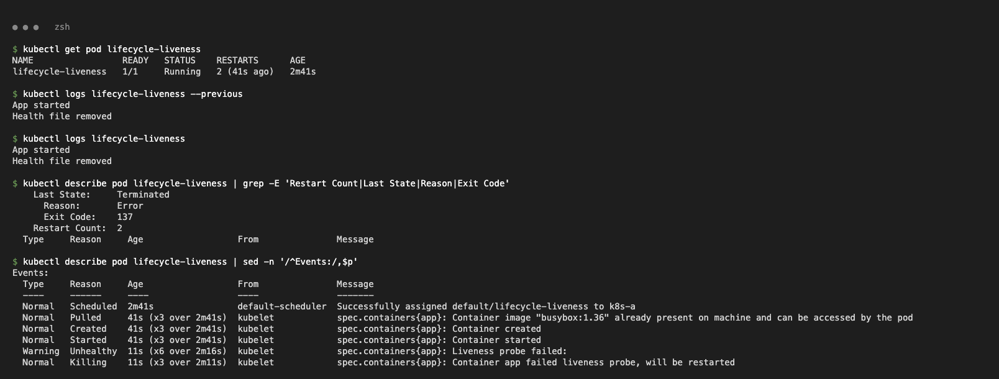
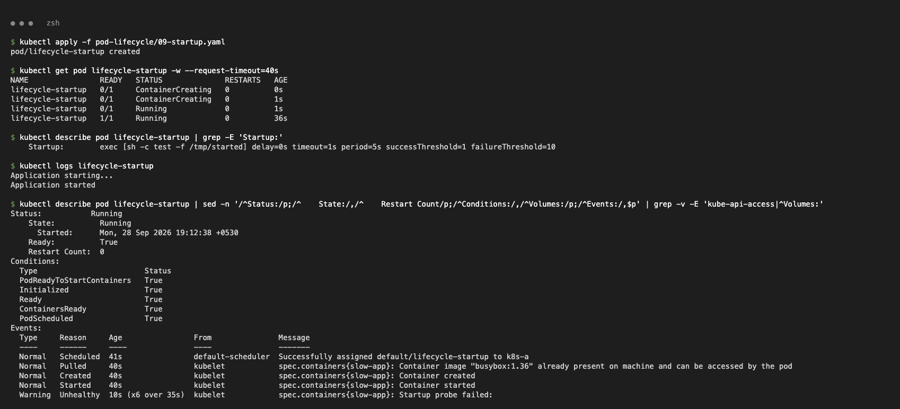
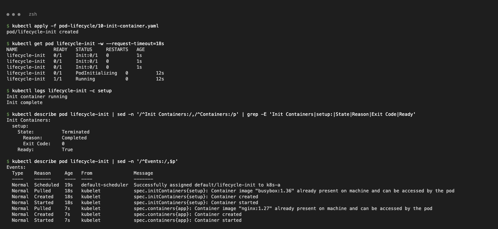
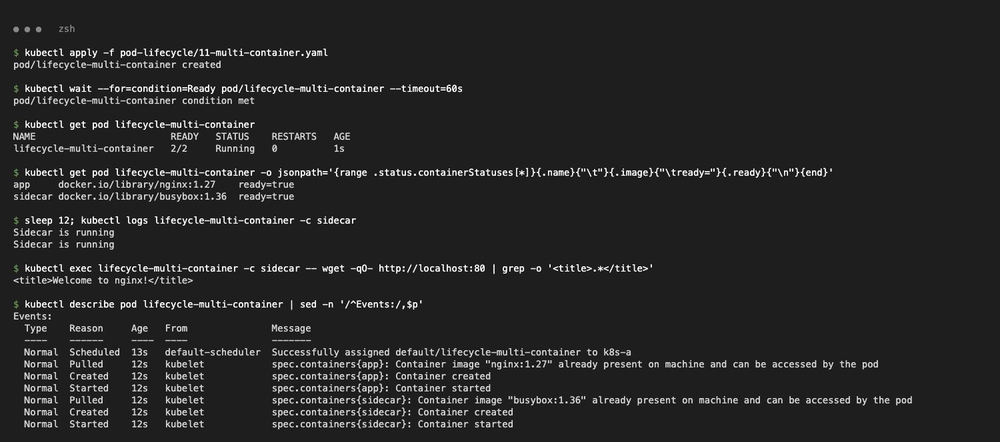
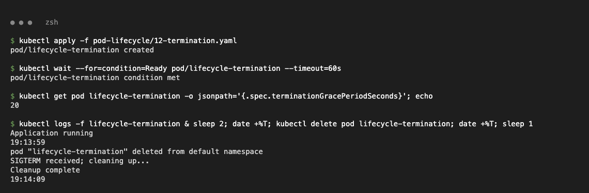
