# Kubernetes Fundamentals Assignment (Session 9)

minikube v1.39.0 on macOS Apple Silicon (Docker driver, profile `k8s-a`), Kubernetes v1.37.0, containerd 2.3.4.

## 1. Install & configure minikube

```bash
brew install minikube kubectl
minikube version
minikube start -p k8s-a --driver=docker --cpus=3 --memory=3072
minikube status -p k8s-a
```

```text
minikube version: v1.39.0
* Preparing Kubernetes v1.37.0 on containerd 2.3.4 ...
* Done! kubectl is now configured to use "k8s-a" cluster and "default" namespace by default
host: Running
kubelet: Running
apiserver: Running
kubeconfig: Configured
```

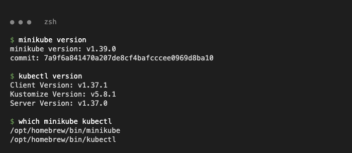
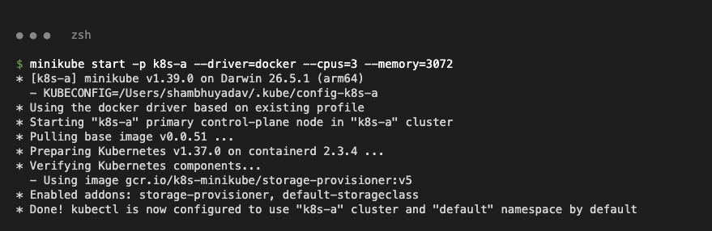
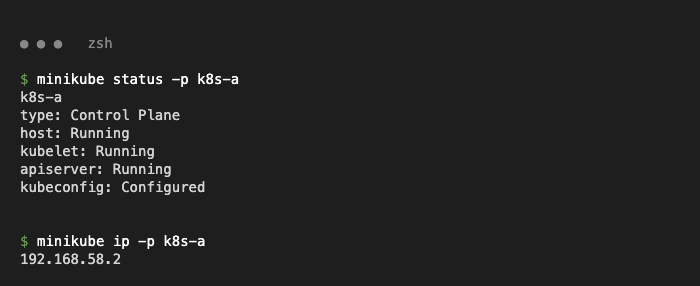

**Issue:** after the first start the CNI pod `kindnet` was in `ImagePullBackOff` (node `NotReady`):
`x509: certificate has expired or is not yet valid: current time 2026-09-28 is before 2026-10-06` — the Mac clock is behind Docker Hub's certificate. **Fix:** make the node's containerd pull `docker.io` images through `mirror.gcr.io` (manifests unchanged):

```bash
minikube -p k8s-a ssh -- "printf 'server = \"https://registry-1.docker.io\"\n\n[host.\"https://mirror.gcr.io\"]\n  capabilities = [\"pull\", \"resolve\"]\n' \
  | sudo tee /etc/containerd/certs.d/docker.io/hosts.toml && sudo systemctl restart containerd"
kubectl -n kube-system delete pod -l app=kindnet
```

## 2. Verify cluster status

```bash
kubectl cluster-info
kubectl get nodes -o wide
kubectl get pods -A
```

```text
Kubernetes control plane is running at https://127.0.0.1:58525
CoreDNS is running at https://127.0.0.1:58525/api/v1/namespaces/kube-system/services/kube-dns:dns/proxy
NAME    STATUS   ROLES           AGE     VERSION   INTERNAL-IP    OS-IMAGE                         CONTAINER-RUNTIME
k8s-a   Ready    control-plane   4m42s   v1.37.0   192.168.58.2   Debian GNU/Linux 12 (bookworm)   containerd://2.3.4
kube-system   coredns-559f6c778d-5j24x        1/1     Running   0          4m36s
kube-system   etcd-k8s-a                      1/1     Running   0          4m41s
kube-system   kindnet-qkjjz                   1/1     Running   0          79s
kube-system   kube-apiserver-k8s-a            1/1     Running   0          4m41s
kube-system   kube-controller-manager-k8s-a   1/1     Running   0          4m41s
kube-system   kube-proxy-fbjhx                1/1     Running   0          4m36s
kube-system   kube-scheduler-k8s-a            1/1     Running   0          4m43s
kube-system   storage-provisioner             1/1     Running   0          4m39s
```

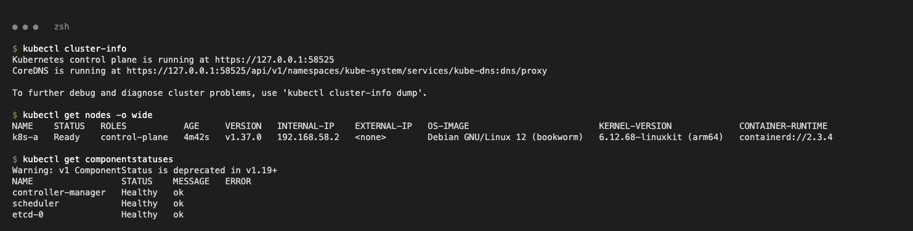
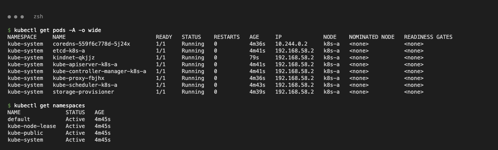

## 3. Architecture

```bash
kubectl get pods -n kube-system -l tier=control-plane
minikube -p k8s-a ssh -- 'sudo systemctl is-active kubelet containerd; ls /etc/kubernetes/manifests'
```

```text
etcd-k8s-a                      etcd                      Running   registry.k8s.io/etcd:3.7.0-0
kube-apiserver-k8s-a            kube-apiserver            Running   registry.k8s.io/kube-apiserver:v1.37.0
kube-controller-manager-k8s-a   kube-controller-manager   Running   registry.k8s.io/kube-controller-manager:v1.37.0
kube-scheduler-k8s-a            kube-scheduler            Running   registry.k8s.io/kube-scheduler:v1.37.0
active        <- kubelet (systemd service on the node)
active        <- containerd
etcd.yaml  kube-apiserver.yaml  kube-controller-manager.yaml  kube-scheduler.yaml   <- static pods started by kubelet
```

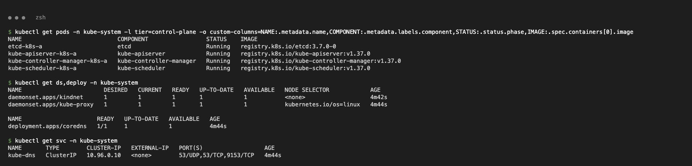
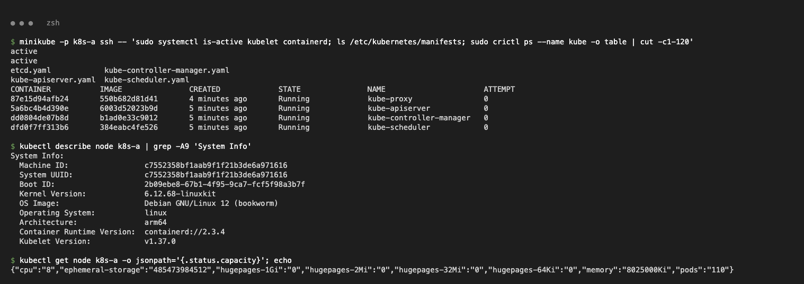

**Notes on the architecture**

| Component | Role |
| --- | --- |
| kube-apiserver | Front door; every client talks to it; stores state in etcd |
| etcd | Key/value store of the whole cluster state |
| kube-scheduler | Picks a node for new Pods |
| kube-controller-manager | Control loops (Deployment, ReplicaSet, Node …) that reconcile desired vs actual state |
| kubelet (node) | Runs Pods on the node via the container runtime, reports status, runs probes |
| containerd (node) | Container runtime (CRI): pulls images, runs containers |
| kube-proxy (node, DaemonSet) | Programs iptables rules for Services |
| CoreDNS / CNI (add-ons) | Cluster DNS / Pod networking (kindnet) |

Flow: `kubectl` → API server (etcd) → controllers create ReplicaSet/Pods → scheduler assigns node → kubelet starts containers. In minikube one node is both control plane and worker.

## 4. Basic objects & commands

```bash
kubectl api-resources --api-group=apps
kubectl explain pod.spec.containers
kubectl run nginx-pod --image=nginx:1.27 --port=80
kubectl get pods -o wide
kubectl logs nginx-pod
kubectl exec nginx-pod -- nginx -v
kubectl delete pod nginx-pod
```

```text
nginx-pod   1/1     Running   0          0s    10.244.0.3   k8s-a
nginx version: nginx/1.27.5
```

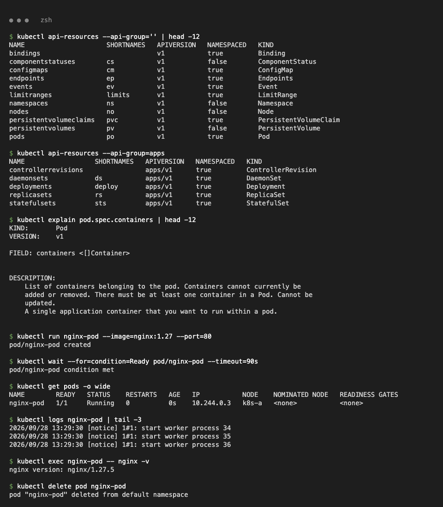

## 5. Kubernetes Basics tutorial

`gcr.io/google-samples/kubernetes-bootcamp:v1` is amd64-only, so the arm64 image `registry.k8s.io/e2e-test-images/agnhost` (`netexec`, `/hostname` returns the pod name) was used: tag `2.39` = v1, `2.40` = v2.

**Create a Deployment**

```bash
kubectl create deployment kubernetes-bootcamp --image=registry.k8s.io/e2e-test-images/agnhost:2.39 -- /agnhost netexec --http-port=8080
kubectl get deployments,pods
```

```text
kubernetes-bootcamp   1/1     1            1           0s
kubernetes-bootcamp-99dc48984-wnl8k   1/1     Running   0          1s    10.244.0.4
```

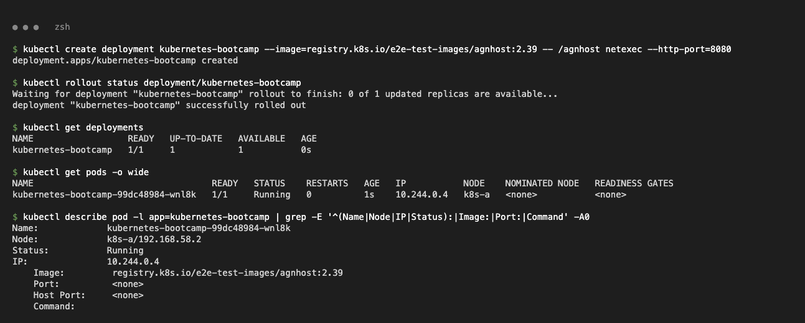

**Explore the app** (`kubectl proxy`, logs, exec)

```text
$ curl http://localhost:8001/api/v1/namespaces/default/pods/$POD:8080/proxy/hostname
kubernetes-bootcamp-99dc48984-wnl8k
$ kubectl exec $POD -- env | grep HOSTNAME
HOSTNAME=kubernetes-bootcamp-99dc48984-wnl8k
```

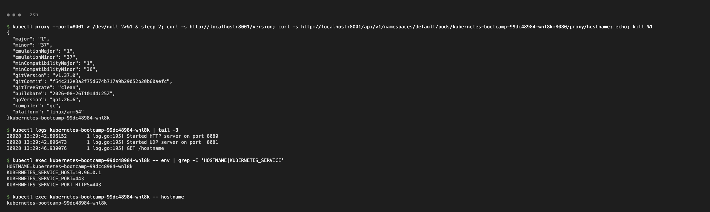

**Expose with a Service + labels**

```bash
kubectl expose deployment/kubernetes-bootcamp --type=NodePort --port=8080
minikube -p k8s-a service kubernetes-bootcamp --url
kubectl label pods -l app=kubernetes-bootcamp version=v1
```

```text
kubernetes-bootcamp   NodePort    10.106.236.8   <none>        8080:31633/TCP   0s
http://127.0.0.1:60342
$ curl -s http://127.0.0.1:60342/hostname
kubernetes-bootcamp-99dc48984-wnl8k
```

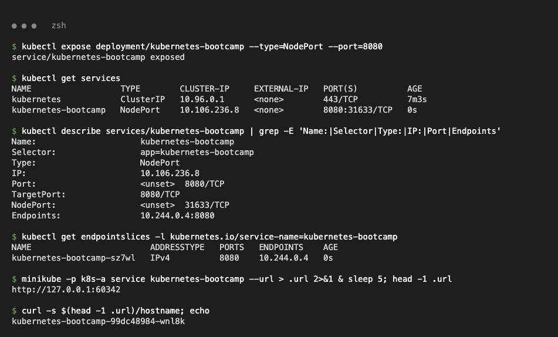
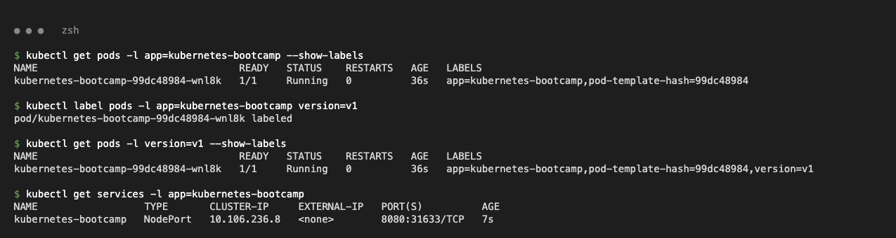

**Scale**

```bash
kubectl scale deployments/kubernetes-bootcamp --replicas=4
```

```text
$ for i in $(seq 1 40); do kubectl exec curl -- curl -s http://kubernetes-bootcamp:8080/hostname; echo; done | sort | uniq -c
   9 kubernetes-bootcamp-99dc48984-6qfhj
   7 kubernetes-bootcamp-99dc48984-9s9s6
  15 kubernetes-bootcamp-99dc48984-wnl8k
   9 kubernetes-bootcamp-99dc48984-xd57m
```

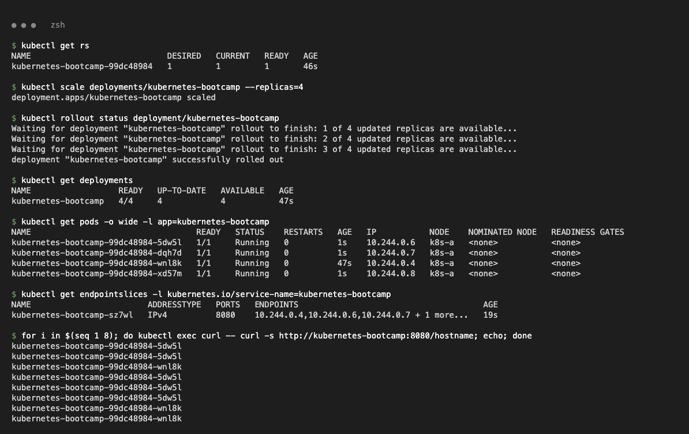
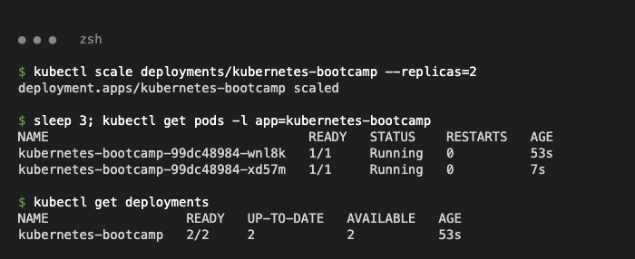

**Rolling update and rollback**

```bash
kubectl set image deployments/kubernetes-bootcamp agnhost=registry.k8s.io/e2e-test-images/agnhost:2.40
kubectl rollout status deployment/kubernetes-bootcamp
kubectl set image deployments/kubernetes-bootcamp agnhost=registry.k8s.io/e2e-test-images/agnhost:v10   # bad tag
kubectl rollout undo deployment/kubernetes-bootcamp
```

```text
deployment "kubernetes-bootcamp" successfully rolled out
kubernetes-bootcamp-6f598bcf4d   4   4   4   1s     <- new RS (2.40)
kubernetes-bootcamp-99dc48984    0   0   0   69s    <- old RS kept for rollback

kubernetes-bootcamp   3/4     2            3           99s
kubernetes-bootcamp-7c4fc9cb49-8fkw4   0/1     ImagePullBackOff   0          20s
deployment.apps/kubernetes-bootcamp rolled back      -> all 4 pods back on agnhost:2.40
```

The bad version never got ready and 3 old pods kept serving; `rollout undo` restored the previous ReplicaSet.

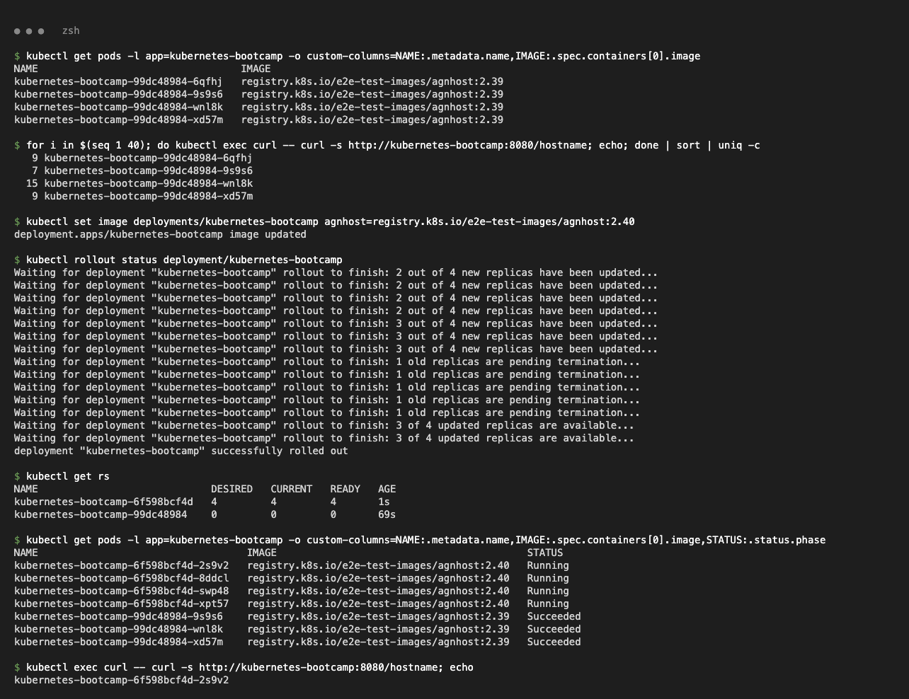
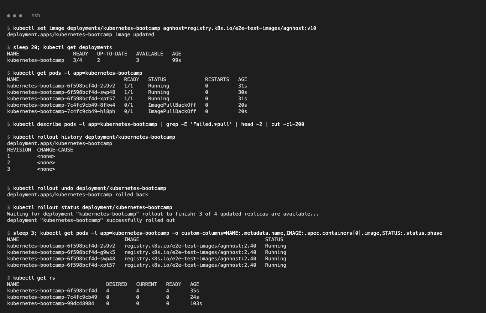
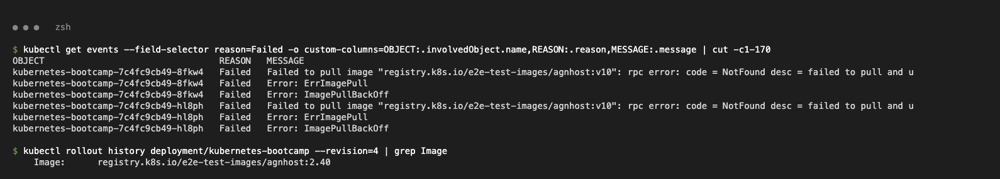
