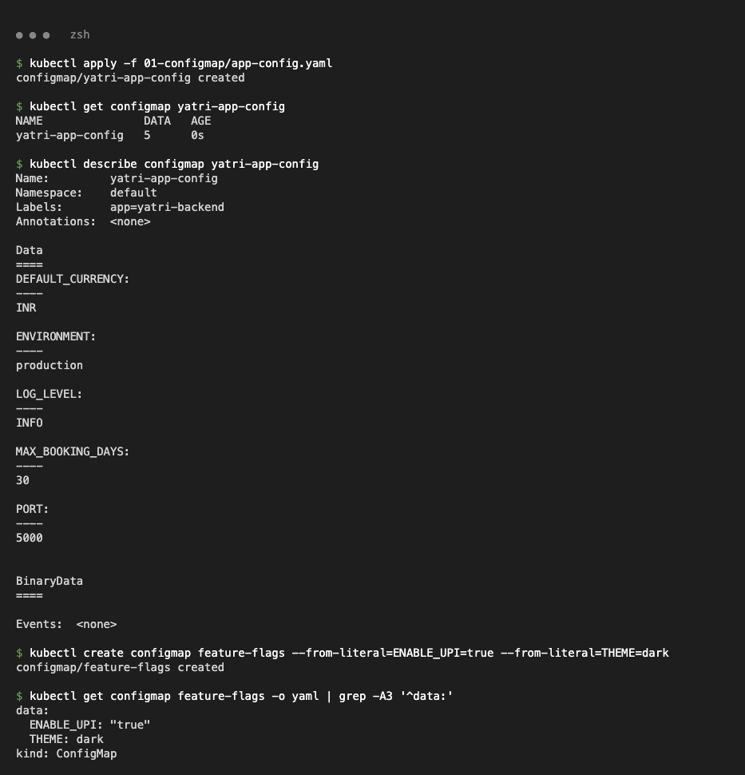
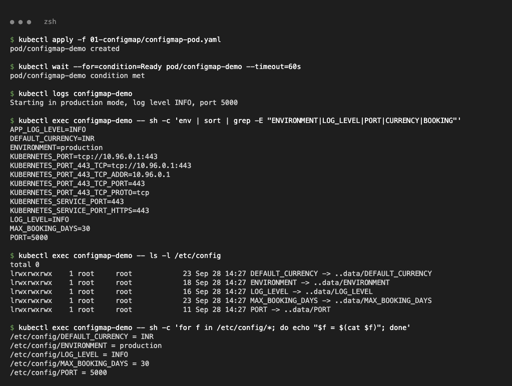
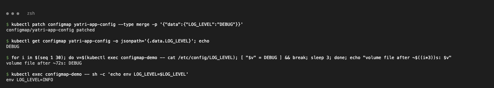
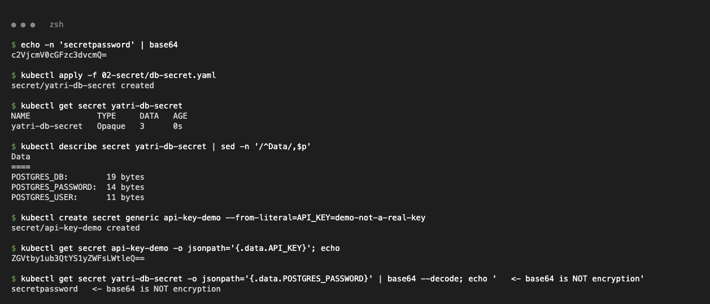
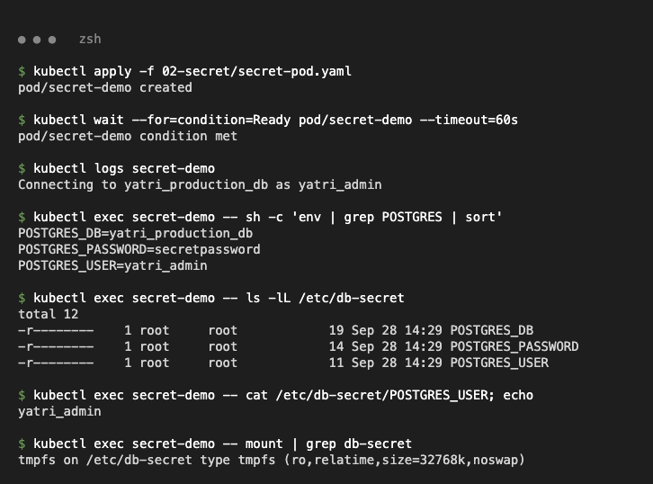
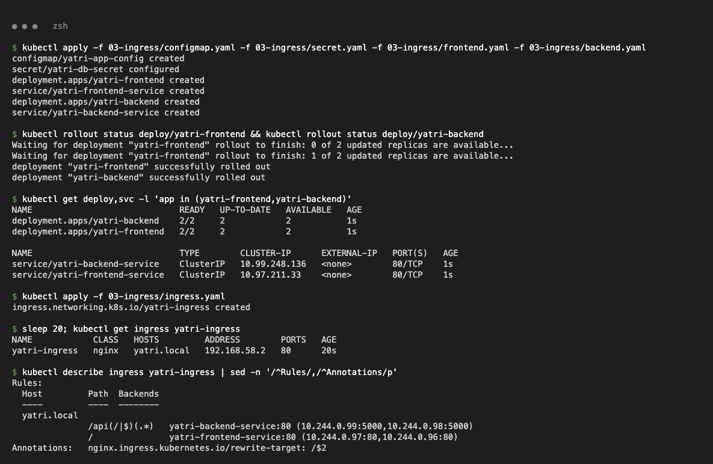
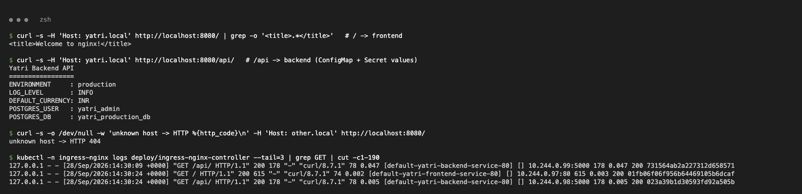
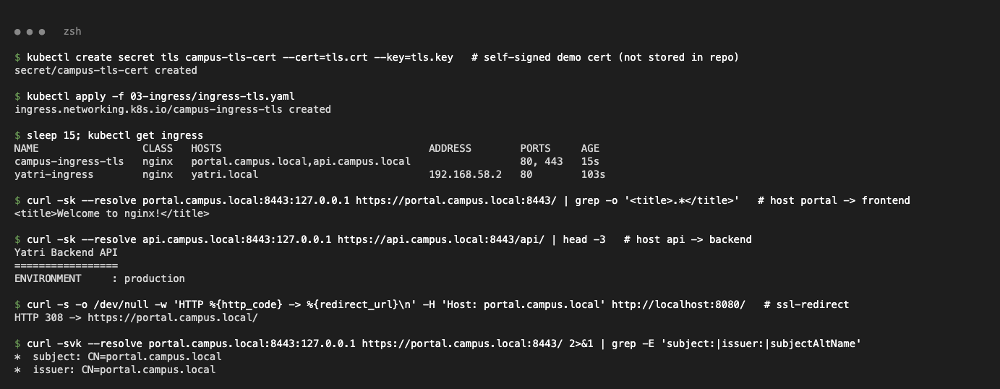
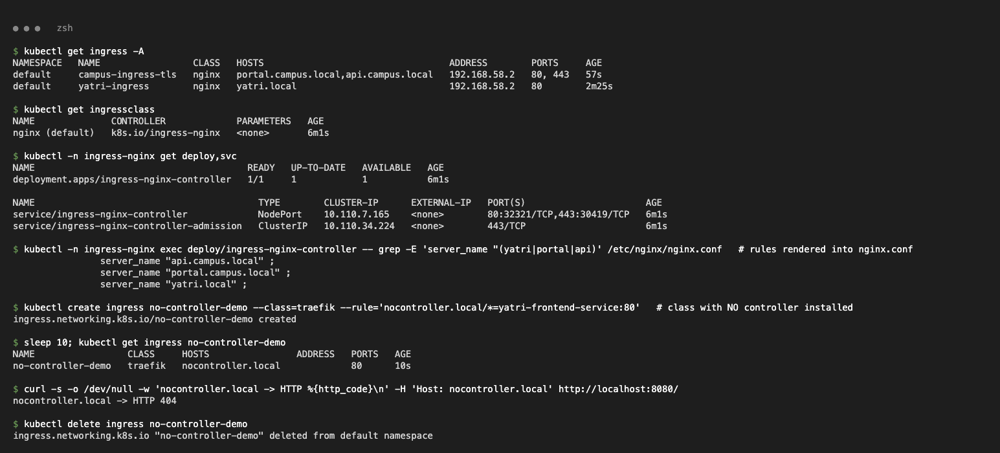

# Ingress, ConfigMaps & Secrets Assignment (Session 12)

Cluster: minikube profile `k8s-a` (Kubernetes v1.37.0) with the `ingress` addon (ingress-nginx v1.15.1). Class YAMLs from `session-12-ingress-configmaps-secrets` are used unchanged; `configmap-pod.yaml` and `secret-pod.yaml` were added.

```text
01-configmap/     app-config.yaml (class)  configmap-pod.yaml
02-secret/        db-secret.yaml (class, dummy values)  secret-pod.yaml  .gitignore
03-ingress/       configmap.yaml secret.yaml frontend.yaml backend.yaml ingress.yaml ingress-tls.yaml (class)
troubleshooting/  README.md + class/fixed YAMLs
screenshots/
```

## Task 1 — ConfigMap

```bash
kubectl apply -f 01-configmap/app-config.yaml
kubectl create configmap feature-flags --from-literal=ENABLE_UPI=true --from-literal=THEME=dark
kubectl apply -f 01-configmap/configmap-pod.yaml      # envFrom + configMapKeyRef + volume
kubectl exec configmap-demo -- env
kubectl exec configmap-demo -- ls /etc/config
```

```text
$ kubectl logs configmap-demo
Starting in production mode, log level INFO, port 5000
$ kubectl exec configmap-demo -- env | sort | grep ...
APP_LOG_LEVEL=INFO
DEFAULT_CURRENCY=INR
ENVIRONMENT=production
LOG_LEVEL=INFO
MAX_BOOKING_DAYS=30
PORT=5000
$ kubectl exec configmap-demo -- sh -c 'for f in /etc/config/*; do echo "$f = $(cat $f)"; done'
/etc/config/DEFAULT_CURRENCY = INR
/etc/config/ENVIRONMENT = production
/etc/config/LOG_LEVEL = INFO
...
```




After `kubectl patch configmap yatri-app-config ... LOG_LEVEL=DEBUG` the mounted file changed to `DEBUG` (after ~72 s) while the env var stayed `INFO` — env vars are only read at container start.



## Task 2 — Secret

```bash
kubectl apply -f 02-secret/db-secret.yaml
kubectl create secret generic api-key-demo --from-literal=API_KEY=demo-not-a-real-key
kubectl apply -f 02-secret/secret-pod.yaml          # secretKeyRef env + secret volume (mode 0400)
```

```text
$ kubectl describe secret yatri-db-secret
POSTGRES_DB:        19 bytes
POSTGRES_PASSWORD:  14 bytes
POSTGRES_USER:      11 bytes
$ kubectl get secret yatri-db-secret -o jsonpath='{.data.POSTGRES_PASSWORD}' | base64 --decode
secretpassword                                   <- base64 is NOT encryption
$ kubectl exec secret-demo -- sh -c 'env | grep POSTGRES'
POSTGRES_DB=yatri_production_db
POSTGRES_PASSWORD=secretpassword
POSTGRES_USER=yatri_admin
$ kubectl exec secret-demo -- ls -lL /etc/db-secret
-r--------    1 root     root            19 Sep 28 14:29 POSTGRES_DB
-r--------    1 root     root            14 Sep 28 14:29 POSTGRES_PASSWORD
-r--------    1 root     root            11 Sep 28 14:29 POSTGRES_USER
$ kubectl exec secret-demo -- mount | grep db-secret
tmpfs on /etc/db-secret type tmpfs (ro,relatime,size=32768k,noswap)
```




**Why Secrets must not be committed to Git**

- `data:` is only **base64-encoded**, not encrypted — anyone with the repo can decode it (shown above), and Git history keeps it forever even after deletion.
- Keep real secret files out of Git (`.gitignore`: see `02-secret/.gitignore`); the values in this repo are dummy demo values.
- Use **Sealed Secrets** (encrypted `SealedSecret` safe to commit), **External Secrets Operator** (Vault / AWS Secrets Manager), or **SOPS**; enable etcd encryption at rest and restrict `get secret` with RBAC.

## Task 3 — Ingress

Path-based (`03-ingress/ingress.yaml`, host `yatri.local`): `/` → frontend, `/api` → backend.

```bash
kubectl apply -f 03-ingress/configmap.yaml -f 03-ingress/secret.yaml -f 03-ingress/frontend.yaml -f 03-ingress/backend.yaml
kubectl apply -f 03-ingress/ingress.yaml
kubectl -n ingress-nginx port-forward svc/ingress-nginx-controller 8080:80 8443:443 &
curl -H 'Host: yatri.local' http://localhost:8080/
curl -H 'Host: yatri.local' http://localhost:8080/api/
```

```text
yatri-ingress   nginx   yatri.local   192.168.58.2   80      20s
  yatri.local  /api(/|$)(.*)   yatri-backend-service:80 (10.244.0.99:5000,10.244.0.98:5000)
               /               yatri-frontend-service:80 (10.244.0.97:80,10.244.0.96:80)

/      -> <title>Welcome to nginx!</title>
/api/  -> Yatri Backend API
          ENVIRONMENT     : production
          POSTGRES_USER   : yatri_admin          (ConfigMap + Secret injected)
Host: other.local -> HTTP 404
```




Host-based + TLS (`03-ingress/ingress-tls.yaml`): `portal.campus.local` → frontend, `api.campus.local/api` → backend. TLS secret created from a self-signed cert (key not stored in the repo):

```text
$ kubectl create secret tls campus-tls-cert --cert=tls.crt --key=tls.key
$ curl -sk --resolve portal.campus.local:8443:127.0.0.1 https://portal.campus.local:8443/   -> <title>Welcome to nginx!</title>
$ curl -sk --resolve api.campus.local:8443:127.0.0.1 https://api.campus.local:8443/api/     -> Yatri Backend API
$ curl -H 'Host: portal.campus.local' http://localhost:8080/                               -> HTTP 308 -> https://portal.campus.local/
*  subject: CN=portal.campus.local
```



## Task 4 — Ingress vs Ingress Controller

| | Ingress | Ingress Controller |
| --- | --- | --- |
| What | API object (YAML) with routing **rules**: host, path → Service, TLS | A running **proxy** (pods) that watches Ingress objects and implements them |
| Here | `yatri-ingress`, `campus-ingress-tls` | `ingress-nginx-controller` Deployment + NodePort Service in `ingress-nginx` |
| Does traffic? | No — just config | Yes — receives requests, routes to pod endpoints |
| Examples | `kind: Ingress`, `ingressClassName: nginx` | ingress-nginx, Traefik, HAProxy, AWS ALB Controller, GKE Ingress |

**Why both:** the Ingress says *what* to route; the controller *does* it. The controller rendered the rules into nginx config (`server_name "yatri.local"` etc.). An Ingress with a class that has no controller (`traefik`) got no ADDRESS and requests returned 404.

```text
$ kubectl get ingressclass
nginx (default)   k8s.io/ingress-nginx
$ kubectl -n ingress-nginx exec deploy/ingress-nginx-controller -- grep -E 'server_name "(yatri|portal|api)' /etc/nginx/nginx.conf
		server_name "api.campus.local" ;
		server_name "portal.campus.local" ;
		server_name "yatri.local" ;
$ kubectl get ingress no-controller-demo
no-controller-demo   traefik   nocontroller.local             80      10s
nocontroller.local -> HTTP 404
```



## Task 5 — Troubleshooting

See [troubleshooting/README.md](troubleshooting/README.md): Secret trailing-newline (`FATAL: password authentication failed` → fixed with `echo -n`), Service with empty endpoints (selector typo), Deployment selector/label mismatch.

## Cleanup

```bash
kubectl delete -f 03-ingress/ -f 01-configmap/ -f 02-secret/ -f troubleshooting/
kubectl delete secret campus-tls-cert
```
