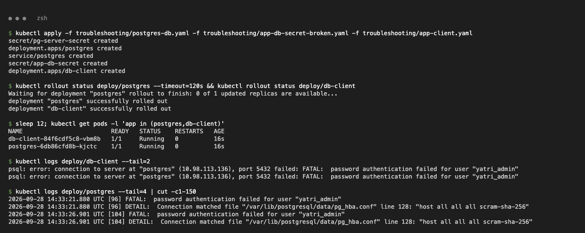
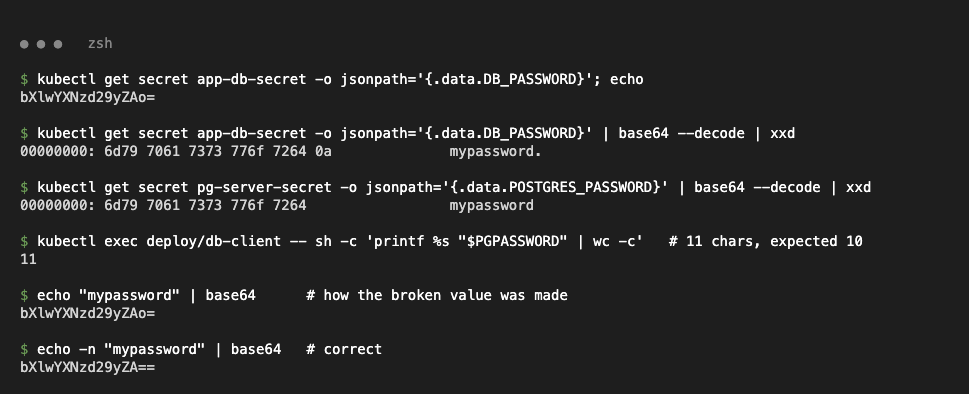
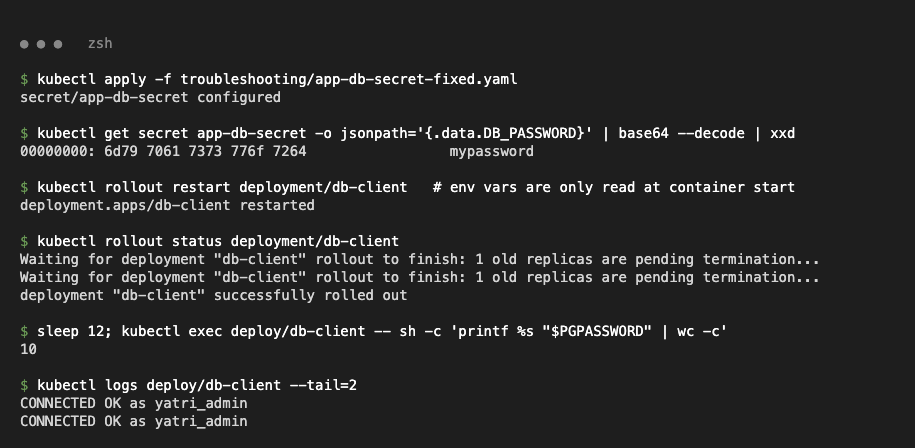
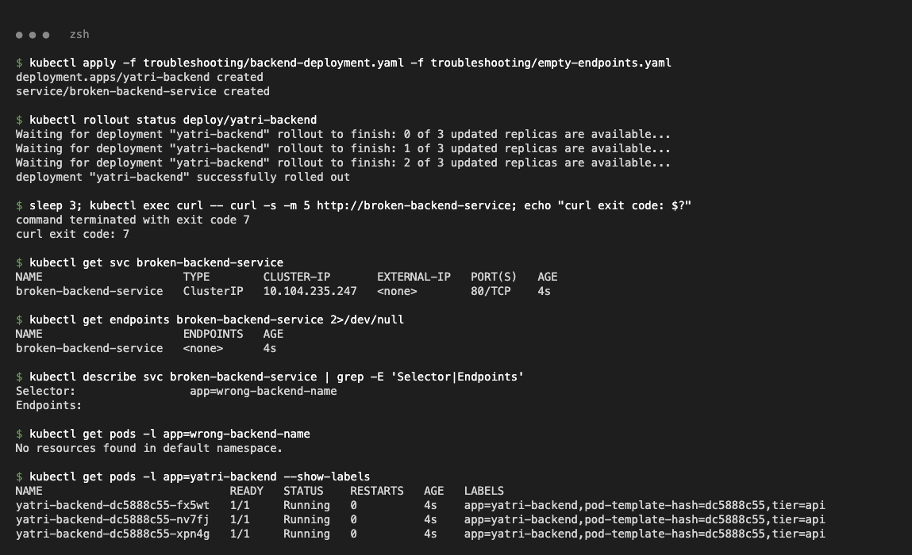
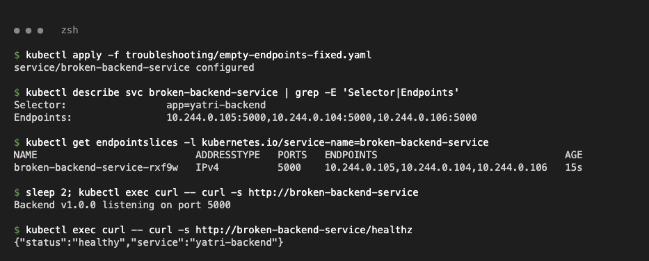
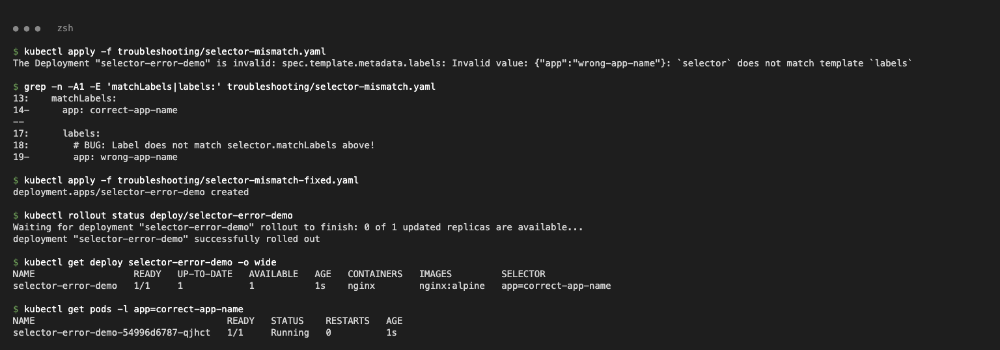

# Troubleshooting

Class files: `secret-base64-gotcha.md` (session 12), `empty-endpoints.yaml` + `backend-deployment.yaml` (session 11), `selector-mismatch.yaml` (session 10). `*-fixed.yaml` files are the corrected versions.

## Case 1 — Secret with a trailing newline (`secret-base64-gotcha.md`)

Files: `postgres-db.yaml` (DB, password `mypassword`), `app-db-secret-broken.yaml`, `app-db-secret-fixed.yaml`, `app-client.yaml` (connects with `psql`). Dummy demo values only.

**Problem**

```bash
kubectl apply -f postgres-db.yaml -f app-db-secret-broken.yaml -f app-client.yaml
kubectl logs deploy/db-client --tail=2
```

```text
psql: error: connection to server at "postgres" (10.98.113.136), port 5432 failed: FATAL:  password authentication failed for user "yatri_admin"
```



**Investigation / root cause**

```text
$ kubectl get secret app-db-secret -o jsonpath='{.data.DB_PASSWORD}' | base64 --decode | xxd
00000000: 6d79 7061 7373 776f 7264 0a              mypassword.      <- 0a = trailing newline
$ kubectl get secret pg-server-secret -o jsonpath='{.data.POSTGRES_PASSWORD}' | base64 --decode | xxd
00000000: 6d79 7061 7373 776f 7264                 mypassword
$ kubectl exec deploy/db-client -- sh -c 'printf %s "$PGPASSWORD" | wc -c'
11
$ echo "mypassword" | base64       ->  bXlwYXNzd29yZAo=   (how the broken value was made)
$ echo -n "mypassword" | base64    ->  bXlwYXNzd29yZA==   (correct)
```

The value was encoded with `echo` without `-n`, so the app sent `mypassword\n` (11 bytes).



**Fix + after**

```bash
kubectl apply -f app-db-secret-fixed.yaml
kubectl rollout restart deployment/db-client     # env vars are read only at container start
```

```text
$ kubectl exec deploy/db-client -- sh -c 'printf %s "$PGPASSWORD" | wc -c'
10
$ kubectl logs deploy/db-client --tail=2
CONNECTED OK as yatri_admin
```



## Case 2 — Service with no endpoints (`empty-endpoints.yaml`)

**Problem**

```text
$ kubectl exec curl -- curl -s -m 5 http://broken-backend-service
command terminated with exit code 7
$ kubectl get endpoints broken-backend-service
broken-backend-service   <none>      4s
```

**Root cause:** Service selector `app=wrong-backend-name` matches no pod; the pods are labelled `app=yatri-backend`.

```text
$ kubectl describe svc broken-backend-service | grep -E 'Selector|Endpoints'
Selector:                 app=wrong-backend-name
Endpoints:
$ kubectl get pods -l app=yatri-backend --show-labels
yatri-backend-dc5888c55-fx5wt   1/1   Running   0   4s   app=yatri-backend,pod-template-hash=dc5888c55,tier=api
```



**Fix + after** — `empty-endpoints-fixed.yaml` uses `selector: app: yatri-backend`:

```text
Selector:                 app=yatri-backend
Endpoints:                10.244.0.105:5000,10.244.0.104:5000,10.244.0.106:5000
$ kubectl exec curl -- curl -s http://broken-backend-service
Backend v1.0.0 listening on port 5000
```



## Case 3 — Deployment selector does not match template labels (`selector-mismatch.yaml`)

```text
$ kubectl apply -f selector-mismatch.yaml
The Deployment "selector-error-demo" is invalid: spec.template.metadata.labels: Invalid value: {"app":"wrong-app-name"}: `selector` does not match template `labels`
```

**Root cause:** `selector.matchLabels: app=correct-app-name` but template label `app=wrong-app-name` → rejected by the API server. **Fix:** `selector-mismatch-fixed.yaml` sets the template label to `correct-app-name`.

```text
$ kubectl apply -f selector-mismatch-fixed.yaml
deployment.apps/selector-error-demo created
selector-error-demo   1/1     1            1           1s    nginx        nginx:alpine   app=correct-app-name
```


