# Kubernetes Services Assignment (Session 11)

Cluster: minikube profile `k8s-a` (Kubernetes v1.37.0, kube-proxy iptables mode). YAMLs are the class files from `session-11-kubernetes-services`; only `04-externalname/service.yaml` was fixed (see below). Task 3: [fqdn/README.md](fqdn/README.md) · Task 4: [coredns/README.md](coredns/README.md).

# Task 1 — Service types

```text
$ kubectl get svc -o wide
NAME                        TYPE           CLUSTER-IP       EXTERNAL-IP   PORT(S)        SELECTOR
external-database-service   ExternalName   <none>           example.com   <none>         <none>
web-service-clusterip       ClusterIP      10.110.134.219   <none>        8080/TCP       app=web-clusterip
web-service-headless        ClusterIP      None             <none>        80/TCP         app=web-headless
web-service-loadbalancer    LoadBalancer   10.102.249.242   <pending>     80:30636/TCP   app=web-loadbalancer
web-service-nodeport        NodePort       10.104.238.42    <none>        80:30080/TCP   app=web-nodeport
```

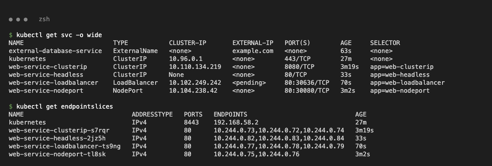

## ClusterIP (`01-clusterip/`)

```bash
kubectl apply -f 01-clusterip/
kubectl exec curl-client -- curl -s http://web-service-clusterip:8080
```

```text
Port: http 8080/TCP   TargetPort: 80/TCP   Endpoints: 10.244.0.73:80,10.244.0.72:80,10.244.0.74:80
HTTP 200 from web-service-clusterip:8080
From the Mac: ClusterIP 10.110.134.219 is NOT reachable (internal only)
```

Stable internal VIP + DNS name; not reachable from outside the cluster.

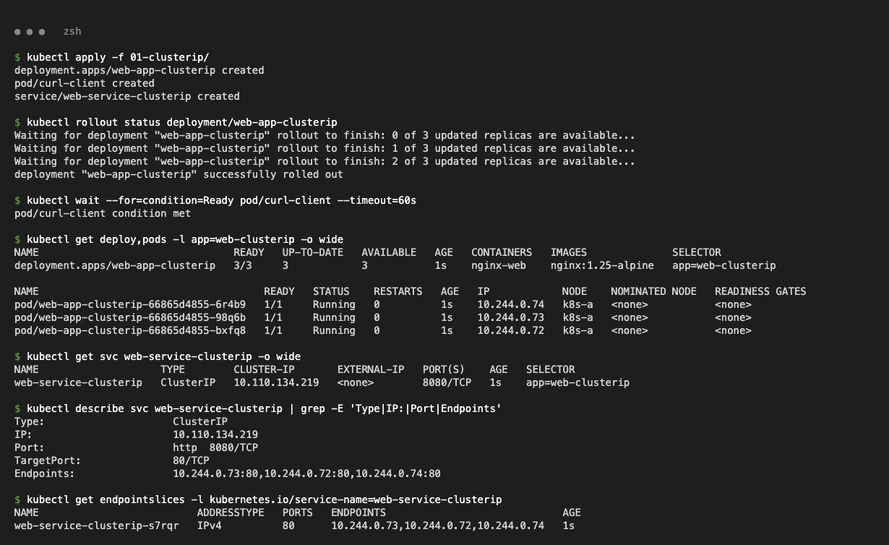
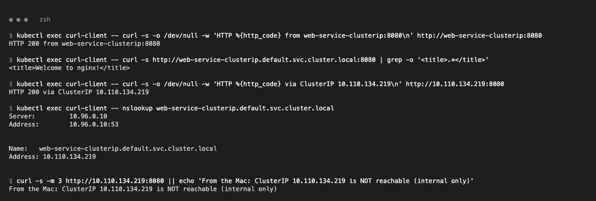

## NodePort (`02-nodeport/`)

```bash
kubectl apply -f 02-nodeport/
minikube -p k8s-a ssh -- curl http://192.168.58.2:30080
minikube -p k8s-a service web-service-nodeport --url
```

```text
web-service-nodeport   NodePort   10.104.238.42   <none>   80:30080/TCP
HTTP_200_via_NodeIP:30080
http://127.0.0.1:63228  -> <title>Welcome to nginx!</title>
```

Port 30080 is opened on the node; on macOS + Docker driver the Mac reaches it through `minikube service --url`.

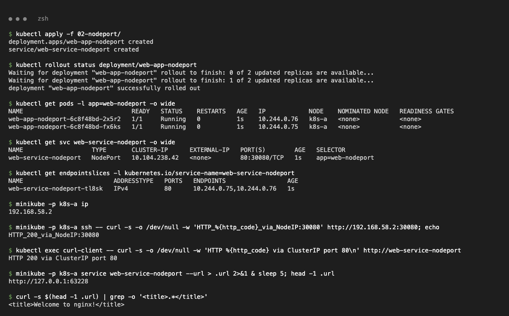

## LoadBalancer (`03-loadbalancer/`)

```bash
kubectl apply -f 03-loadbalancer/
kubectl get svc web-service-loadbalancer
minikube -p k8s-a service web-service-loadbalancer --url
```

```text
web-service-loadbalancer   LoadBalancer   10.107.77.1   <pending>     80:32210/TCP
HTTP_200_via_auto-allocated_NodePort
http://127.0.0.1:63323  -> <title>Welcome to nginx!</title>
```

`<pending>`: minikube has no cloud load balancer. `minikube tunnel` assigned `127.0.0.1` but needs `sudo` for port 80 (`requires privileged ports to be exposed: [80]`), so access was shown via the auto-allocated NodePort.

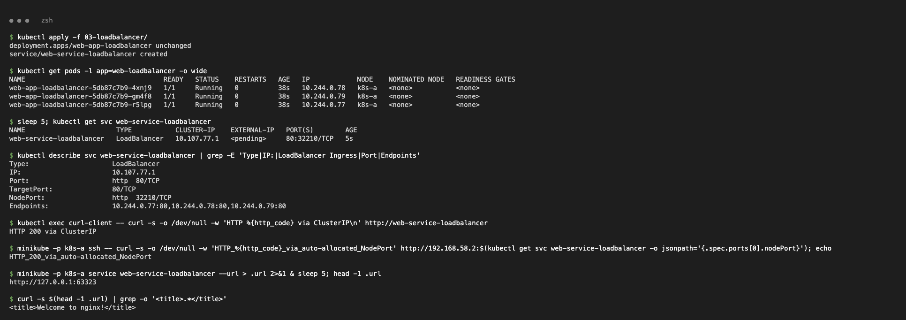
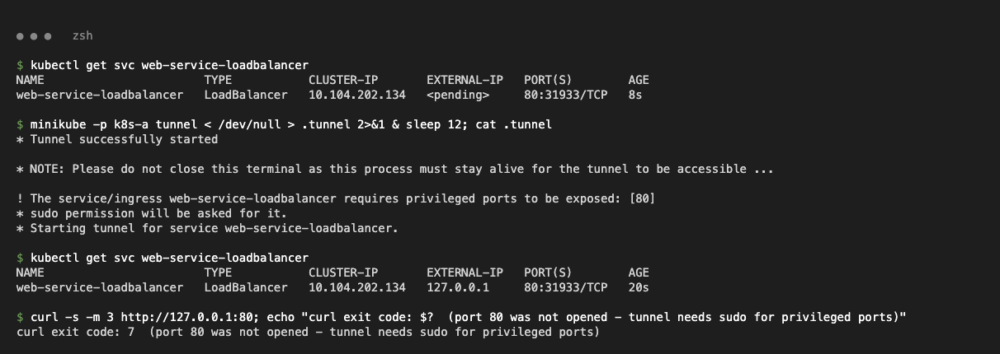

## ExternalName (`04-externalname/`)

```bash
kubectl apply -f 04-externalname/
kubectl exec dns-test-client -- nslookup external-database-service.default.svc.cluster.local
```

Class target `nencyravaliya.me` returned the CNAME but the domain is `NXDOMAIN` (curl exit 6). **Fix:** `externalName: example.com`.

```text
external-database-service.default.svc.cluster.local	canonical name = example.com
Name:	example.com   Address: 104.20.23.154
HTTP 200 from 172.66.147.243
```

Pure DNS CNAME — no ClusterIP, no endpoints.

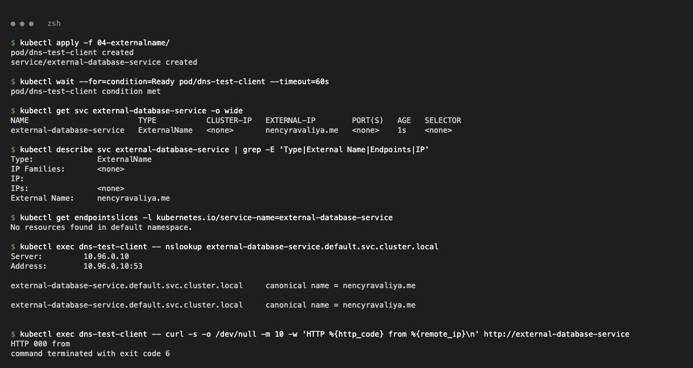
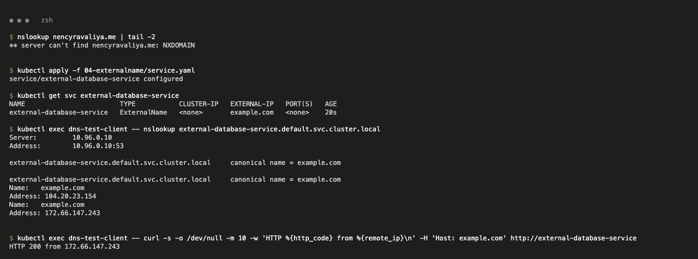

## Headless (`05-headless/`)

```bash
kubectl apply -f 05-headless/
kubectl exec headless-dns-client -- nslookup web-service-headless.default.svc.cluster.local
```

```text
web-service-headless   ClusterIP   None
Name: web-service-headless.default.svc.cluster.local  Address: 10.244.0.82 / 10.244.0.83 / 10.244.0.84
Name: web-stateful-0.web-service-headless.default.svc.cluster.local  Address: 10.244.0.82
web-stateful-1.web-service-headless -> HTTP 200 from 10.244.0.83
```

DNS returns pod IPs directly; each StatefulSet pod gets a stable name.

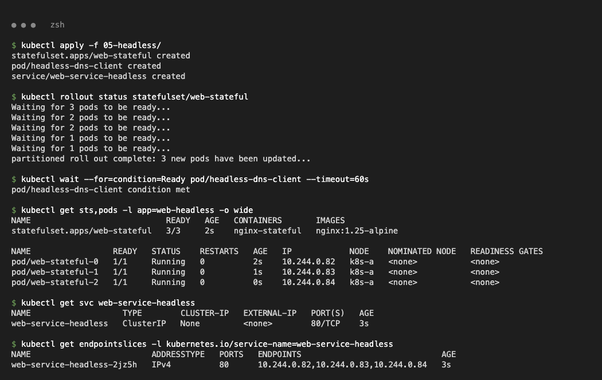
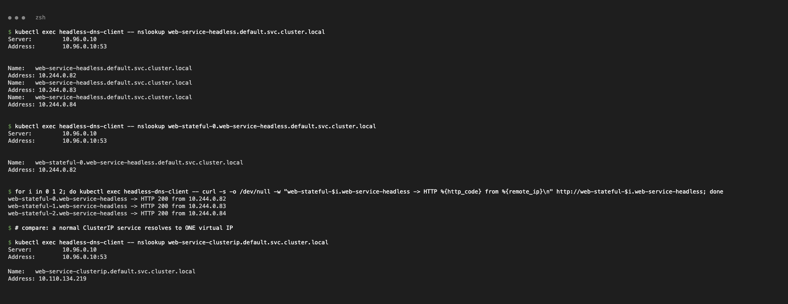

# Task 2 — Comparisons

## Deployment vs ReplicaSet

| | ReplicaSet | Deployment |
| --- | --- | --- |
| Purpose | Keep N identical pods running | Manage versions of an app via ReplicaSets |
| Pod management | Creates/deletes pods directly | Creates one ReplicaSet per template version |
| Scaling | `scale rs` (overridden if owned by a Deployment) | `scale deploy` |
| Rolling updates / rollback | No | Yes (`rollout status/undo/history`) |

```text
replicaset ownerReferences: kind: Deployment, name: web-app-clusterip
pod ownerReferences:        kind: ReplicaSet, name: web-app-clusterip-66865d4855
kubectl delete pod ...6r4b9           -> new pod ...cfv5s created by the RS
kubectl scale rs ... --replicas=5     -> back to 3 (Deployment wins)
```

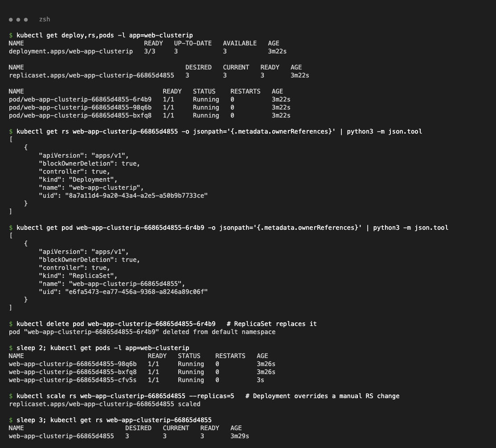

## Deployment vs DaemonSet vs StatefulSet

| | Deployment | DaemonSet | StatefulSet |
| --- | --- | --- | --- |
| Use case | Stateless apps | One pod per node (agents) | Stateful apps (DBs) |
| Pod creation | Via ReplicaSet, parallel, random names | One per node, automatic on new nodes | Ordered `-0, -1, -2`, stable names |
| Scaling | `replicas` | Follows node count | `replicas`, ordered |
| Networking | Shared ClusterIP Service | Often hostNetwork/hostPort | Headless Service, DNS per pod |
| Storage | Shared / none | hostPath | `volumeClaimTemplates` → PVC per pod |
| Examples | nginx, APIs | kube-proxy, fluent-bit, node-exporter | MySQL, Kafka, MongoDB |

```text
node-logging-agent-ktk9n            DaemonSet     node-logging-agent
web-app-clusterip-66865d4855-98q6b  ReplicaSet    web-app-clusterip-66865d4855
web-stateful-0                      StatefulSet   web-stateful
```

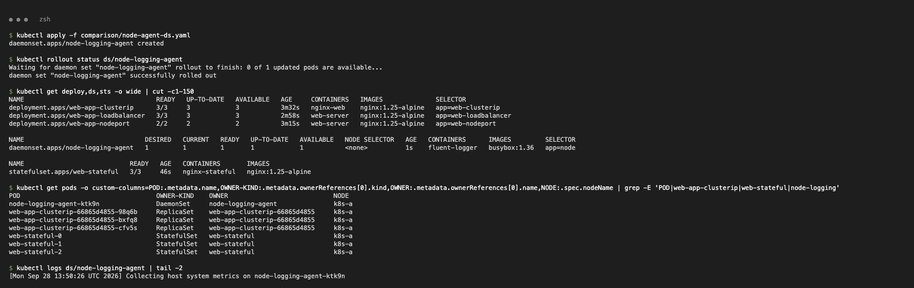

## ReplicaSet vs Service

| | ReplicaSet | Service |
| --- | --- | --- |
| Responsibility | Keeps pods alive (availability) | Stable IP/DNS + load balancing (discovery) |
| Pods | Creates them (IPs change) | Selects Ready pods → EndpointSlice |

**Why a Service:** a replaced pod got a new IP (10.244.0.74 → 10.244.0.85); clients keep using the Service IP. **Traffic path:** CoreDNS resolves the name → kube-proxy's iptables rules DNAT the ClusterIP to a random endpoint:

```text
-A KUBE-SERVICES -d 10.110.134.219/32 ... --dport 8080 -j KUBE-SVC-TIXQXGX7DUC52XEM
-A KUBE-SVC-TIXQXGX7DUC52XEM ... -> 10.244.0.72:80 --probability 0.33333333349 -j KUBE-SEP-LML2WS3OJ3BWQSMS
-A KUBE-SVC-TIXQXGX7DUC52XEM ... -> 10.244.0.73:80 --probability 0.50000000000 -j KUBE-SEP-DBX77TRAF5UQV4HB
-A KUBE-SVC-TIXQXGX7DUC52XEM ... -> 10.244.0.85:80 -j KUBE-SEP-MBPOOIBCFWOH2P5R
-A KUBE-SEP-DBX77TRAF5UQV4HB ... -j DNAT --to-destination 10.244.0.73:80
```

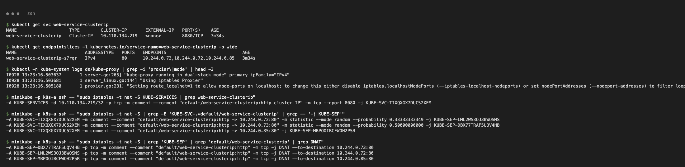
