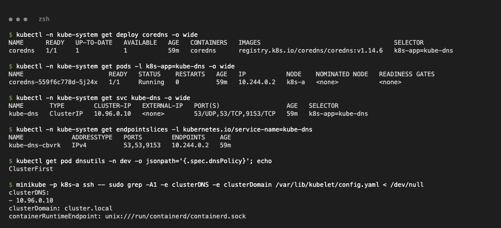
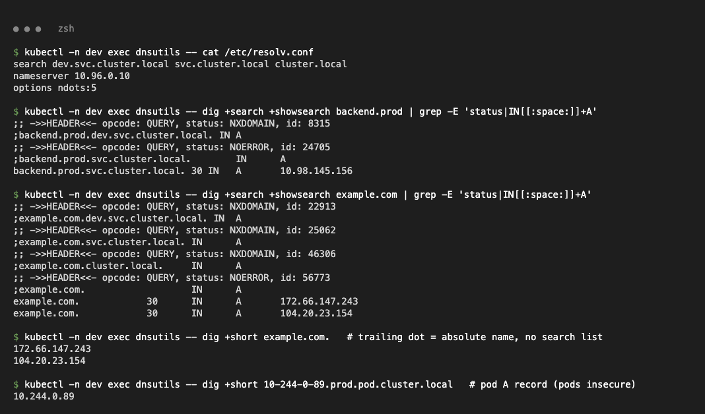
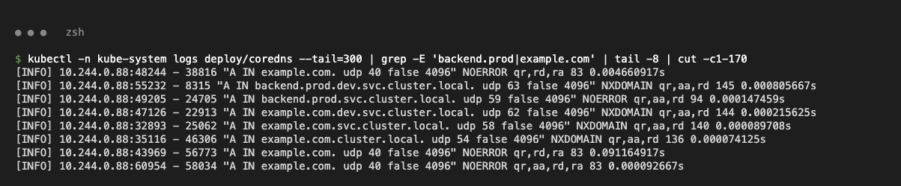
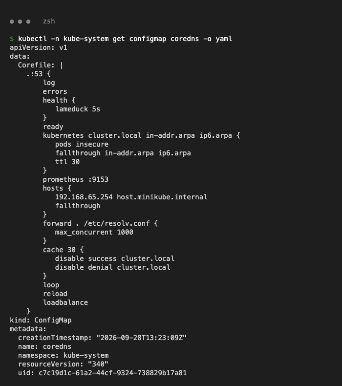
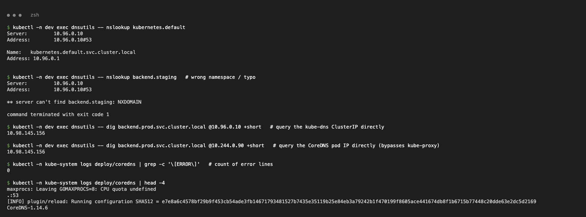
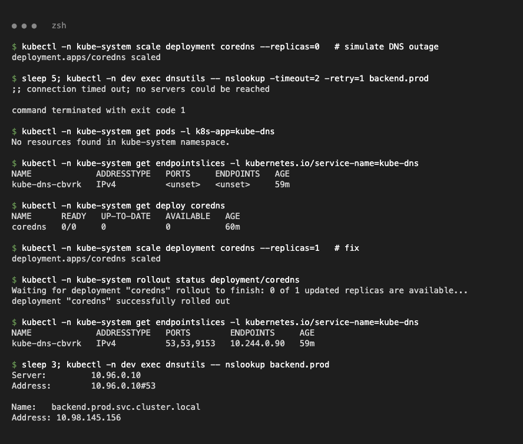

# CoreDNS

Test client: `dnsutils` pod in namespace `dev` (from [`../fqdn/fqdn-demo.yaml`](../fqdn/fqdn-demo.yaml)).

## What & why

- **CoreDNS** is the cluster DNS server (plugin-based, configured by a Corefile); runs as Deployment `coredns` behind Service `kube-dns` (10.96.0.10).
- **Why:** pod/Service IPs change; CoreDNS watches the API and serves stable names, and forwards external names upstream.
- **Service discovery:** every Service gets `<svc>.<ns>.svc.cluster.local` automatically.

```text
coredns    1/1     registry.k8s.io/coredns/coredns:v1.14.6
kube-dns   ClusterIP   10.96.0.10   53/UDP,53/TCP,9153/TCP
dnsPolicy: ClusterFirst
clusterDNS: [10.96.0.10]   clusterDomain: cluster.local      (kubelet config)
```



## How a query is resolved

1. kubelet writes `/etc/resolv.conf`: `nameserver 10.96.0.10`, `search <ns>.svc.cluster.local svc.cluster.local cluster.local`, `ndots:5`.
2. Names with fewer than 5 dots are tried with each search suffix first.
3. CoreDNS answers `cluster.local` from the `kubernetes` plugin; others are forwarded upstream.

```text
$ dig +search +showsearch backend.prod
status: NXDOMAIN   ;backend.prod.dev.svc.cluster.local. IN A
status: NOERROR    ;backend.prod.svc.cluster.local.     IN A   -> 10.98.145.156
$ dig +search +showsearch example.com
NXDOMAIN example.com.dev.svc.cluster.local. / example.com.svc.cluster.local. / example.com.cluster.local.
NOERROR  example.com. -> 172.66.147.243, 104.20.23.154
$ dig +short 10-244-0-89.prod.pod.cluster.local
10.244.0.89
```

CoreDNS log (`log` plugin):

```text
"A IN backend.prod.dev.svc.cluster.local." NXDOMAIN qr,aa,rd 0.000805667s
"A IN backend.prod.svc.cluster.local." NOERROR qr,aa,rd 0.000147459s
"A IN example.com. udp 40 false 4096" NOERROR qr,rd,ra 0.091164917s
```




## Configuration

```bash
kubectl -n kube-system get configmap coredns -o yaml
```

```yaml
  Corefile: |
    .:53 {
        log
        errors
        health {
           lameduck 5s
        }
        ready
        kubernetes cluster.local in-addr.arpa ip6.arpa {
           pods insecure
           fallthrough in-addr.arpa ip6.arpa
           ttl 30
        }
        prometheus :9153
        hosts {
           192.168.65.254 host.minikube.internal
           fallthrough
        }
        forward . /etc/resolv.conf {
           max_concurrent 1000
        }
        cache 30 {
           disable success cluster.local
           disable denial cluster.local
        }
        loop
        reload
        loadbalance
    }
```

| Plugin | Purpose |
| --- | --- |
| `kubernetes` | Service/pod records for `cluster.local` |
| `forward` | External names → node's upstream DNS |
| `cache` | Cache answers 30 s |
| `health` / `ready` | Liveness/readiness endpoints |
| `prometheus` | Metrics on :9153 |
| `log` / `errors` | Query / error logging |
| `loop` / `reload` / `loadbalance` | Loop detection / auto-reload / shuffle A records |



## Troubleshooting DNS

```bash
kubectl exec <pod> -- nslookup kubernetes.default          # basic check
kubectl exec <pod> -- cat /etc/resolv.conf
kubectl -n kube-system get pods,endpointslices -l k8s-app=kube-dns
kubectl -n kube-system logs deploy/coredns
kubectl exec <pod> -- dig <name> @<coredns-pod-ip>          # bypass the Service
```

```text
nslookup kubernetes.default        -> 10.96.0.1
nslookup backend.staging           -> NXDOMAIN (wrong namespace/name)
dig ... @10.96.0.10 / @10.244.0.90 -> 10.98.145.156
grep -c '[ERROR]' coredns logs     -> 0
```



**Scenario — DNS outage:** CoreDNS scaled to 0 → `;; connection timed out; no servers could be reached`. Root cause: no CoreDNS pods, kube-dns EndpointSlice `<unset>`. Fix: `kubectl -n kube-system scale deployment coredns --replicas=1` → endpoint `10.244.0.90`, `backend.prod` resolves again.


