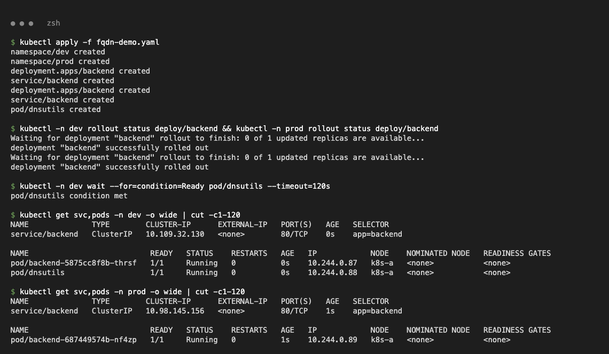
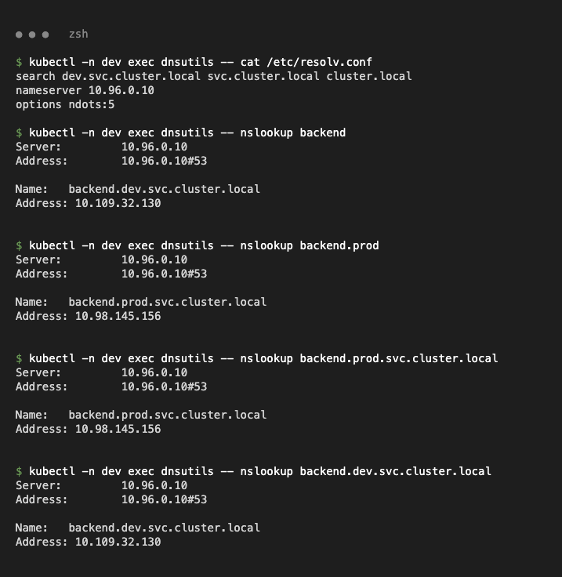
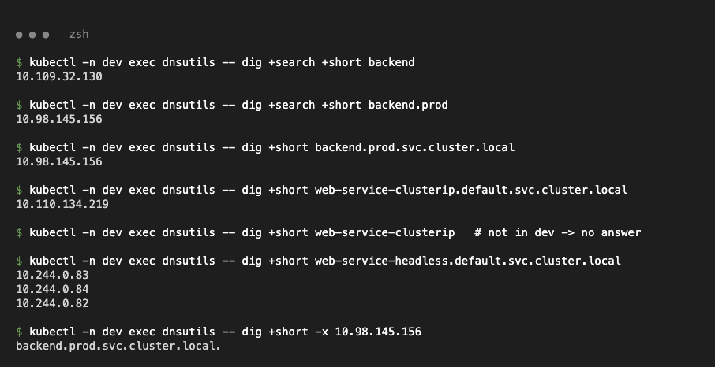
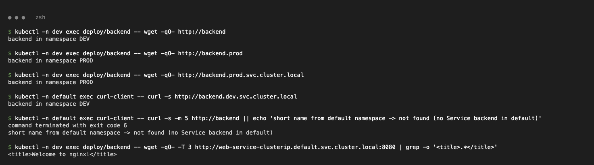

# FQDN & Kubernetes Service DNS

Demo: [`fqdn-demo.yaml`](fqdn-demo.yaml) — namespaces `dev` and `prod`, each with a Service named `backend`, plus a `dnsutils` pod in `dev`.

```bash
kubectl apply -f fqdn-demo.yaml
```



## Concepts

- **FQDN** (Fully Qualified Domain Name): the complete absolute name, e.g. `backend.prod.svc.cluster.local.` — unambiguous from anywhere.
- **Service DNS:** CoreDNS creates a record for every Service: ClusterIP (normal), pod IPs (headless), CNAME (ExternalName).
- **Naming convention:** `<service>.<namespace>.svc.<cluster-domain>` → `backend.prod.svc.cluster.local`; StatefulSet pods: `<pod>.<svc>.<ns>.svc.cluster.local`.
- **Namespace-based DNS:** the pod's search list starts with its own namespace, so a short name resolves inside the same namespace; other namespaces need `<svc>.<ns>` or the FQDN.

```text
$ kubectl -n dev exec dnsutils -- cat /etc/resolv.conf
search dev.svc.cluster.local svc.cluster.local cluster.local
nameserver 10.96.0.10
options ndots:5
```

## Examples (from pod in `dev`)

```text
$ kubectl -n dev exec dnsutils -- nslookup backend
Name:	backend.dev.svc.cluster.local      Address: 10.109.32.130
$ kubectl -n dev exec dnsutils -- nslookup backend.prod
Name:	backend.prod.svc.cluster.local     Address: 10.98.145.156
$ kubectl -n dev exec dnsutils -- nslookup backend.prod.svc.cluster.local
Name:	backend.prod.svc.cluster.local     Address: 10.98.145.156
$ kubectl -n dev exec dnsutils -- dig +short web-service-headless.default.svc.cluster.local
10.244.0.83  10.244.0.84  10.244.0.82          <- headless: pod IPs
$ kubectl -n dev exec dnsutils -- dig +short -x 10.98.145.156
backend.prod.svc.cluster.local.
```




## Pod-to-Service communication

```text
$ kubectl -n dev exec deploy/backend -- wget -qO- http://backend
backend in namespace DEV
$ kubectl -n dev exec deploy/backend -- wget -qO- http://backend.prod
backend in namespace PROD
$ kubectl -n default exec curl-client -- curl -s http://backend.dev.svc.cluster.local
backend in namespace DEV
$ kubectl -n default exec curl-client -- curl -s -m 5 http://backend
command terminated with exit code 6           <- no Service "backend" in default
```

Same short name, different namespace → different Service; use the FQDN across namespaces.


