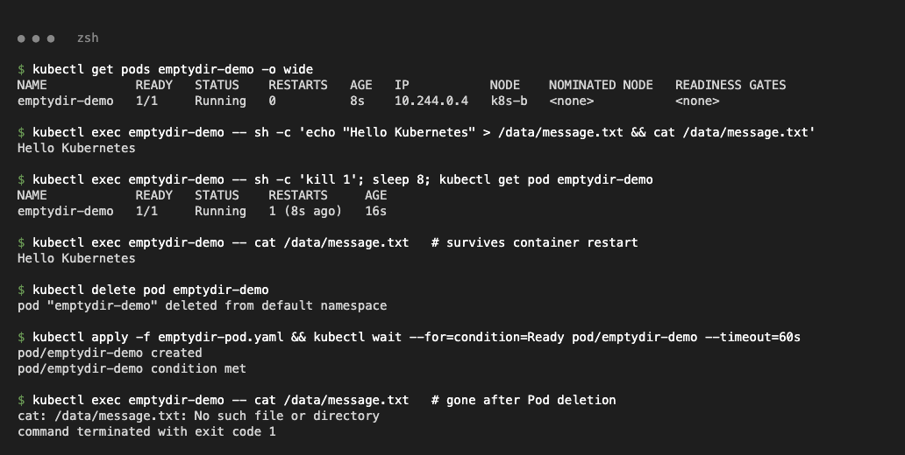
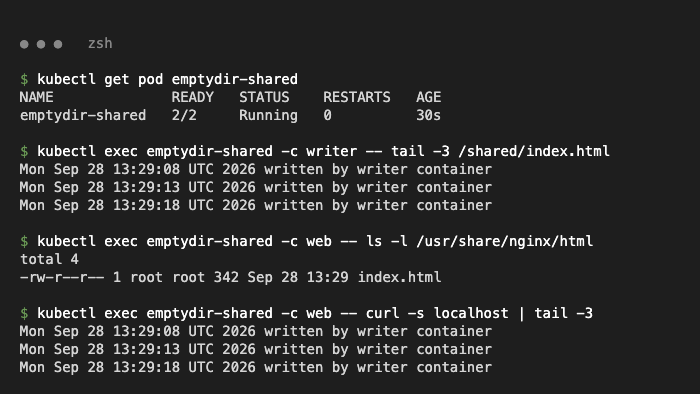
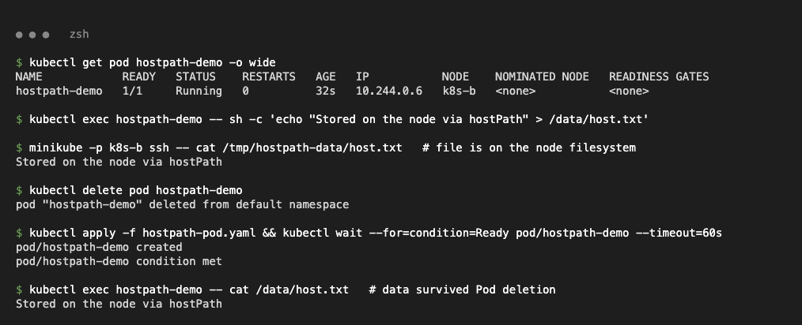
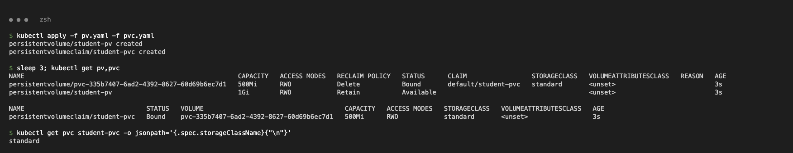
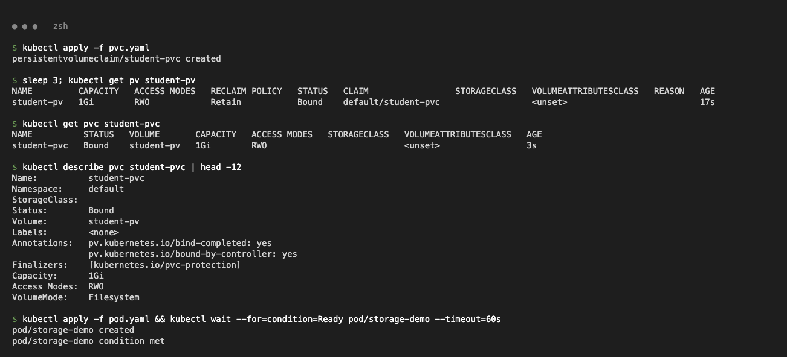
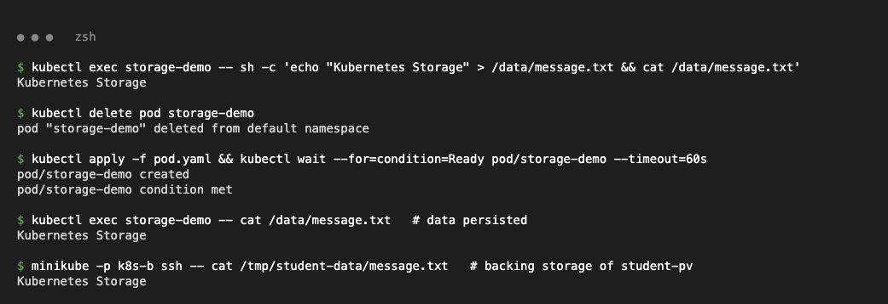
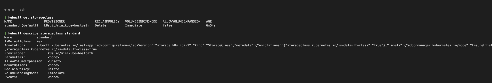
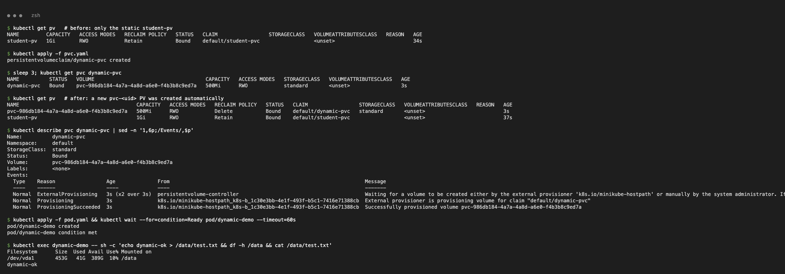
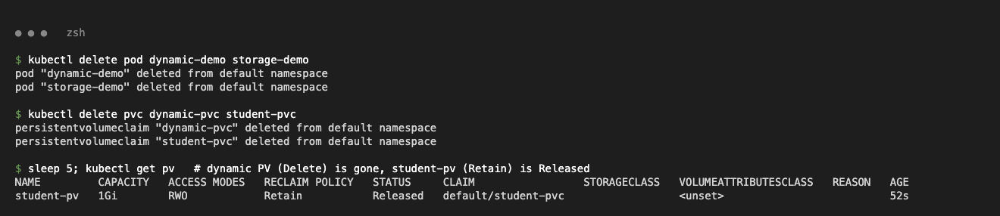

# Task 1 – Kubernetes Volumes

| Type | What it is | Lifetime |
| :--- | :--- | :--- |
| **emptyDir** | Empty dir created with the Pod, shared by its containers | Deleted with the Pod (survives container restarts) |
| **hostPath** | Directory from the node's filesystem | Stays on that node; not portable, security risk |
| **PersistentVolume (PV)** | Cluster-level storage (capacity, access mode, reclaim policy) | Independent of Pods |
| **PersistentVolumeClaim (PVC)** | Namespaced request for storage; Pods mount the PVC | Bound 1:1 to a PV until deleted |
| **StorageClass** | Storage "type" + provisioner; can be the default | — |
| **Dynamic provisioning** | PVC names a StorageClass and the provisioner creates the PV automatically | PV follows the class reclaim policy |

Files: `01-volumes/` (class `emptydir-pod.yaml`, `hostpath-pod.yaml`, plus `emptydir-shared-pod.yaml` with two containers sharing one emptyDir), `02-persistent-storage/` (class `pv.yaml`, `pvc.yaml`, `pod.yaml`), `03-storageclass/` (class `pvc.yaml`, plus `pod.yaml` that mounts it).

## 1. emptyDir

```text
$ kubectl exec emptydir-demo -- sh -c 'echo "Hello Kubernetes" > /data/message.txt && cat /data/message.txt'
Hello Kubernetes
$ kubectl exec emptydir-demo -- sh -c 'kill 1'; sleep 8; kubectl get pod emptydir-demo
NAME            READY   STATUS    RESTARTS     AGE
emptydir-demo   1/1     Running   1 (8s ago)   16s
$ kubectl exec emptydir-demo -- cat /data/message.txt   # survives container restart
Hello Kubernetes
$ kubectl delete pod emptydir-demo && kubectl apply -f emptydir-pod.yaml
$ kubectl exec emptydir-demo -- cat /data/message.txt   # gone after Pod deletion
cat: /data/message.txt: No such file or directory
```



Sharing between containers (`emptydir-shared-pod.yaml`: busybox writes, nginx serves):

```text
$ kubectl exec emptydir-shared -c writer -- tail -1 /shared/index.html
Mon Sep 28 13:29:18 UTC 2026 written by writer container
$ kubectl exec emptydir-shared -c web -- curl -s localhost | tail -1
Mon Sep 28 13:29:18 UTC 2026 written by writer container
```



## 2. hostPath

```text
$ kubectl exec hostpath-demo -- sh -c 'echo "Stored on the node via hostPath" > /data/host.txt'
$ minikube -p k8s-b ssh -- cat /tmp/hostpath-data/host.txt   # file is on the node filesystem
Stored on the node via hostPath
$ kubectl delete pod hostpath-demo && kubectl apply -f hostpath-pod.yaml
$ kubectl exec hostpath-demo -- cat /data/host.txt   # data survived Pod deletion
Stored on the node via hostPath
```



## 3. PV / PVC (static binding)

With the class `pvc.yaml` as-is, the PVC got the default `standard` class and a new dynamic PV, so `student-pv` stayed `Available`:

```text
$ kubectl get pv,pvc
persistentvolume/pvc-335b7407-...   500Mi   RWO   Delete   Bound       default/student-pvc   standard
persistentvolume/student-pv         1Gi     RWO   Retain   Available
persistentvolumeclaim/student-pvc   Bound   pvc-335b7407-...   500Mi   RWO   standard
```



**Fix:** add `storageClassName: ""` to `pvc.yaml`, which turns off dynamic provisioning for this claim.

```text
$ kubectl get pv student-pv
NAME         CAPACITY   ACCESS MODES   RECLAIM POLICY   STATUS   CLAIM                 STORAGECLASS
student-pv   1Gi        RWO            Retain           Bound    default/student-pvc
$ kubectl get pvc student-pvc
NAME          STATUS   VOLUME       CAPACITY   ACCESS MODES   STORAGECLASS
student-pvc   Bound    student-pv   1Gi        RWO
```



Data persists across Pod deletion:

```text
$ kubectl exec storage-demo -- sh -c 'echo "Kubernetes Storage" > /data/message.txt'
$ kubectl delete pod storage-demo && kubectl apply -f pod.yaml
$ kubectl exec storage-demo -- cat /data/message.txt   # data persisted
Kubernetes Storage
```



## 4. StorageClass + dynamic provisioning

```text
$ kubectl get storageclass
NAME                 PROVISIONER                RECLAIMPOLICY   VOLUMEBINDINGMODE   ALLOWVOLUMEEXPANSION
standard (default)   k8s.io/minikube-hostpath   Delete          Immediate           false

$ kubectl apply -f pvc.yaml          # dynamic-pvc, storageClassName: standard
$ kubectl get pvc dynamic-pvc
NAME          STATUS   VOLUME                                     CAPACITY   ACCESS MODES   STORAGECLASS
dynamic-pvc   Bound    pvc-986db184-4a7a-4a8d-a6e0-f4b3b8c9ed7a   500Mi      RWO            standard
$ kubectl describe pvc dynamic-pvc | grep ProvisioningSucceeded
  Normal  ProvisioningSucceeded  3s  k8s.io/minikube-hostpath_...  Successfully provisioned volume pvc-986db184-4a7a-4a8d-a6e0-f4b3b8c9ed7a
$ kubectl exec dynamic-demo -- sh -c 'echo dynamic-ok > /data/test.txt && cat /data/test.txt'
dynamic-ok
```




Reclaim policy on cleanup: when its PVC was deleted, the dynamic PV (`Delete`) was removed and `student-pv` (`Retain`) became `Released`.


