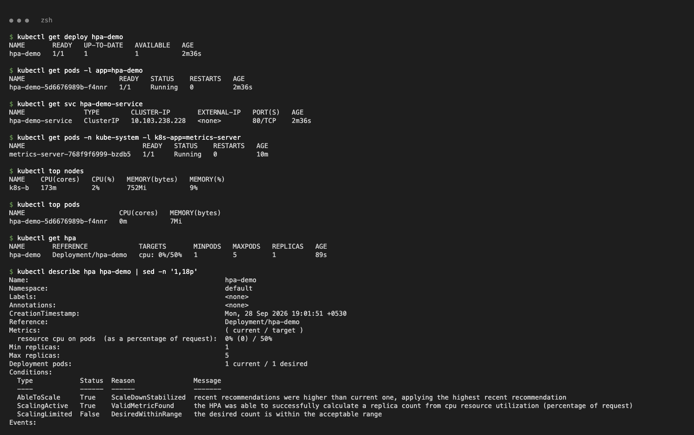
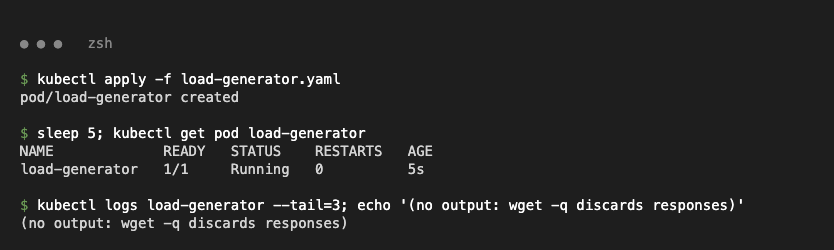
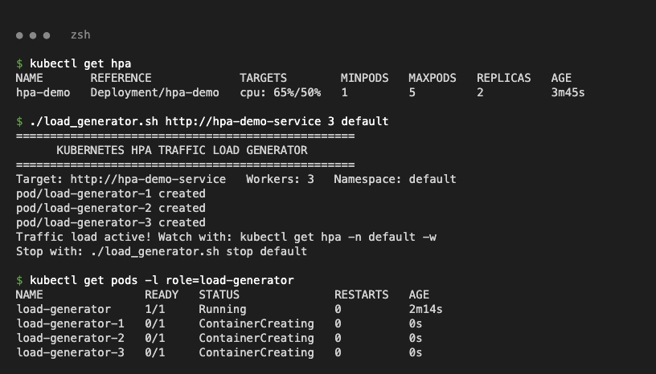
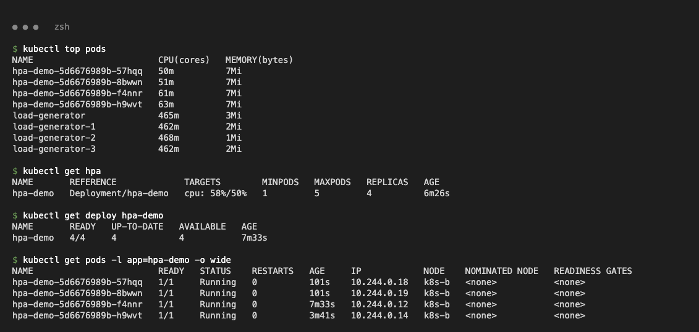
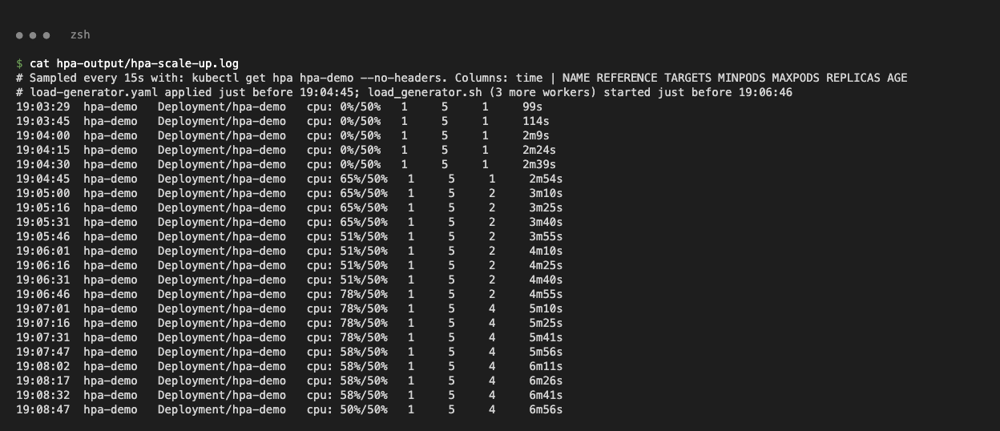
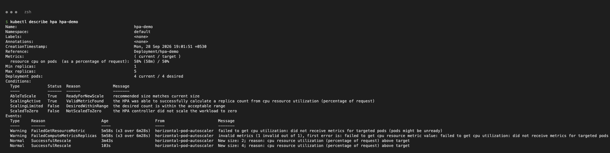
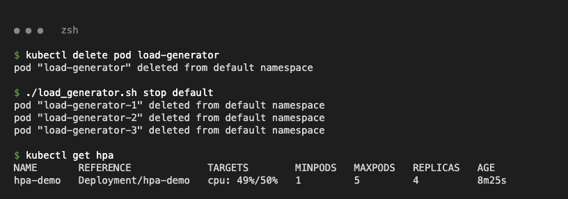
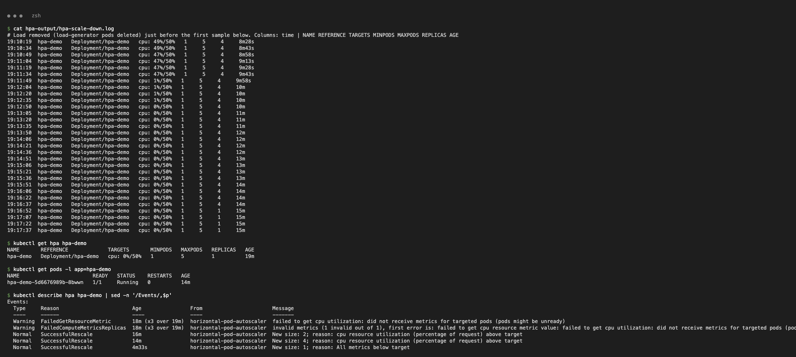

# Task 2 – HPA Hands-on

Files: `deployment.yaml` (nginx, `requests.cpu: 100m`), `service.yaml`, `hpa.yaml` (min 1 / max 5 / 50 % CPU), `load-generator.yaml` (busybox wget loop), `load_generator.sh`, and `hpa-output/*.log` (HPA sampled every 15 s).

`load_generator.sh` was adapted from the class version, which hit a non-existent `yatri-backend` Service through one port-forward. It now starts N in-cluster busybox wget-loop Pods against any Service: `./load_generator.sh <url> <workers> <ns>` and `./load_generator.sh stop <ns>`.

## 1. Deploy app + HPA

```bash
minikube -p k8s-b addons enable metrics-server
kubectl apply -f deployment.yaml -f service.yaml -f hpa.yaml
```

```text
$ kubectl top pods
NAME                        CPU(cores)   MEMORY(bytes)
hpa-demo-5d6676989b-f4nnr   0m           7Mi
$ kubectl get hpa
NAME       REFERENCE             TARGETS       MINPODS   MAXPODS   REPLICAS   AGE
hpa-demo   Deployment/hpa-demo   cpu: 0%/50%   1         5         1          89s
```



## 2. Load generator and more load

```bash
kubectl apply -f load-generator.yaml                  # 1 worker
./load_generator.sh http://hpa-demo-service 3 default # +3 workers
```




## 3. CPU utilisation and scaling

```text
$ kubectl top pods
NAME                        CPU(cores)   MEMORY(bytes)
hpa-demo-5d6676989b-57hqq   50m          7Mi
hpa-demo-5d6676989b-8bwwn   51m          7Mi
hpa-demo-5d6676989b-f4nnr   61m          7Mi
hpa-demo-5d6676989b-h9wvt   63m          7Mi
load-generator              465m         3Mi
load-generator-1            462m         2Mi
...
$ kubectl get hpa
NAME       REFERENCE             TARGETS        MINPODS   MAXPODS   REPLICAS   AGE
hpa-demo   Deployment/hpa-demo   cpu: 58%/50%   1         5         4          6m26s
```

`hpa-output/hpa-scale-up.log` (excerpt):

```text
19:04:30  hpa-demo  Deployment/hpa-demo  cpu: 0%/50%   1  5  1
19:04:45  hpa-demo  Deployment/hpa-demo  cpu: 65%/50%  1  5  1   <- load-generator running
19:05:00  hpa-demo  Deployment/hpa-demo  cpu: 65%/50%  1  5  2   <- 1 -> 2
19:06:46  hpa-demo  Deployment/hpa-demo  cpu: 78%/50%  1  5  2   <- +3 workers
19:07:01  hpa-demo  Deployment/hpa-demo  cpu: 78%/50%  1  5  4   <- 2 -> 4  (ceil(2*78/50))
19:08:47  hpa-demo  Deployment/hpa-demo  cpu: 50%/50%  1  5  4   <- target met
```




## 4. `kubectl describe hpa`

```text
Metrics:  resource cpu on pods (as a percentage of request):  58% (58m) / 50%
Deployment pods:  4 current / 4 desired
Events:
  Normal   SuccessfulRescale  3m43s  horizontal-pod-autoscaler  New size: 2; reason: cpu resource utilization (percentage of request) above target
  Normal   SuccessfulRescale  103s   horizontal-pod-autoscaler  New size: 4; reason: cpu resource utilization (percentage of request) above target
```



## 5. Remove load → scale down

```bash
kubectl delete pod load-generator && ./load_generator.sh stop default
```

```text
19:11:49  hpa-demo  Deployment/hpa-demo  cpu: 1%/50%  1  5  4
19:16:37  hpa-demo  Deployment/hpa-demo  cpu: 0%/50%  1  5  4
19:16:52  hpa-demo  Deployment/hpa-demo  cpu: 0%/50%  1  5  1   <- 4 -> 1 after the 5-min stabilisation window
  Normal   SuccessfulRescale  4m22s  horizontal-pod-autoscaler  New size: 1; reason: All metrics below target
```




Scale-up happens within one 15 s sync. Scale-down waits for the default 300 s stabilisation window.
