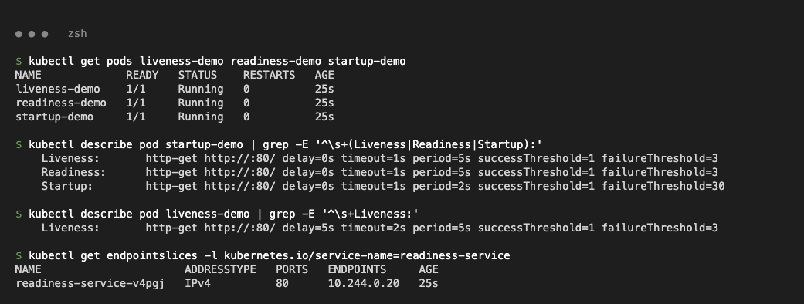
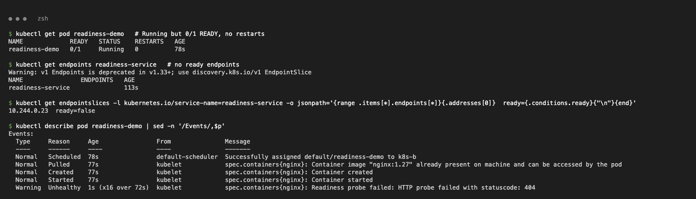
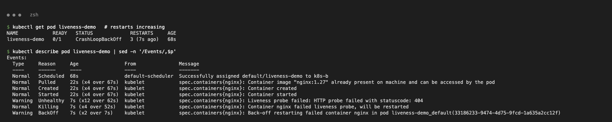

# Probes – Liveness, Readiness, Startup

| Probe | Question | On failure |
| :--- | :--- | :--- |
| startup | Has the app started? | Restart; liveness and readiness wait until it passes |
| readiness | Can it take traffic? | Pod `NotReady`, removed from Service endpoints (no restart) |
| liveness | Is it healthy? | Container restarted |

Files: class `liveness.yaml`, `readiness.yaml`, `startup.yaml`, plus `*-broken.yaml` copies with `path: /wrong-path`.

## Healthy

```text
$ kubectl get pods liveness-demo readiness-demo startup-demo
NAME             READY   STATUS    RESTARTS   AGE
liveness-demo    1/1     Running   0          25s
readiness-demo   1/1     Running   0          25s
startup-demo     1/1     Running   0          25s
$ kubectl describe pod startup-demo | grep -E '^\s+(Liveness|Readiness|Startup):'
    Liveness:       http-get http://:80/ delay=0s timeout=1s period=5s successThreshold=1 failureThreshold=3
    Readiness:      http-get http://:80/ delay=0s timeout=1s period=5s successThreshold=1 failureThreshold=3
    Startup:        http-get http://:80/ delay=0s timeout=1s period=2s successThreshold=1 failureThreshold=30
```



## Readiness failure → NotReady, no restart

```text
$ kubectl get pod readiness-demo
NAME             READY   STATUS    RESTARTS   AGE
readiness-demo   0/1     Running   0          78s
10.244.0.23  ready=false
  Warning  Unhealthy  1s (x16 over 72s)  kubelet  Readiness probe failed: HTTP probe failed with statuscode: 404
```



## Liveness failure → restarts

```text
$ kubectl get pod liveness-demo
NAME            READY   STATUS             RESTARTS     AGE
liveness-demo   0/1     CrashLoopBackOff   3 (7s ago)   68s
  Warning  Unhealthy  7s (x12 over 62s)  kubelet  Liveness probe failed: HTTP probe failed with statuscode: 404
  Normal   Killing    7s (x4 over 52s)   kubelet  Container nginx failed liveness probe, will be restarted
```


