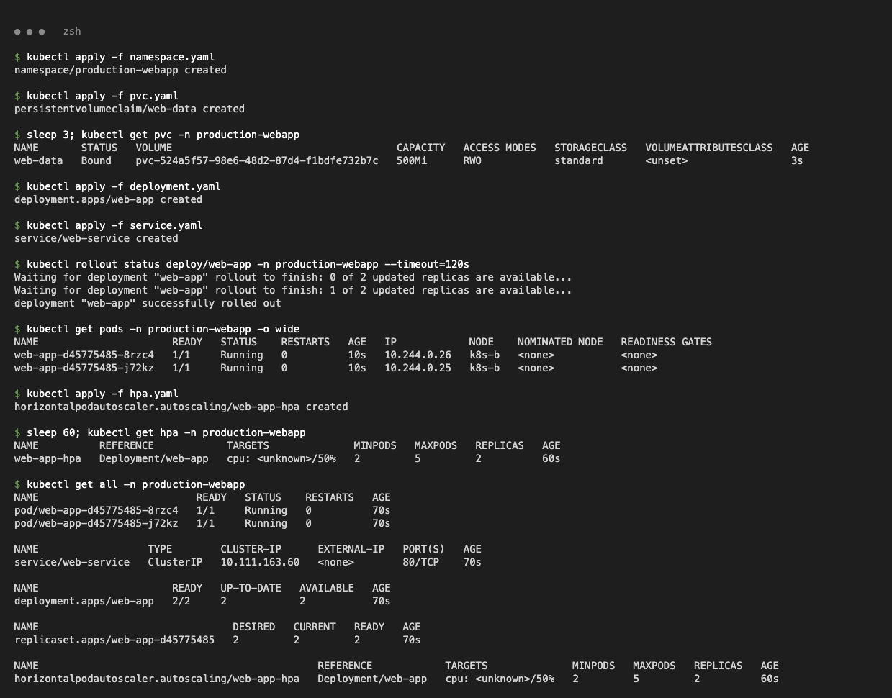
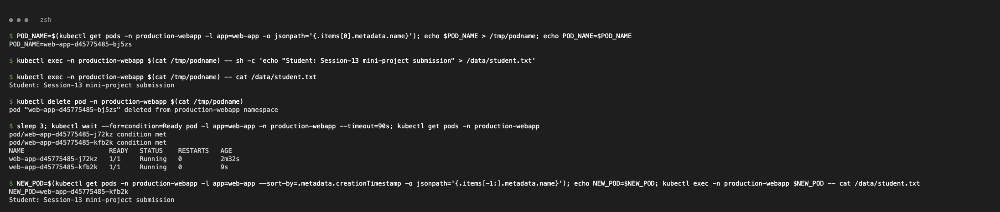
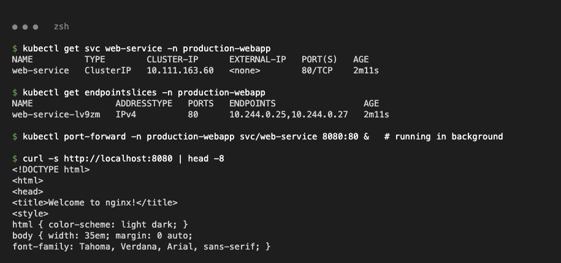
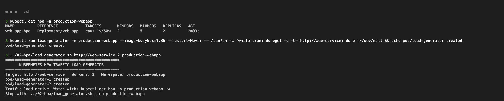
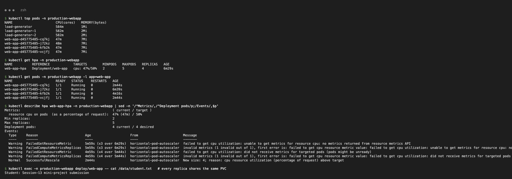
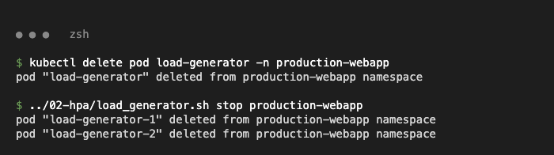
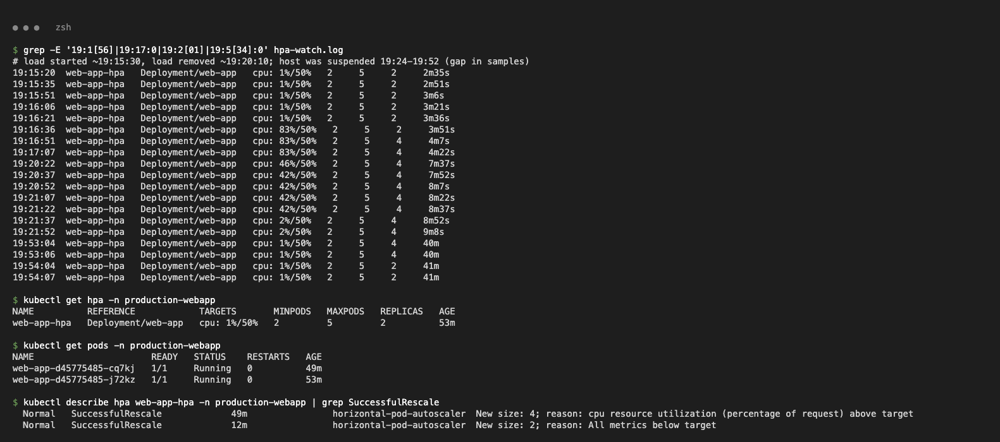
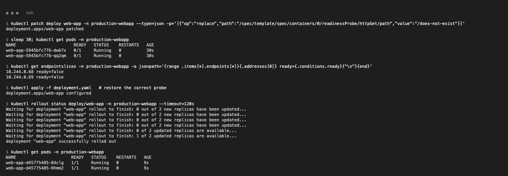

# Task 3 – Mini Project: Production-Ready Web App (PVC + HPA + Probes)

nginx `web-app` in namespace `production-webapp` with a 500Mi PVC at `/data`, startup/readiness/liveness probes, CPU requests/limits, a ClusterIP Service, and an HPA (2–5 replicas, 50 % CPU). Files: `namespace.yaml`, `pvc.yaml`, `deployment.yaml`, `service.yaml`, `hpa.yaml` (class files, used as-is), plus `hpa-watch.log` (recorded HPA samples).

## Deploy

```bash
kubectl apply -f namespace.yaml
kubectl apply -f pvc.yaml
kubectl apply -f deployment.yaml -f service.yaml
kubectl apply -f hpa.yaml
```

```text
$ kubectl get pvc -n production-webapp
NAME       STATUS   VOLUME                                     CAPACITY   ACCESS MODES   STORAGECLASS   AGE
web-data   Bound    pvc-524a5f57-98e6-48d2-87d4-f1bdfe732b7c   500Mi      RWO            standard       3s

$ kubectl get all -n production-webapp
NAME                          READY   STATUS    RESTARTS   AGE
pod/web-app-d45775485-8rzc4   1/1     Running   0          70s
pod/web-app-d45775485-j72kz   1/1     Running   0          70s

NAME                  TYPE        CLUSTER-IP      EXTERNAL-IP   PORT(S)   AGE
service/web-service   ClusterIP   10.111.163.60   <none>        80/TCP    70s

NAME                      READY   UP-TO-DATE   AVAILABLE   AGE
deployment.apps/web-app   2/2     2            2           70s

NAME                                              REFERENCE            TARGETS              MINPODS   MAXPODS   REPLICAS
horizontalpodautoscaler.autoscaling/web-app-hpa   Deployment/web-app   cpu: <unknown>/50%   2         5         2
```

`<unknown>` disappears after about 2 minutes, once metrics-server has samples for the Pods (`cpu: 1%/50%`).



## Verification 1 – Storage persistence

```text
POD_NAME=web-app-d45775485-bj5zs
$ kubectl exec -n production-webapp $POD_NAME -- sh -c 'echo "Student: Session-13 mini-project submission" > /data/student.txt'
$ kubectl exec -n production-webapp $POD_NAME -- cat /data/student.txt
Student: Session-13 mini-project submission
$ kubectl delete pod -n production-webapp $POD_NAME
pod "web-app-d45775485-bj5zs" deleted from production-webapp namespace
NEW_POD=web-app-d45775485-kfb2k
$ kubectl exec -n production-webapp $NEW_POD -- cat /data/student.txt
Student: Session-13 mini-project submission
```



## Verification 2 – Service

```text
$ kubectl get endpointslices -n production-webapp
NAME                ADDRESSTYPE   PORTS   ENDPOINTS                 AGE
web-service-lv9zm   IPv4          80      10.244.0.25,10.244.0.27   2m11s

$ kubectl port-forward -n production-webapp svc/web-service 8080:80 &
$ curl -s http://localhost:8080 | head -4
<!DOCTYPE html>
<html>
<head>
<title>Welcome to nginx!</title>
```



## Verification 3 – HPA elastic scaling

```bash
kubectl run load-generator -n production-webapp --image=busybox:1.36 --restart=Never -- \
  /bin/sh -c 'while true; do wget -q -O- http://web-service; done'
../02-hpa/load_generator.sh http://web-service 2 production-webapp     # 2 more workers
```

```text
$ kubectl top pods -n production-webapp
NAME                      CPU(cores)   MEMORY(bytes)
load-generator            584m         1Mi
load-generator-1          582m         2Mi
load-generator-2          582m         2Mi
web-app-d45775485-cq7kj   47m          7Mi
web-app-d45775485-j72kz   48m          7Mi
web-app-d45775485-kfb2k   47m          7Mi
web-app-d45775485-vcjfj   47m          7Mi

$ kubectl describe hpa web-app-hpa -n production-webapp | grep SuccessfulRescale
  Normal   SuccessfulRescale   49m   horizontal-pod-autoscaler  New size: 4; reason: cpu resource utilization (percentage of request) above target
  Normal   SuccessfulRescale   12m   horizontal-pod-autoscaler  New size: 2; reason: All metrics below target
```

`hpa-watch.log` (excerpt):

```text
19:16:21  web-app-hpa   Deployment/web-app   cpu: 1%/50%    2  5  2
19:16:36  web-app-hpa   Deployment/web-app   cpu: 83%/50%   2  5  2   <- load running
19:16:51  web-app-hpa   Deployment/web-app   cpu: 83%/50%   2  5  4   <- scaled 2 -> 4
19:18:38  web-app-hpa   Deployment/web-app   cpu: 47%/50%   2  5  4   <- target met
19:21:37  web-app-hpa   Deployment/web-app   cpu: 2%/50%    2  5  4   <- load removed
19:54:04  web-app-hpa   Deployment/web-app   cpu: 1%/50%    2  5  2   <- scaled back to minReplicas
```

The laptop was suspended from about 19:24 to 19:52, which paused the cluster. Scale-down therefore came after the 5-minute stabilisation window plus that pause.






## Bonus – Readiness gating (Challenge 2)

With the readiness path set to `/does-not-exist`, the Pods are `Running` but `0/1` and their endpoints are `ready=false`, so the Service gets no traffic. Re-applying `deployment.yaml` restores it.

```text
$ kubectl get pods -n production-webapp
NAME                       READY   STATUS    RESTARTS   AGE
web-app-5945bfc776-dwb7x   0/1     Running   0          30s
web-app-5945bfc776-qq2qm   0/1     Running   0          30s
10.244.0.68 ready=false
10.244.0.69 ready=false
```


