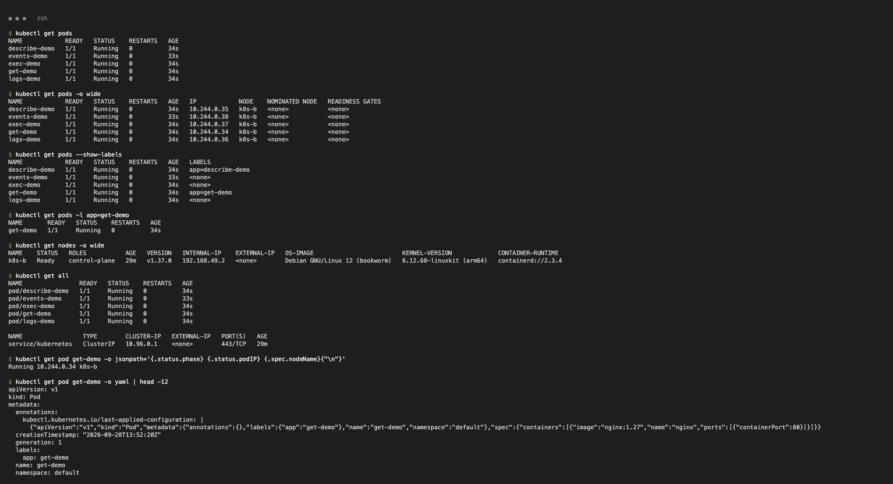
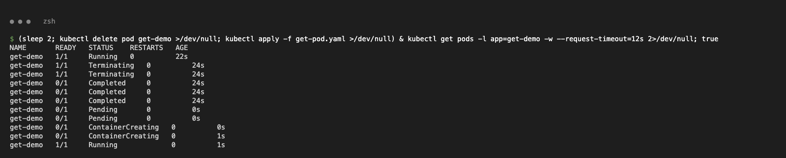
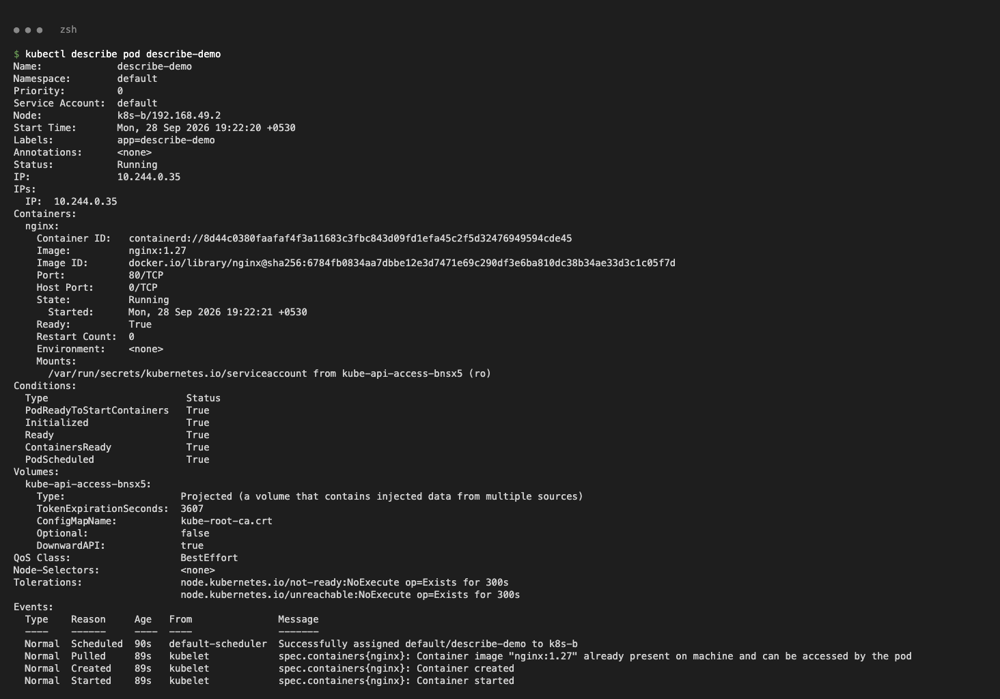
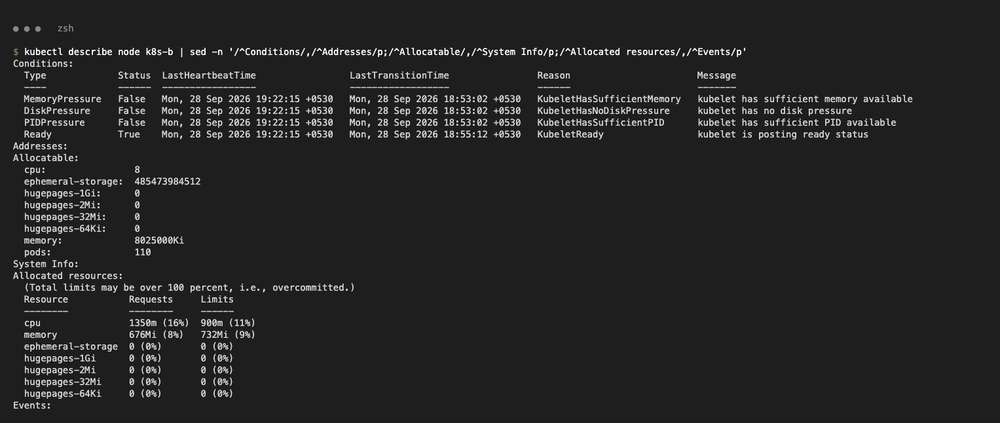
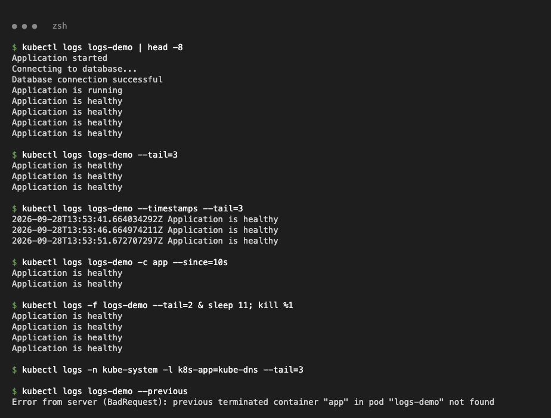
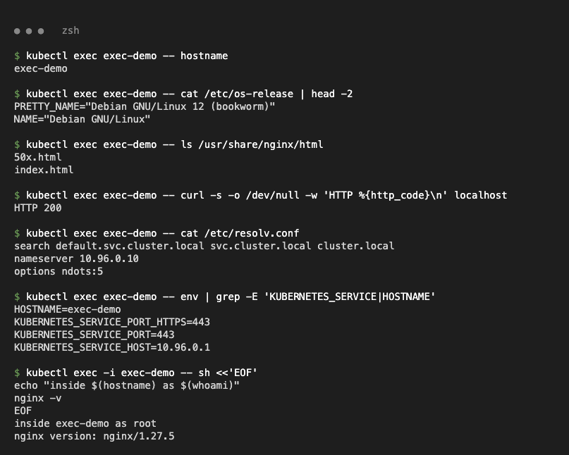
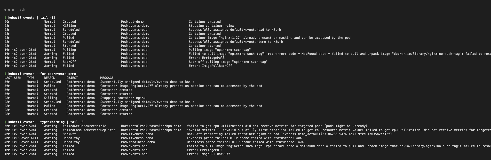
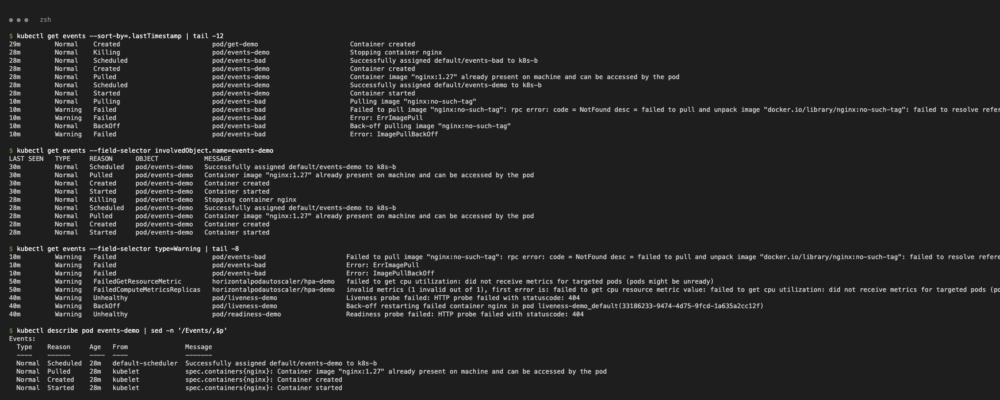
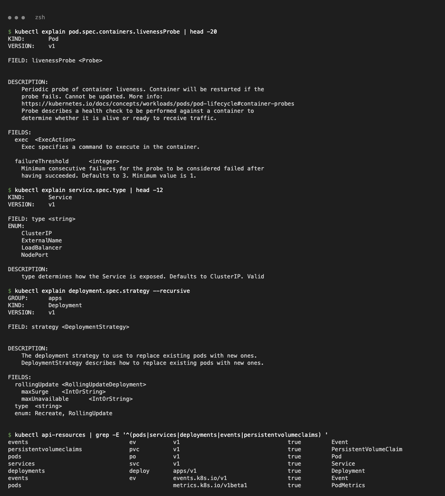
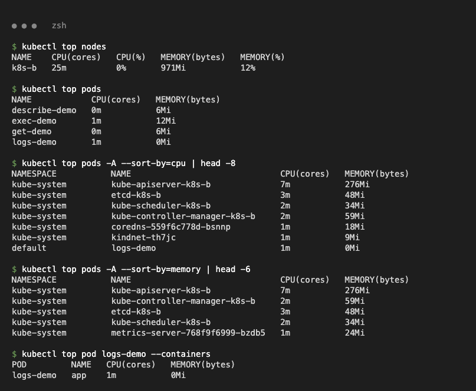

# Kubernetes Troubleshooting – Assignment

| Task | Location |
| :--- | :--- |
| 1 – kubectl troubleshooting commands | this file (`task1-kubectl-commands/` holds the class 01–05 Pod manifests) |
| 2 – Troubleshooting 9 failure types | [`task2-troubleshooting/README.md`](task2-troubleshooting/README.md) |
| 3 – Mini project | [`mini-project/README.md`](mini-project/README.md) |

Cluster: minikube, single node `k8s-b`, Kubernetes v1.37, containerd, arm64.

---

## Task 1 – kubectl hands-on

```bash
cd task1-kubectl-commands
kubectl apply -f get-pod.yaml -f describe-pod.yaml -f logs-pod.yaml -f exec-pod.yaml -f events-pod.yaml
```

The class `02-kubectl-describe/README.md` runs `kubectl apply -f pod.yaml`, but that folder's file is `demo-pod.yaml`. It is copied here as `describe-pod.yaml`.

### kubectl get / get -o wide: list resources and their status

```text
$ kubectl get pods -o wide
NAME            READY   STATUS    RESTARTS   AGE   IP            NODE    NOMINATED NODE   READINESS GATES
describe-demo   1/1     Running   0          17s   10.244.0.35   k8s-b   <none>           <none>
events-demo     1/1     Running   0          16s   10.244.0.38   k8s-b   <none>           <none>
exec-demo       1/1     Running   0          17s   10.244.0.37   k8s-b   <none>           <none>
get-demo        1/1     Running   0          17s   10.244.0.34   k8s-b   <none>           <none>
logs-demo       1/1     Running   0          17s   10.244.0.36   k8s-b   <none>           <none>

$ kubectl get pod get-demo -o jsonpath='{.status.phase} {.status.podIP} {.spec.nodeName}{"\n"}'
Running 10.244.0.34 k8s-b
```

Also shown: `--show-labels`, `-l app=get-demo`, `get nodes -o wide`, `get all`, `-o yaml`, and `-w` (watch Pod recreation).




### kubectl describe: full details, conditions and Events

```text
$ kubectl describe pod describe-demo
...
    State:          Running
    Ready:          True
    Restart Count:  0
...
Events:
  Normal  Scheduled  90s   default-scheduler  Successfully assigned default/describe-demo to k8s-b
  Normal  Pulled     89s   kubelet            Container image "nginx:1.27" already present on machine
  Normal  Created    89s   kubelet            Container created
  Normal  Started    89s   kubelet            Container started
```




### kubectl logs: the container's stdout/stderr

```text
$ kubectl logs logs-demo --timestamps --tail=3
2026-09-28T13:53:41.664034292Z Application is healthy
2026-09-28T13:53:46.664974211Z Application is healthy
2026-09-28T13:53:51.672707297Z Application is healthy
$ kubectl logs logs-demo --previous
Error from server (BadRequest): previous terminated container "app" in pod "logs-demo" not found
```

`--previous` only works after a restart (see CrashLoopBackOff in Task 2). Also shown: `-f`, `-c`, `--since`, and `-l` across Pods.



### kubectl exec: run commands inside a container

```text
$ kubectl exec exec-demo -- curl -s -o /dev/null -w 'HTTP %{http_code}\n' localhost
HTTP 200
$ kubectl exec exec-demo -- cat /etc/resolv.conf
search default.svc.cluster.local svc.cluster.local cluster.local
nameserver 10.96.0.10
options ndots:5
```



### kubectl events / kubectl get events: cluster event history

```text
$ kubectl events --for pod/events-demo
LAST SEEN   TYPE     REASON      OBJECT            MESSAGE
30m         Normal   Scheduled   Pod/events-demo   Successfully assigned default/events-demo to k8s-b
30m         Normal   Pulled      Pod/events-demo   Container image "nginx:1.27" already present on machine ...
30m         Normal   Started     Pod/events-demo   Container started
$ kubectl get events --field-selector type=Warning | head -3
10m   Warning   Failed   pod/events-bad   Failed to pull image "nginx:no-such-tag": ... not found
10m   Warning   Failed   pod/events-bad   Error: ErrImagePull
10m   Warning   Failed   pod/events-bad   Error: ImagePullBackOff
```

`events-bad` (`kubectl run events-bad --image=nginx:no-such-tag`) was created to produce Warning events. Event ages jump because the host was suspended for about 25 minutes during this session.




### kubectl explain: API field documentation

```text
$ kubectl explain deployment.spec.strategy --recursive
FIELDS:
  rollingUpdate	<RollingUpdateDeployment>
    maxSurge	<IntOrString>
    maxUnavailable	<IntOrString>
  type	<string>
  enum: Recreate, RollingUpdate
```



### kubectl top: live CPU and memory from metrics-server

```text
$ kubectl top nodes
NAME    CPU(cores)   CPU(%)   MEMORY(bytes)   MEMORY(%)
k8s-b   25m          0%       971Mi           12%
$ kubectl top pods -A --sort-by=memory | head -3
NAMESPACE     NAME                            CPU(cores)   MEMORY(bytes)
kube-system   kube-apiserver-k8s-b            7m           276Mi
kube-system   kube-controller-manager-k8s-b   2m           59Mi
```


