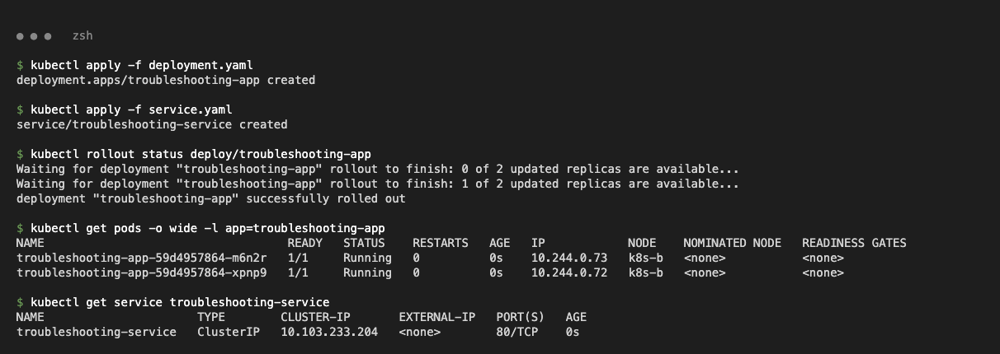
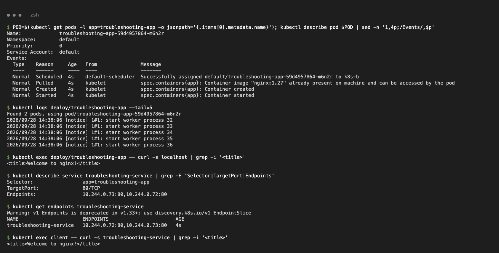
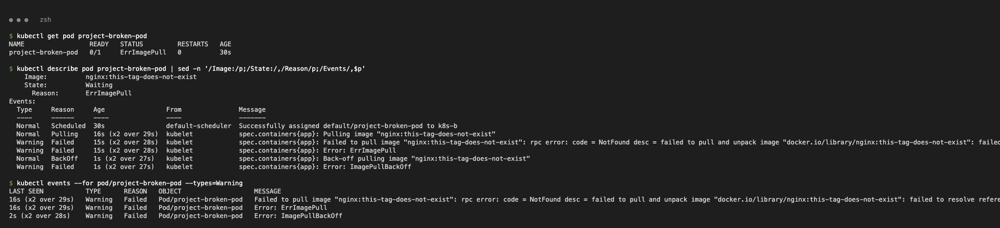
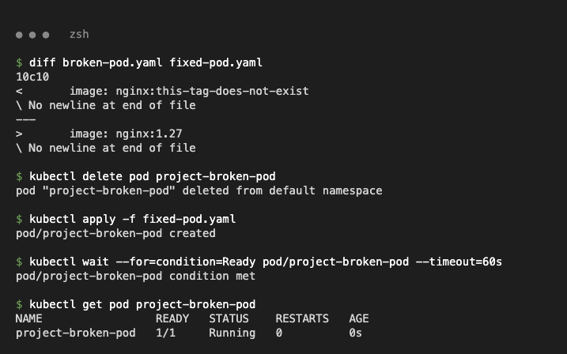
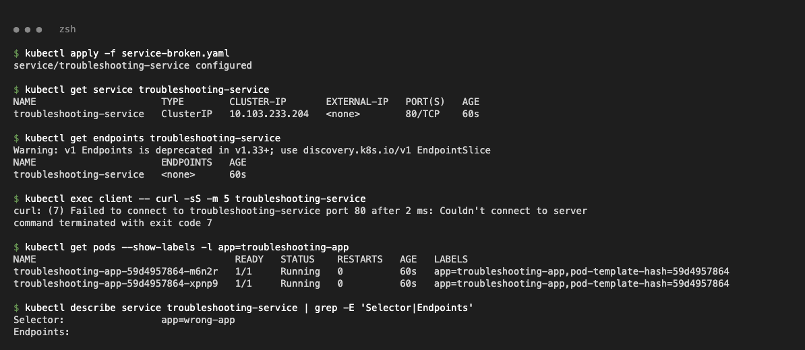
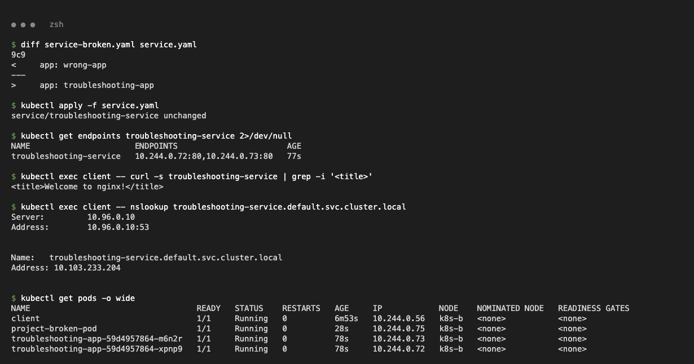

# Task 3 – Mini Project: Troubleshooting Challenge

Files: class `deployment.yaml`, `service.yaml` and `broken-pod.yaml`, plus `fixed-pod.yaml` and `service-broken.yaml` (selector changed to `app: wrong-app` as instructed).

## 1. Deploy and check the application

```text
$ kubectl get pods -o wide -l app=troubleshooting-app
NAME                                   READY   STATUS    RESTARTS   AGE   IP            NODE
troubleshooting-app-59d4957864-m6n2r   1/1     Running   0          0s    10.244.0.73   k8s-b
troubleshooting-app-59d4957864-xpnp9   1/1     Running   0          0s    10.244.0.72   k8s-b
$ kubectl exec deploy/troubleshooting-app -- curl -s localhost | grep -i '<title>'
<title>Welcome to nginx!</title>
$ kubectl describe service troubleshooting-service | grep -E 'Selector|TargetPort|Endpoints'
Selector:                 app=troubleshooting-app
TargetPort:               80/TCP
Endpoints:                10.244.0.73:80,10.244.0.72:80
```




## 2. Broken Pod

**Problem statement:** `project-broken-pod` does not start.

```text
$ kubectl get pod project-broken-pod
NAME                 READY   STATUS         RESTARTS   AGE
project-broken-pod   0/1     ErrImagePull   0          30s
$ kubectl describe pod project-broken-pod | sed -n '/Image:/p;/Events/,$p'
    Image:          nginx:this-tag-does-not-exist
  Warning  Failed   15s (x2 over 28s)  kubelet  Failed to pull image "nginx:this-tag-does-not-exist": ... not found
  Warning  Failed   15s (x2 over 28s)  kubelet  Error: ErrImagePull
  Normal   BackOff  1s (x2 over 27s)   kubelet  Back-off pulling image "nginx:this-tag-does-not-exist"
  Warning  Failed   1s (x2 over 27s)   kubelet  Error: ImagePullBackOff
```

| Question | Answer |
| :--- | :--- |
| 1. Pod status? | `ErrImagePull`, which then alternates with `ImagePullBackOff`; `0/1`, never Running |
| 2. Actual error? | `failed to resolve reference "docker.io/library/nginx:this-tag-does-not-exist": not found` |
| 3. Command that found it? | `kubectl describe pod project-broken-pod` (Events), also `kubectl events --for pod/project-broken-pod` |
| 4. What is wrong with the image? | Tag `this-tag-does-not-exist` is not published for `nginx` |
| 5. Fix? | Use a valid tag (`nginx:1.27`) and recreate the Pod |

```text
$ kubectl apply -f fixed-pod.yaml
$ kubectl get pod project-broken-pod
NAME                 READY   STATUS    RESTARTS   AGE
project-broken-pod   1/1     Running   0          0s
```




## 3. Service selector challenge

```text
$ kubectl apply -f service-broken.yaml
$ kubectl get endpoints troubleshooting-service
NAME                      ENDPOINTS   AGE
troubleshooting-service   <none>      60s
$ kubectl exec client -- curl -sS -m 5 troubleshooting-service
curl: (7) Failed to connect to troubleshooting-service port 80 after 2 ms: Couldn't connect to server
$ kubectl get pods --show-labels -l app=troubleshooting-app
troubleshooting-app-59d4957864-m6n2r   1/1   Running   0   60s   app=troubleshooting-app,...
$ kubectl describe service troubleshooting-service | grep -E 'Selector|Endpoints'
Selector:                 app=wrong-app
Endpoints:
```

**Root cause:** selector `app=wrong-app` doesn't match the Pod label `app=troubleshooting-app`. **Fix:** re-apply `service.yaml`.

```text
$ kubectl get endpoints troubleshooting-service
troubleshooting-service   10.244.0.72:80,10.244.0.73:80   77s
$ kubectl exec client -- curl -s troubleshooting-service | grep -i '<title>'
<title>Welcome to nginx!</title>
$ kubectl exec client -- nslookup troubleshooting-service.default.svc.cluster.local
Name:	troubleshooting-service.default.svc.cluster.local
Address: 10.103.233.204
```




## 4. Troubleshooting table

| Problem | What I Saw | Command I Used | Root Cause | Fix |
| :--- | :--- | :--- | :--- | :--- |
| Broken Pod | `0/1 ErrImagePull` / `ImagePullBackOff` | `kubectl get pod`, `kubectl describe pod` | Pod spec references a non-existent image | Correct image in the manifest, recreate |
| Service Problem | `ENDPOINTS <none>`, curl connection refused | `kubectl get endpoints`, `kubectl describe svc`, `kubectl get pods --show-labels` | Selector `app=wrong-app` ≠ label `app=troubleshooting-app` | Selector `app: troubleshooting-app` |
| Image Problem | `not found` in Events | `kubectl events --for pod/project-broken-pod` | Tag `this-tag-does-not-exist` not in registry | `nginx:1.27` |

## 5. README questions

1. **`kubectl get`**: a one-line status summary of resources (ready count, phase, restarts, age; `-o wide` adds IP and node).
2. **`get` vs `describe`**: `get` is a summary table. `describe` shows full spec and status, conditions and the related **Events**.
3. **`kubectl logs`**: shows the application's stdout/stderr, i.e. what the app itself reports (`--previous` for the crashed container).
4. **`kubectl exec`**: to test from inside the container, e.g. curl localhost, check config files, env, DNS (`/etc/resolv.conf`).
5. **CrashLoopBackOff**: the container keeps starting and exiting, so the kubelet waits longer and longer between restarts.
6. **ImagePullBackOff**: the image pull failed (wrong name/tag, private registry without credentials, network), and the kubelet is backing off before retrying.
7. **Pending**: the scheduler can't place the Pod: not enough CPU/memory, nodeSelector/affinity/taints don't match, or an unbound PVC.
8. **Service with no endpoints**: no Ready Pods match its selector (label mismatch, wrong namespace, or Pods failing readiness).
9. **Selector and labels**: the Service sends traffic only to Pods whose labels match all of its selector's key/values; the matches become its endpoints.
10. **Kubernetes DNS**: CoreDNS (`kube-dns` Service, 10.96.0.10) resolves `<service>.<namespace>.svc.cluster.local` to the Service ClusterIP, so Pods find Services by name.
