# Task 2 – Troubleshooting Common Kubernetes Issues

Each folder holds the broken and fixed manifests. Class files come from `06-crashloopbackoff`, `07-imagepullbackoff`, `08-pending-pods`, `09-service-dns-troubleshooting` and `scenarios/` (saved as `scenario-broken.yaml`). Folders 04, 07 and 08 are my own manifests. A `client` Pod (`curlimages/curl:8.6.0`, `sleep 3600`) is used for in-cluster tests.

| # | Issue | Root cause | Fix |
| :--- | :--- | :--- | :--- |
| 1 | CrashLoopBackOff | Process exits with code 1 (class pod: `exit 1`; scenario: `DATABASE_URL` missing) | Keep process running; add the env var |
| 2 | ErrImagePull / ImagePullBackOff | Image tag / repository does not exist | Use an existing image:tag |
| 3 | Pending | nodeSelector matches no node; requests 500 CPU / 1000Gi | Remove selector; realistic requests |
| 4 | ContainerCreating | Volume references missing ConfigMap and Secret | Create them |
| 5 | Service connectivity | Service selector `app=web-ahsgdf` ≠ Pod label `app=web` | Fix selector |
| 6 | DNS | Wrong hostname / non-existent namespace; class dnsutils image tag gone | Correct FQDN; working dnsutils image |
| 7 | Pod networking | `targetPort`/`containerPort` 8080, nginx listens on 80 | Use port 80 |
| 8 | Configuration | `configMapKeyRef` key `DATABASE_HOST` not in ConfigMap | Use existing key `DB_HOST` |
| 9 | OOMKilled | Allocates ~1000MB with 20Mi limit | Bound memory use and raise the limit |

---

## 1. CrashLoopBackOff (`01-crashloopbackoff/`)

**Problem:** `crash-demo` (class) and `fail-1-crashloop-pod` (scenario-1) restart repeatedly.

**Investigation:**

```text
$ kubectl get pods crash-demo fail-1-crashloop-pod
NAME                   READY   STATUS             RESTARTS      AGE
crash-demo             0/1     Error              4 (58s ago)   93s
fail-1-crashloop-pod   0/1     CrashLoopBackOff   4 (75s ago)   2m45s

$ kubectl describe pod crash-demo | sed -n '/State:/,/Restart Count/p'
    State:          Terminated
      Reason:       Error
      Exit Code:    1
    Restart Count:  3
  Warning  BackOff  10s (x3 over 43s)  kubelet  Back-off restarting failed container app in pod crash-demo_default(...)

$ kubectl logs crash-demo
Application starting...
Something went wrong!

$ kubectl logs fail-1-crashloop-pod
[FATAL ERROR]: DATABASE_URL environment variable is MISSING!
```

**Root cause:** the container's main process exits with code 1. The status switches between `Error` and `CrashLoopBackOff` while the kubelet backs off between restarts.

**Fix:** `fixed-pod.yaml` (class) keeps the process running. `scenario-fixed.yaml` adds `env: DATABASE_URL` and keeps Python running, because exiting even with code 0 would still restart under `restartPolicy: Always`.

```text
$ kubectl get pods crash-demo fail-1-crashloop-pod
NAME                   READY   STATUS    RESTARTS   AGE
crash-demo             1/1     Running   0          30s
fail-1-crashloop-pod   1/1     Running   0          30s
$ kubectl logs fail-1-crashloop-pod
Application started successfully!
```

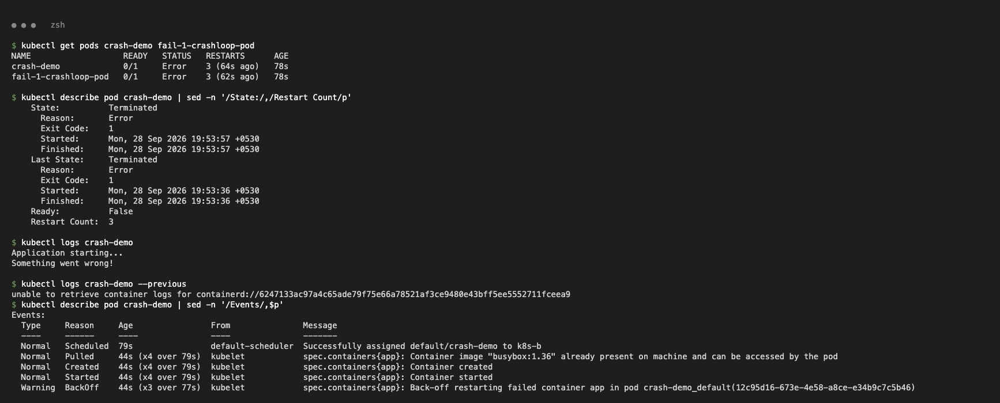
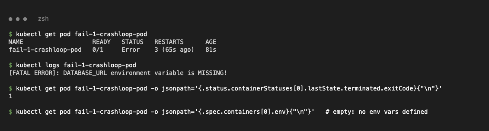
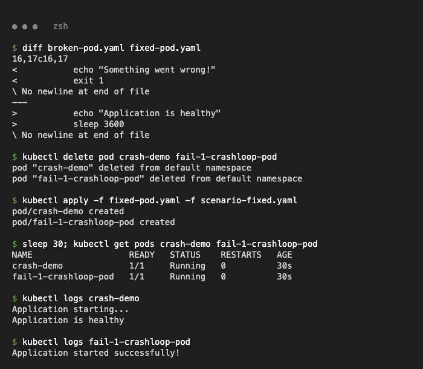

## 2. ErrImagePull / ImagePullBackOff (`02-imagepullbackoff-errimagepull/`)

**Problem:** `image-demo` (`nginx:this-image-does-not-exist`) and `fail-2-imagepull-pod` (`yatri-api-service:v999-invalid-tag-does-not-exist`) never start.

**Investigation:**

```text
$ kubectl get pods image-demo fail-2-imagepull-pod
NAME                   READY   STATUS             RESTARTS   AGE
image-demo             0/1     ErrImagePull       0          47s
fail-2-imagepull-pod   0/1     ImagePullBackOff   0          47s

$ kubectl describe pod image-demo | sed -n '/Events/,$p'
  Warning  Failed   12s (x2 over 28s)  kubelet  Failed to pull image "nginx:this-image-does-not-exist": ... docker.io/library/nginx:this-image-does-not-exist: not found
  Warning  Failed   12s (x2 over 28s)  kubelet  Error: ErrImagePull
  Normal   BackOff  0s (x2 over 27s)   kubelet  Back-off pulling image "nginx:this-image-does-not-exist"
  Warning  Failed   0s (x2 over 27s)   kubelet  Error: ImagePullBackOff
```

**Root cause:** the registry returns `NotFound`. `ErrImagePull` is the failed attempt and `ImagePullBackOff` is the wait before the kubelet retries.

**Fix:** use an image that exists (`nginx:1.27` in both `fixed-pod.yaml` and `scenario-fixed.yaml`).

```text
$ kubectl get pods image-demo fail-2-imagepull-pod
NAME                   READY   STATUS    RESTARTS   AGE
image-demo             1/1     Running   0          8s
fail-2-imagepull-pod   1/1     Running   0          8s
```

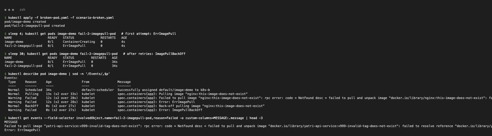
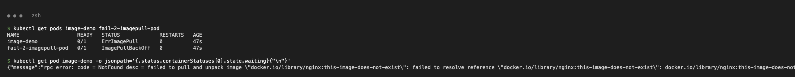
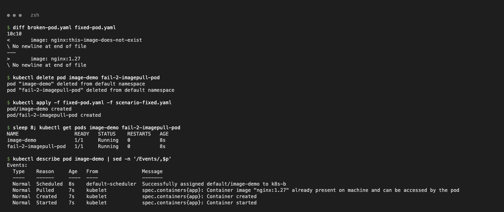

## 3. Pending (`03-pending/`)

**Problem:** `pending-demo` and `fail-3-pending-pod` stay `Pending` with no node or IP.

**Investigation:**

```text
$ kubectl describe pod pending-demo | sed -n '/Node-Selectors/p;/Events/,$p'
Node-Selectors:              kubernetes.io/hostname=node-that-does-not-exist
  Warning  FailedScheduling  5s  default-scheduler  0/1 nodes are available: 1 node(s) didn't match Pod's node affinity/selector.
$ kubectl describe pod fail-3-pending-pod | sed -n '/Requests/,/memory/p;/Events/,$p'
    Requests:
      cpu:        500
      memory:     1000Gi
  Warning  FailedScheduling  5s  default-scheduler  0/1 nodes are available: 1 Insufficient cpu, 1 Insufficient memory.
$ kubectl get nodes --show-labels | tr ',' '\n' | grep hostname
kubernetes.io/hostname=k8s-b
```

**Root cause:** the scheduler can't place either Pod. One has a nodeSelector for a non-existent node. The other requests more than the node's 8 CPU / about 8Gi allocatable.

**Fix:** remove the nodeSelector; request `100m` CPU / `64Mi` memory with limits.

```text
$ kubectl get pods pending-demo fail-3-pending-pod -o wide
NAME                 READY   STATUS    RESTARTS   AGE   IP            NODE
pending-demo         1/1     Running   0          8s    10.244.0.52   k8s-b
fail-3-pending-pod   1/1     Running   0          8s    10.244.0.51   k8s-b
```

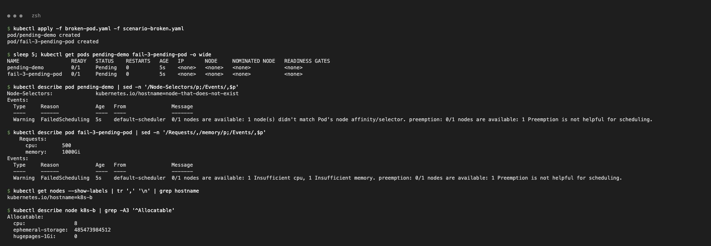
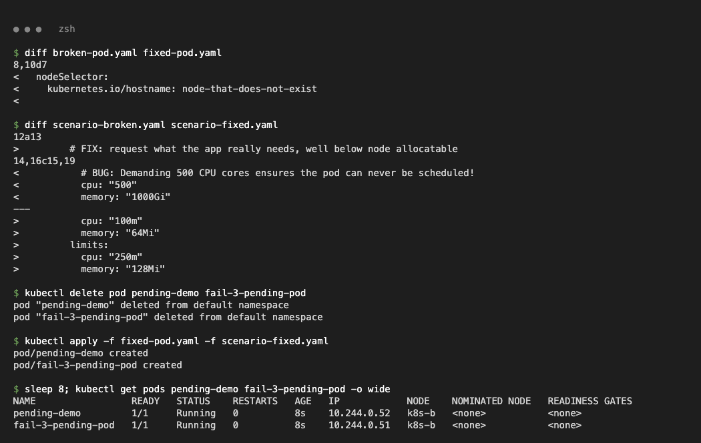

## 4. ContainerCreating (`04-containercreating/`)

**Problem:** `cc-demo` stays in `ContainerCreating`.

**Investigation:**

```text
$ kubectl get pod cc-demo
NAME      READY   STATUS              RESTARTS   AGE
cc-demo   0/1     ContainerCreating   0          40s
$ kubectl describe pod cc-demo | sed -n '/Events/,$p'
  Warning  FailedMount  8s (x7 over 40s)  kubelet  MountVolume.SetUp failed for volume "site" : configmap "web-content" not found
  Warning  FailedMount  8s (x7 over 40s)  kubelet  MountVolume.SetUp failed for volume "creds" : secret "web-creds" not found
$ kubectl get configmap web-content
Error from server (NotFound): configmaps "web-content" not found
```

**Root cause:** the Pod's volumes reference a ConfigMap and a Secret that don't exist, so the kubelet cannot set up the volumes.

**Fix:** `kubectl apply -f missing-objects.yaml`. The same Pod starts on the kubelet's next mount retry.

```text
$ kubectl wait --for=condition=Ready pod/cc-demo --timeout=180s
pod/cc-demo condition met
$ kubectl exec cc-demo -- curl -s localhost
<h1>Served from ConfigMap web-content</h1>
$ kubectl exec cc-demo -- ls /etc/creds
password
username
```

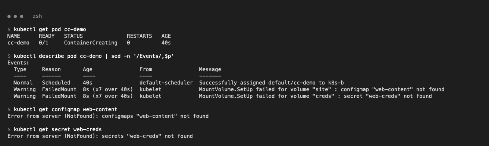
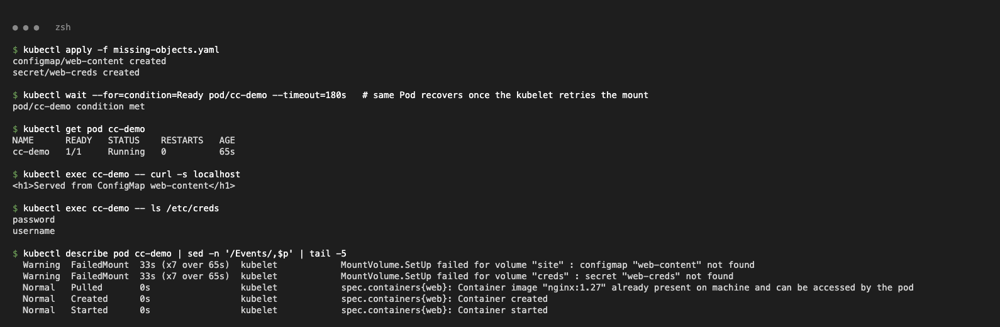

## 5. Service connectivity (`05-service-connectivity/`)

**Problem:** the `web` Pods are Running, but `curl http://web-service` fails.

**Investigation:**

```text
$ kubectl exec client -- curl -s -m 5 http://web-service || echo "curl failed, exit code $?"
command terminated with exit code 7
$ kubectl describe svc web-service | grep -E 'Selector|Endpoints'
Selector:                 app=web-ahsgdf
Endpoints:
$ kubectl get pods -l app=web --show-labels
web-557577df75-5krqp   1/1   Running   0   2s   app=web,pod-template-hash=557577df75
$ kubectl get pods -l app=web-ahsgdf
No resources found in default namespace.
```

**Root cause:** the class `service.yaml` selector `app=web-ahsgdf` matches no Pods, so the Service has no endpoints. `broken-service.yaml` (`app=does-not-exist`) has the same problem.

**Fix:** `service-fixed.yaml` with `selector: app: web`; delete `broken-service`.

```text
$ kubectl get endpointslices -l kubernetes.io/service-name=web-service
NAME                ADDRESSTYPE   PORTS   ENDPOINTS                 AGE
web-service-xkn6l   IPv4          80      10.244.0.55,10.244.0.54   3s
$ kubectl exec client -- curl -s -m 5 http://web-service | grep -i title
<title>Welcome to nginx!</title>
```

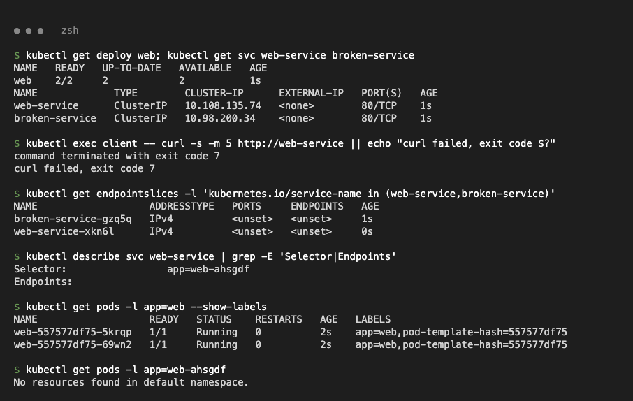
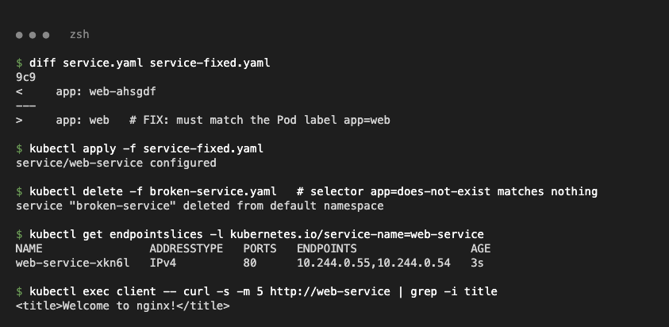

## 6. DNS (`06-dns/`)

**Problem:** `fail-4-dns-failure-pod` can't reach its database.

**Investigation:**

```text
$ kubectl exec fail-4-dns-failure-pod -- curl -sS --connect-timeout 3 http://postgres-db-wrong-name.production.svc.cluster.local:5432
curl: (6) Could not resolve host: postgres-db-wrong-name.production.svc.cluster.local
$ kubectl exec dns-test -- nslookup postgres-db-wrong-name.production.svc.cluster.local
** server can't find postgres-db-wrong-name.production.svc.cluster.local: NXDOMAIN
$ kubectl get ns production
Error from server (NotFound): namespaces "production" not found
```

Cluster DNS itself is healthy:

```text
$ kubectl get pods -n kube-system -l k8s-app=kube-dns
coredns-559f6c778d-bsnnp   1/1   Running   0   69m
$ kubectl exec dns-test -- nslookup web-service.default.svc.cluster.local
Name:	web-service.default.svc.cluster.local
Address: 10.108.135.74
```

**Root cause:** the hostname points to a Service and namespace that don't exist, which gives NXDOMAIN. DNS names follow `<service>.<namespace>.svc.cluster.local`. Separately, the class `dns-test-pod.yaml` image `registry.k8s.io/e2e-test-images/dnsutils:1.3` no longer exists ("not found"), so it was changed to `jessie-dnsutils:1.7`.

**Fix:** `scenario-fixed.yaml` uses `web-service.default.svc.cluster.local`.

```text
$ kubectl logs fail-4-dns-failure-pod
Attempting connection to internal service...
HTTP 200 from web-service
Process sleeping...
```

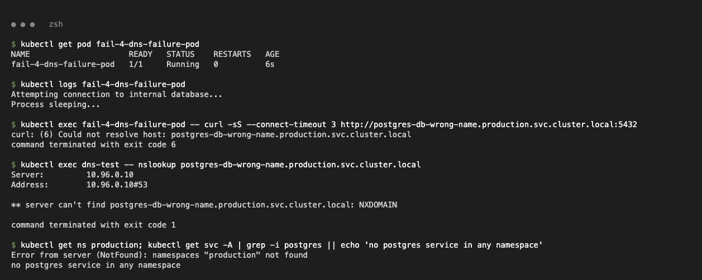
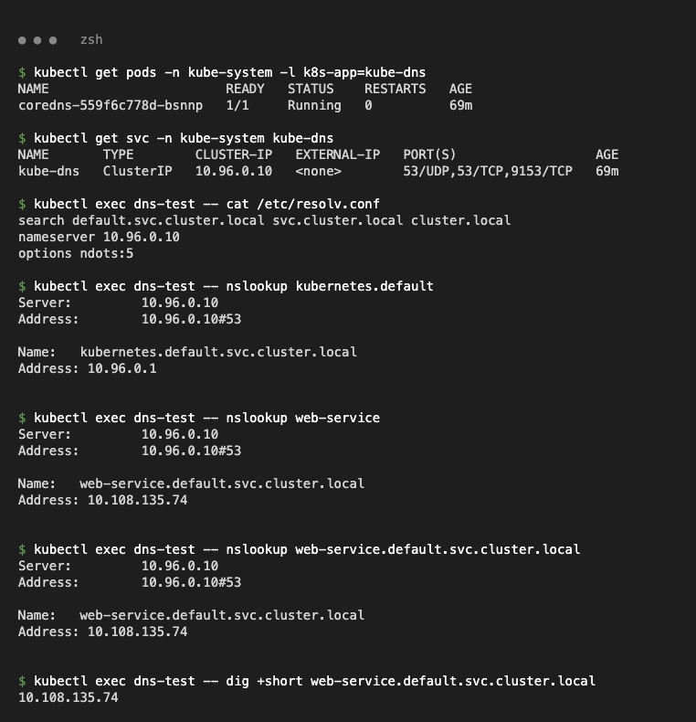
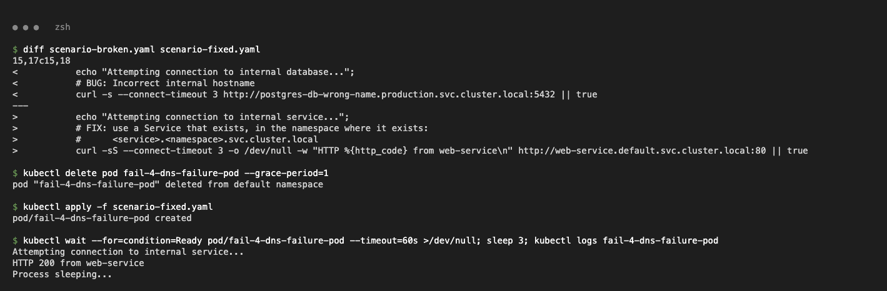

## 7. Pod networking: port mismatch (`07-pod-networking/`)

**Problem:** `api-service` has endpoints, but connections are refused.

**Investigation:**

```text
$ kubectl exec client -- curl -sS -m 5 http://api-service
curl: (7) Failed to connect to api-service port 80 after 3 ms: Couldn't connect to server
$ kubectl describe svc api-service | grep -E 'Port|Endpoints'
TargetPort:               8080/TCP
Endpoints:                10.244.0.60:8080,10.244.0.61:8080
pod:8080 -> HTTP 000      (connection refused)
pod:80   -> HTTP 200
$ kubectl exec deploy/api -- sh -c 'grep -h listen /etc/nginx/conf.d/*.conf'
    listen       80;
```

**Root cause:** the selector is correct, but traffic goes to port 8080 and nginx listens on 80. `containerPort` doesn't change what the process listens on.

**Fix:** `fixed.yaml` sets `containerPort: 80` and `targetPort: 80`.

```text
$ kubectl get endpointslices -l kubernetes.io/service-name=api-service
api-service-zv5kp   IPv4   80   10.244.0.61,10.244.0.62,10.244.0.63
$ kubectl exec client -- curl -sS -m 5 -o /dev/null -w 'api-service -> HTTP %{http_code}\n' http://api-service
api-service -> HTTP 200
```

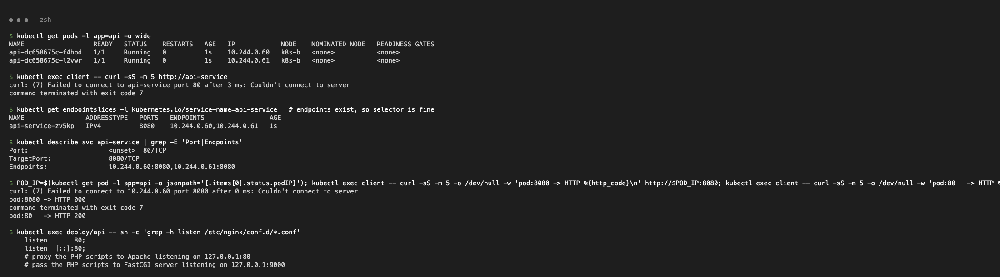
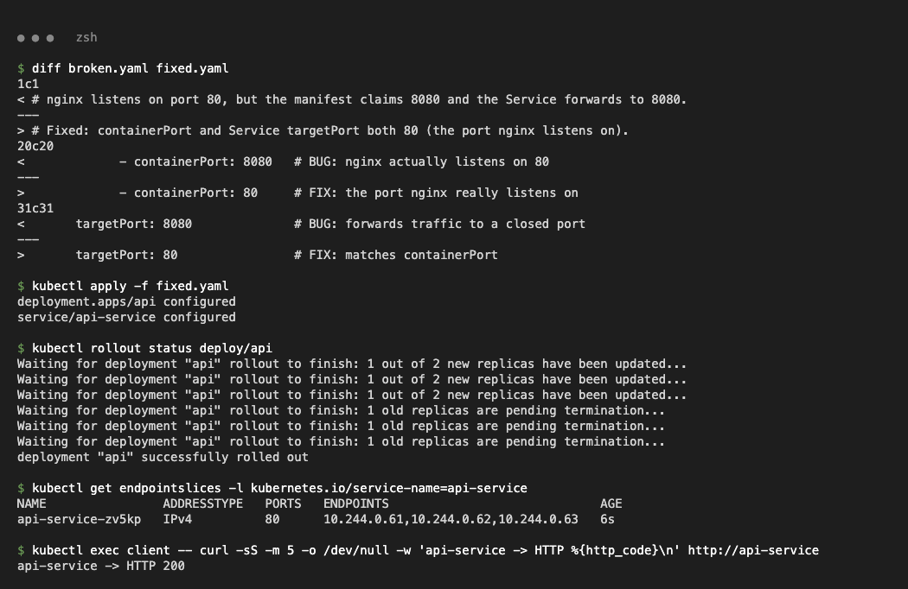

## 8. Configuration: wrong ConfigMap key (`08-configuration/`)

**Problem:** `config-demo` shows `CreateContainerConfigError`.

**Investigation:**

```text
$ kubectl describe pod config-demo | sed -n '/Events/,$p'
  Warning  Failed  11s (x2 over 12s)  kubelet  Error: couldn't find key DATABASE_HOST in ConfigMap default/app-settings
$ kubectl get configmap app-settings -o jsonpath='{.data}'
{"APP_MODE":"production","DB_HOST":"postgres.default.svc.cluster.local"}
```

**Root cause:** `env.valueFrom.configMapKeyRef.key: DATABASE_HOST` doesn't exist in the ConfigMap (the key is `DB_HOST`).

**Fix:** `fixed-pod.yaml` uses `key: DB_HOST`.

```text
$ kubectl logs config-demo
mode=production db=postgres.default.svc.cluster.local
```

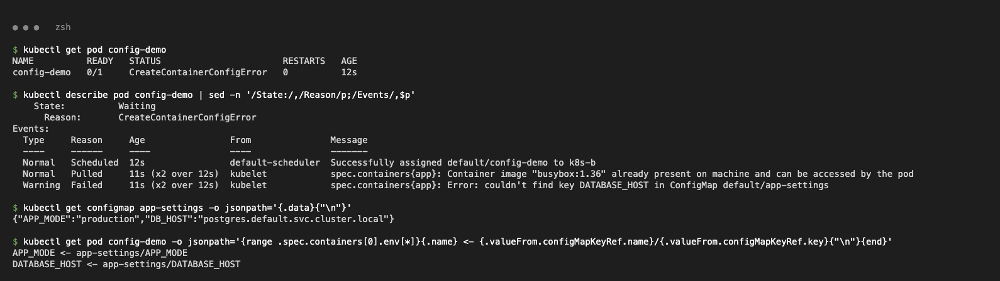
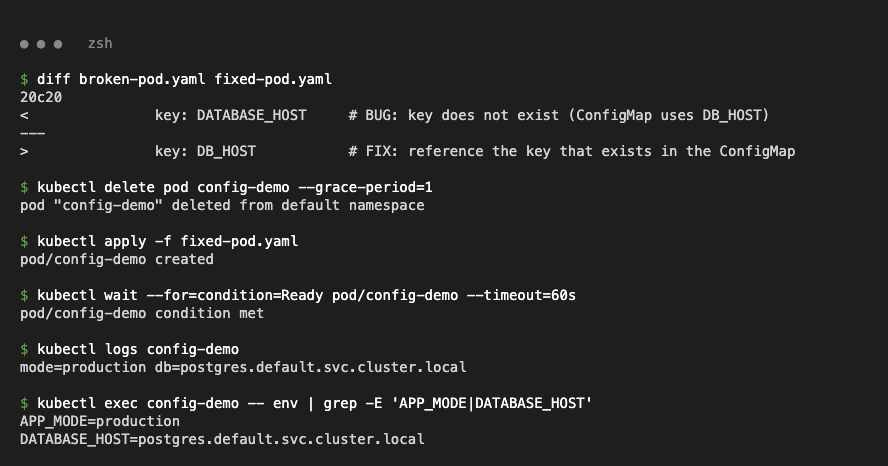

## 9. OOMKilled (`09-oomkilled/`)

**Problem:** `fail-5-oomkilled-pod` keeps restarting.

**Investigation:**

```text
$ kubectl describe pod fail-5-oomkilled-pod | sed -n '/State:/,/Restart Count/p;/Limits/,/memory/p'
    Last State:     Terminated
      Reason:       OOMKilled
      Exit Code:    137
    Restart Count:  3
    Limits:
      memory:  20Mi
```

**Root cause:** the Python process allocates 100 × 10MB with a 20Mi memory limit. The kernel OOM killer stops it with exit code 137 (128 + SIGKILL).

**Fix:** `fixed.yaml` limits the working set to 50MB and sets `requests: 96Mi`, `limits: 128Mi`.

```text
$ kubectl get pod fail-5-oomkilled-pod
NAME                   READY   STATUS    RESTARTS   AGE
fail-5-oomkilled-pod   1/1     Running   0          22s
$ kubectl logs fail-5-oomkilled-pod
Allocating 50MB working set...
Allocated 50 MB - running
```

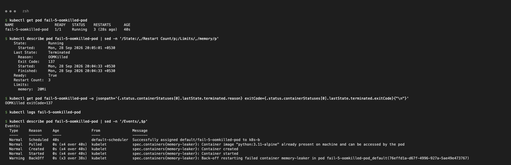
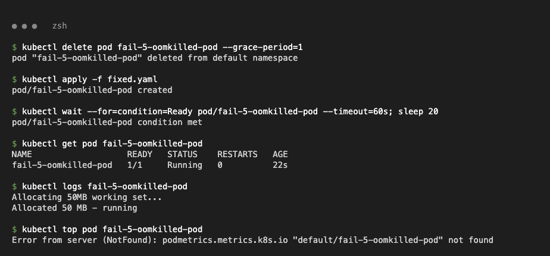
