# Linux Assignment

All commands were executed on an **Ubuntu 22.04** system running **systemd as PID 1** (a privileged Ubuntu 22.04 container named `linux-hw`, so `systemctl` and `journalctl` work normally). Every command in the screenshots is prefixed with `docker exec linux-hw ...` because it was run against that Ubuntu machine from the terminal.

```bash
$ docker exec linux-hw ps -p 1 -o pid,comm
  PID COMMAND
    1 systemd
```

---

## Task 1 – Soft Link vs Hard Link

### Difference

| Point | Hard link | Soft (symbolic) link |
|---|---|---|
| What it is | Another directory entry (name) pointing to the **same inode** | A **separate small file** whose content is the path of the target |
| Inode number | **Same** inode as the original | **Different** inode of its own |
| Link count (`ls -l` 2nd column) | Increases the link count of the file | Does not change the target's link count |
| Cross filesystem / partition | **Not allowed** (inode numbers are only unique inside one filesystem) | **Allowed** (it just stores a path) |
| Directories | **Not allowed** (prevents loops in the directory tree) | **Allowed** |
| Original file deleted | Data is **still accessible** – data is freed only when link count becomes 0 | Link becomes **dangling / broken** ("No such file or directory") |
| File permissions | Same as original (same inode) | Shows `lrwxrwxrwx`; real permissions are the target's |
| Size | Same as original | Length of the target path (e.g. 12 bytes for `original.txt`) |
| Command | `ln target linkname` | `ln -s target linkname` |

### Commands to create

```bash
ln  original.txt hardlink.txt      # hard link
ln -s original.txt softlink.txt    # soft / symbolic link
ls -li                             # -i shows inode numbers
```

### Practice – create both links

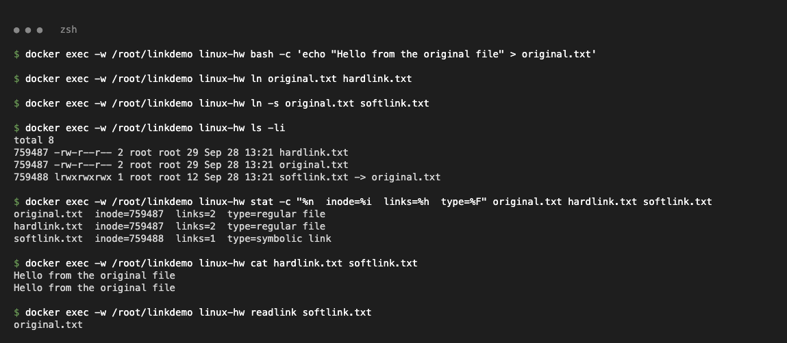

```bash
$ echo "Hello from the original file" > original.txt
$ ln original.txt hardlink.txt
$ ln -s original.txt softlink.txt
$ ls -li
total 8
759487 -rw-r--r-- 2 root root 29 Sep 28 13:21 hardlink.txt
759487 -rw-r--r-- 2 root root 29 Sep 28 13:21 original.txt
759488 lrwxrwxrwx 1 root root 12 Sep 28 13:21 softlink.txt -> original.txt

$ stat -c "%n  inode=%i  links=%h  type=%F" original.txt hardlink.txt softlink.txt
original.txt  inode=759487  links=2  type=regular file
hardlink.txt  inode=759487  links=2  type=regular file
softlink.txt  inode=759488  links=1  type=symbolic link

$ cat hardlink.txt softlink.txt
Hello from the original file
Hello from the original file

$ readlink softlink.txt
original.txt
```

Observations:
- `original.txt` and `hardlink.txt` share inode **759487** and the link count is **2**.
- `softlink.txt` has its own inode **759488**, type `l`, and points to `original.txt`.

### Practice – delete the original file

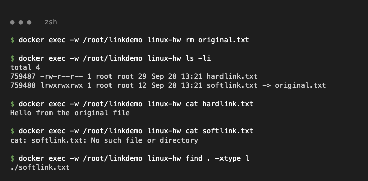

```bash
$ rm original.txt
$ ls -li
total 4
759487 -rw-r--r-- 1 root root 29 Sep 28 13:21 hardlink.txt
759488 lrwxrwxrwx 1 root root 12 Sep 28 13:21 softlink.txt -> original.txt

$ cat hardlink.txt
Hello from the original file

$ cat softlink.txt
cat: softlink.txt: No such file or directory

$ find . -xtype l          # lists broken (dangling) symlinks
./softlink.txt
```

Observations:
- The hard link is still readable; its link count dropped from **2 → 1** (the inode/data still exists).
- The soft link is now **dangling** – it still points to the name `original.txt`, which no longer exists.

### Practice – directories, cross filesystem and deleting links

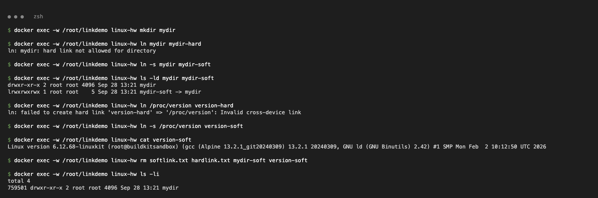

```bash
$ mkdir mydir
$ ln mydir mydir-hard
ln: mydir: hard link not allowed for directory
$ ln -s mydir mydir-soft
$ ls -ld mydir mydir-soft
drwxr-xr-x 2 root root 4096 Sep 28 13:21 mydir
lrwxrwxrwx 1 root root    5 Sep 28 13:21 mydir-soft -> mydir

$ ln /proc/version version-hard          # /proc is a different filesystem
ln: failed to create hard link 'version-hard' => '/proc/version': Invalid cross-device link
$ ln -s /proc/version version-soft
$ cat version-soft
Linux version 6.12.68-linuxkit (root@buildkitsandbox) (gcc (Alpine 13.2.1_git20240309) 13.2.1 20240309, GNU ld (GNU Binutils) 2.42) #1 SMP Mon Feb  2 10:12:50 UTC 2026

$ rm softlink.txt hardlink.txt mydir-soft version-soft    # links are deleted with rm (or unlink)
$ ls -li
total 4
759501 drwxr-xr-x 2 root root 4096 Sep 28 13:21 mydir
```

Deleting a soft link removes only the link, never the target. Deleting the last hard link (link count 0) frees the data.

### Interview answer

> "A **hard link** is just another name for the same inode, so it has the same inode number, increases the link count, and the data survives until every hard link is removed. Because it refers to an inode, it can't cross filesystems and can't be made for directories.
> A **soft (symbolic) link** is a separate file with its own inode that stores the path to the target – like a shortcut. It can point to directories and to files on other filesystems, but if the target is deleted or moved, the symlink becomes dangling.
> I create them with `ln file hardlink` and `ln -s file softlink`, and verify with `ls -li`. In practice symlinks are used for things like `/etc/nginx/sites-enabled -> sites-available`, versioned releases (`current -> release-42`) and tool versions; hard links are used for space-efficient backups/snapshots."

---

## Task 2 – `adduser` vs `useradd`

| | `useradd` | `adduser` |
|---|---|---|
| Type | Low-level native binary (part of `shadow`/`passwd`), available on every Linux distro | High-level, friendly **Perl script** (Debian/Ubuntu) that internally calls `useradd`, `passwd`, `chfn` |
| Home directory | **Not created** by default (needs `-m`) | Created automatically and populated from `/etc/skel` |
| Login shell | Default from `/etc/default/useradd` (`/bin/sh` on Ubuntu) unless `-s` | `/bin/bash` (from `/etc/adduser.conf`) |
| Password | Not set – account is locked until `passwd` is run | Prompts for password (interactive) |
| User info (GECOS) | Not asked | Asks Full Name, Room, Phone… |
| Group | Creates a user private group | Creates user private group, picks next free UID/GID per `/etc/adduser.conf` |
| Best use | Scripts, automation, Dockerfiles, non-Debian distros | Manually creating users on Ubuntu/Debian |

**Which is preferred on Ubuntu?** `adduser`. The Ubuntu/Debian `useradd` man page itself recommends using `adduser` instead, because it follows the distribution policy (`/etc/adduser.conf`): creates the home directory, copies skeleton files (`.bashrc`, `.profile`), sets bash as the shell, picks proper UID/GID and sets a password – so the user is immediately usable. `useradd` is preferred only in scripts or when the exact same command must work on every distro.

```bash
$ file /usr/sbin/adduser
/usr/sbin/adduser: Perl script text executable
```

### Create a user with the recommended command (`adduser`)

`--disabled-password --gecos ""` makes it non-interactive (no password prompt, no full-name questions).

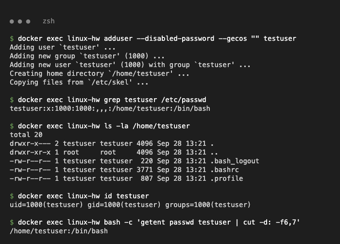

```bash
$ adduser --disabled-password --gecos "" testuser
Adding user `testuser' ...
Adding new group `testuser' (1000) ...
Adding new user `testuser' (1000) with group `testuser' ...
Creating home directory `/home/testuser' ...
Copying files from `/etc/skel' ...

$ grep testuser /etc/passwd
testuser:x:1000:1000:,,,:/home/testuser:/bin/bash

$ ls -la /home/testuser
total 20
drwxr-x--- 2 testuser testuser 4096 Sep 28 13:21 .
drwxr-xr-x 1 root     root     4096 Sep 28 13:21 ..
-rw-r--r-- 1 testuser testuser  220 Sep 28 13:21 .bash_logout
-rw-r--r-- 1 testuser testuser 3771 Sep 28 13:21 .bashrc
-rw-r--r-- 1 testuser testuser  807 Sep 28 13:21 .profile

$ id testuser
uid=1000(testuser) gid=1000(testuser) groups=1000(testuser)

$ getent passwd testuser | cut -d: -f6,7
/home/testuser:/bin/bash
```

`/etc/passwd` format: `username:x:UID:GID:GECOS:home:shell` (the `x` means the password hash is in `/etc/shadow`).

### `useradd` for contrast

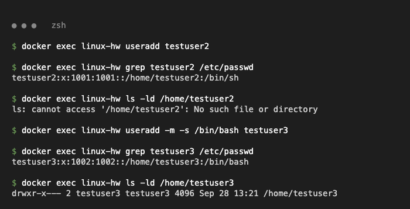

```bash
$ useradd testuser2
$ grep testuser2 /etc/passwd
testuser2:x:1001:1001::/home/testuser2:/bin/sh
$ ls -ld /home/testuser2
ls: cannot access '/home/testuser2': No such file or directory      # no home dir, shell is /bin/sh

$ useradd -m -s /bin/bash testuser3          # -m = create home, -s = shell
$ grep testuser3 /etc/passwd
testuser3:x:1002:1002::/home/testuser3:/bin/bash
$ ls -ld /home/testuser3
drwxr-x--- 2 testuser3 testuser3 4096 Sep 28 13:21 /home/testuser3
```

### Clean up

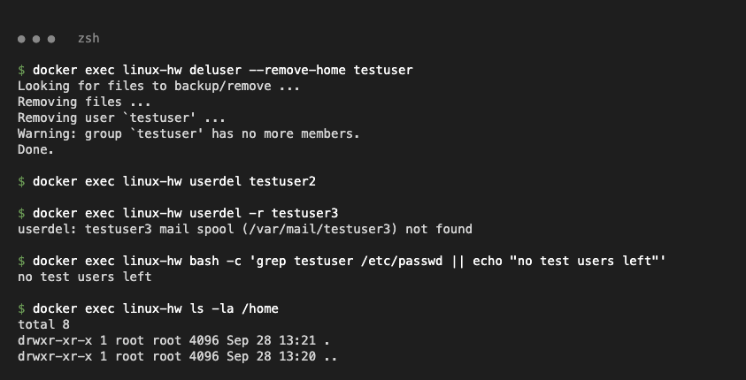

```bash
$ deluser --remove-home testuser
Looking for files to backup/remove ...
Removing files ...
Removing user `testuser' ...
Warning: group `testuser' has no more members.
Done.
$ userdel testuser2
$ userdel -r testuser3
userdel: testuser3 mail spool (/var/mail/testuser3) not found
$ grep testuser /etc/passwd || echo "no test users left"
no test users left
$ ls -la /home
total 8
drwxr-xr-x 1 root root 4096 Sep 28 13:21 .
drwxr-xr-x 1 root root 4096 Sep 28 13:20 ..
```

---

## Task 3 – `journalctl`

**What it is:** `journalctl` is the command used to query and display logs collected by **systemd-journald**, the logging service of systemd. journald collects kernel messages, boot messages, stdout/stderr of every systemd service and syslog messages into a structured, indexed binary journal (`/run/log/journal` or `/var/log/journal`). Because every entry is tagged with metadata (unit, PID, priority, boot ID, time) it can be filtered easily.

### Useful options

| Command | Purpose |
|---|---|
| `journalctl` | All logs, oldest first (opens in a pager) |
| `journalctl --no-pager` | Print directly instead of opening `less` (good for scripts) |
| `journalctl -n 20` | Last 20 lines |
| `journalctl -f` | Follow live logs (like `tail -f`) |
| `journalctl -u nginx` | Logs of one service (unit) |
| `journalctl -b` / `-b -1` | Logs of the current / previous boot |
| `journalctl --list-boots` | List recorded boots |
| `journalctl --since "10 minutes ago"` / `--since "2026-09-28 10:00" --until "..."` | Time range |
| `journalctl -p err` | Only priority `err` and more severe (`emerg, alert, crit, err, warning, notice, info, debug`) |
| `journalctl -xe` | Jump to end with extra explanation (`-x`) – used after a failed service |
| `journalctl -k` | Kernel messages only (like `dmesg`) |
| `journalctl -o short-iso` / `-o json` | Change output format |
| `journalctl --disk-usage` / `--vacuum-time=7d` | Check / clean journal size |

### Install and start a service (nginx) to practice on

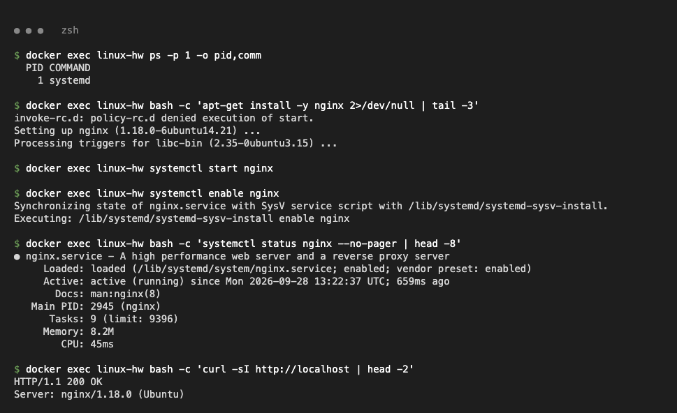

```bash
$ apt-get install -y nginx
...
Setting up nginx (1.18.0-6ubuntu14.21) ...
$ systemctl start nginx
$ systemctl enable nginx
$ systemctl status nginx --no-pager | head -8
● nginx.service - A high performance web server and a reverse proxy server
     Loaded: loaded (/lib/systemd/system/nginx.service; enabled; vendor preset: enabled)
     Active: active (running) since Mon 2026-09-28 13:22:37 UTC; 659ms ago
       Docs: man:nginx(8)
   Main PID: 2945 (nginx)
      Tasks: 9 (limit: 9396)
     Memory: 8.2M
        CPU: 45ms
$ curl -sI http://localhost | head -2
HTTP/1.1 200 OK
Server: nginx/1.18.0 (Ubuntu)
```

### Viewing system logs

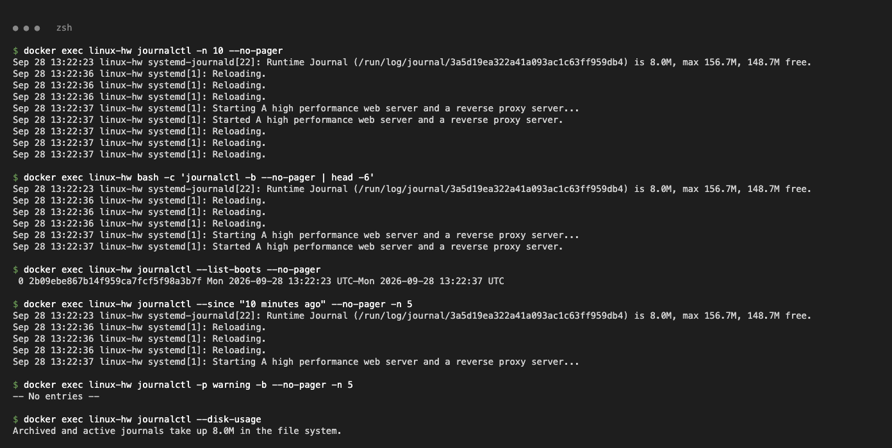

```bash
$ journalctl -n 10 --no-pager
Sep 28 13:22:23 linux-hw systemd-journald[22]: Runtime Journal (/run/log/journal/3a5d19ea322a41a093ac1c63ff959db4) is 8.0M, max 156.7M, 148.7M free.
Sep 28 13:22:36 linux-hw systemd[1]: Reloading.
...
Sep 28 13:22:37 linux-hw systemd[1]: Starting A high performance web server and a reverse proxy server...
Sep 28 13:22:37 linux-hw systemd[1]: Started A high performance web server and a reverse proxy server.

$ journalctl --list-boots --no-pager
 0 2b09ebe867b14f959ca7fcf5f98a3b7f Mon 2026-09-28 13:22:23 UTC—Mon 2026-09-28 13:22:37 UTC

$ journalctl -p warning -b --no-pager -n 5
-- No entries --

$ journalctl --disk-usage
Archived and active journals take up 8.0M in the file system.
```

### Viewing service logs – `journalctl -u nginx`

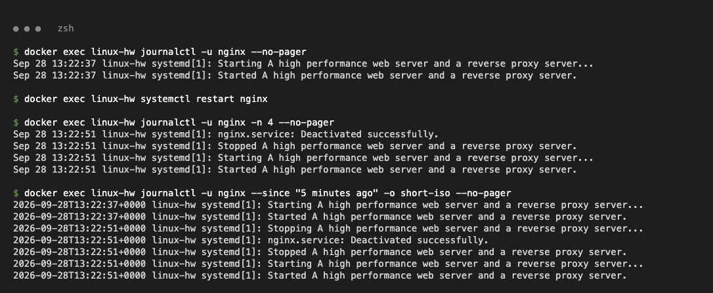

```bash
$ journalctl -u nginx --no-pager
Sep 28 13:22:37 linux-hw systemd[1]: Starting A high performance web server and a reverse proxy server...
Sep 28 13:22:37 linux-hw systemd[1]: Started A high performance web server and a reverse proxy server.

$ systemctl restart nginx
$ journalctl -u nginx -n 4 --no-pager
Sep 28 13:22:51 linux-hw systemd[1]: nginx.service: Deactivated successfully.
Sep 28 13:22:51 linux-hw systemd[1]: Stopped A high performance web server and a reverse proxy server.
Sep 28 13:22:51 linux-hw systemd[1]: Starting A high performance web server and a reverse proxy server...
Sep 28 13:22:51 linux-hw systemd[1]: Started A high performance web server and a reverse proxy server.

$ journalctl -u nginx --since "5 minutes ago" -o short-iso --no-pager
2026-09-28T13:22:37+0000 linux-hw systemd[1]: Starting A high performance web server and a reverse proxy server...
2026-09-28T13:22:37+0000 linux-hw systemd[1]: Started A high performance web server and a reverse proxy server.
2026-09-28T13:22:51+0000 linux-hw systemd[1]: Stopping A high performance web server and a reverse proxy server...
2026-09-28T13:22:51+0000 linux-hw systemd[1]: nginx.service: Deactivated successfully.
2026-09-28T13:22:51+0000 linux-hw systemd[1]: Stopped A high performance web server and a reverse proxy server.
2026-09-28T13:22:51+0000 linux-hw systemd[1]: Starting A high performance web server and a reverse proxy server...
2026-09-28T13:22:51+0000 linux-hw systemd[1]: Started A high performance web server and a reverse proxy server.
```

### Troubleshooting a failed service with `-p err`

A broken config file was added on purpose so that nginx fails to restart, then the error was found with `journalctl` and fixed.

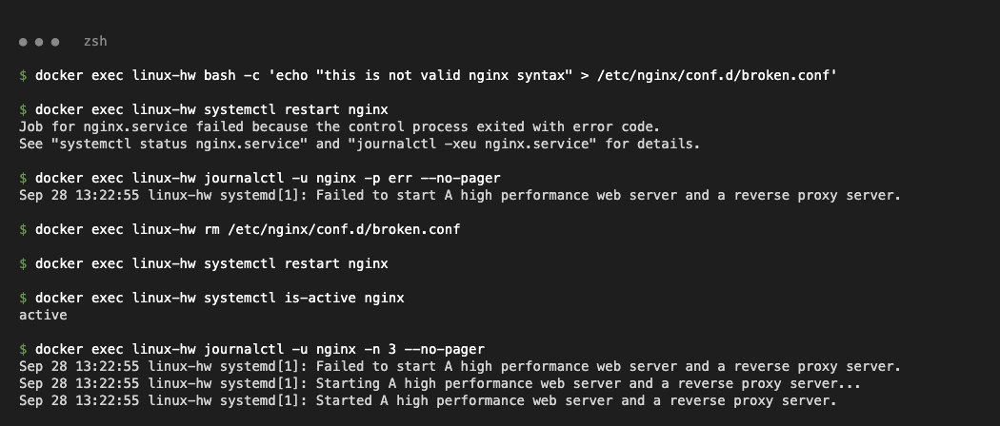

```bash
$ echo "this is not valid nginx syntax" > /etc/nginx/conf.d/broken.conf
$ systemctl restart nginx
Job for nginx.service failed because the control process exited with error code.
See "systemctl status nginx.service" and "journalctl -xeu nginx.service" for details.

$ journalctl -u nginx -p err --no-pager
Sep 28 13:22:55 linux-hw systemd[1]: Failed to start A high performance web server and a reverse proxy server.

$ rm /etc/nginx/conf.d/broken.conf
$ systemctl restart nginx
$ systemctl is-active nginx
active
$ journalctl -u nginx -n 3 --no-pager
Sep 28 13:22:55 linux-hw systemd[1]: Failed to start A high performance web server and a reverse proxy server.
Sep 28 13:22:55 linux-hw systemd[1]: Starting A high performance web server and a reverse proxy server...
Sep 28 13:22:55 linux-hw systemd[1]: Started A high performance web server and a reverse proxy server.
```

### Following logs live (`-f`) and explanations (`-x`)

`journalctl -u nginx -f` keeps running and prints new lines as they arrive (Ctrl+C to stop). Here it was run for 4 seconds while nginx was reloaded:

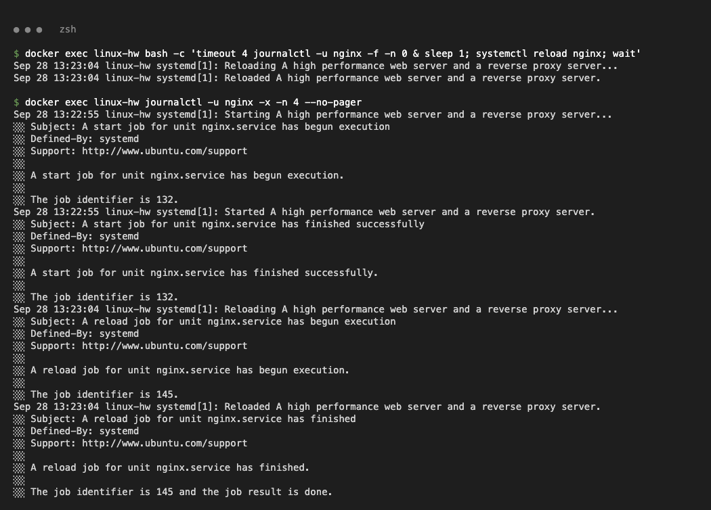

```bash
$ timeout 4 journalctl -u nginx -f -n 0 & sleep 1; systemctl reload nginx; wait
Sep 28 13:23:04 linux-hw systemd[1]: Reloading A high performance web server and a reverse proxy server...
Sep 28 13:23:04 linux-hw systemd[1]: Reloaded A high performance web server and a reverse proxy server.
```

---

## Task 4 – Linux Command Cheat Sheet (practice)

Reviewed: `session2-linux/basic-linux.pdf`, `session2-linux/ad-linux.pdf`, `session2-linux/Linux Networking Cheat Sheet.pdf` and `session2.md`. (Networking commands are practised in detail in the Networking assignment.)

### Cheat sheet

| Category | Command | Purpose | Example |
|---|---|---|---|
| Files & dirs | `pwd` | Print current directory | `pwd` |
| | `ls` | List files (`-l` long, `-a` hidden, `-i` inode, `-ltr` by time, `-R` recursive) | `ls -ltr` |
| | `cd` | Change directory | `cd /var/log` |
| | `mkdir` | Create directory (`-p` parents) | `mkdir -p devops_logs/archive` |
| | `touch` | Create empty file / update timestamp | `touch index.html` |
| | `cp` | Copy (`-r` for dirs) | `cp app.conf devops_logs/` |
| | `mv` | Move / rename | `mv index.html home.html` |
| | `rm` | Remove (`-r` dirs, `-f` force) | `rm -r devops_logs/archive` |
| | `ln` / `ln -s` | Hard / soft link | `ln -s target link` |
| Viewing | `cat` | Print file | `cat /etc/os-release` |
| | `head` / `tail` | First / last lines (`tail -f` follow) | `tail -n 100 /var/log/syslog` |
| | `less` | Page through a large file | `less /var/log/syslog` |
| | `wc -l` | Count lines | `wc -l app.log` |
| Search & text | `find` | Find files by name/type/size | `find /etc -type f -name "*.conf"` |
| | `grep` | Search text (`-i` ignore case, `-n` line no, `-v` invert, `-r` recursive, `-c` count) | `grep -ir "error" /var/log/` |
| | `sed` | Stream editor – substitute / print lines | `sed 's/ERROR/CRITICAL/' app.log` |
| | `awk` | Column processing | `awk '{print $3}' app.log` |
| | `sort` / `uniq -c` | Sort / count duplicates | `awk '{print $3}' app.log \| sort \| uniq -c` |
| Permissions | `chmod` | Change permissions (numeric or symbolic) | `chmod 755 script.sh` |
| | `chown` | Change owner:group | `chown appuser:appuser app.conf` |
| | `umask` | Default permission mask | `umask` |
| Processes | `ps aux` | List all processes | `ps aux \| grep nginx` |
| | `top` / `htop` | Live resource usage (`top -b -n 1` for one snapshot) | `top` |
| | `pgrep` / `pkill` | Find / kill by name | `pkill sleep` |
| | `kill -9 PID` | Force kill by PID | `kill -9 1234` |
| | `nohup cmd &` | Keep running after logout, in background | `nohup sleep 300 &` |
| | `systemctl` | Manage services | `systemctl restart nginx` |
| | `journalctl` | Read systemd logs | `journalctl -u nginx` |
| Disk & memory | `df -h` | Filesystem usage | `df -h` |
| | `du -sh` | Size of a dir | `du -sh /var/log` |
| | `free -h` | RAM / swap usage | `free -h` |
| | `lsblk` | Block devices | `lsblk` |
| Archive | `tar -czvf` | Create gzip archive | `tar -czvf backup.tar.gz files` |
| | `tar -tzvf` / `-xzf` | List / extract archive | `tar -xzf backup.tar.gz -C restore` |
| System info | `uname -a` | Kernel info | `uname -a` |
| | `hostname`, `whoami`, `date`, `uptime` | Host, user, time, load | `uptime` |
| Users | `adduser`, `useradd`, `usermod -aG`, `passwd`, `id`, `userdel` | User management | `id testuser` |
| Packages | `apt update && apt install -y` | Install software | `apt install -y nginx` |
| Network | `ip a`, `ss -tuln`, `curl -I`, `ping` | Interfaces, ports, HTTP, reachability | `ss -tuln` |

### 1. File & directory operations

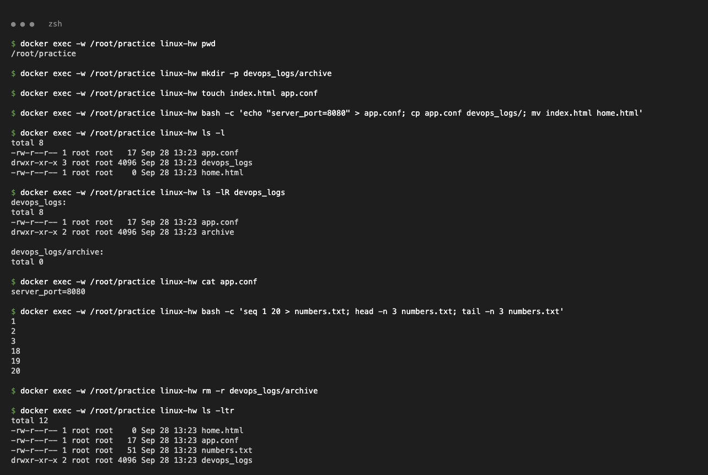

```bash
$ pwd
/root/practice
$ mkdir -p devops_logs/archive
$ touch index.html app.conf
$ echo "server_port=8080" > app.conf; cp app.conf devops_logs/; mv index.html home.html
$ ls -l
total 8
-rw-r--r-- 1 root root   17 Sep 28 13:23 app.conf
drwxr-xr-x 3 root root 4096 Sep 28 13:23 devops_logs
-rw-r--r-- 1 root root    0 Sep 28 13:23 home.html
$ ls -lR devops_logs
devops_logs:
total 8
-rw-r--r-- 1 root root   17 Sep 28 13:23 app.conf
drwxr-xr-x 2 root root 4096 Sep 28 13:23 archive

devops_logs/archive:
total 0
$ cat app.conf
server_port=8080
$ seq 1 20 > numbers.txt; head -n 3 numbers.txt; tail -n 3 numbers.txt
1
2
3
18
19
20
$ rm -r devops_logs/archive
$ ls -ltr
total 12
-rw-r--r-- 1 root root    0 Sep 28 13:23 home.html
-rw-r--r-- 1 root root   17 Sep 28 13:23 app.conf
-rw-r--r-- 1 root root   51 Sep 28 13:23 numbers.txt
drwxr-xr-x 2 root root 4096 Sep 28 13:23 devops_logs
```

### 2. Permissions – `chmod`, `chown`, `umask`

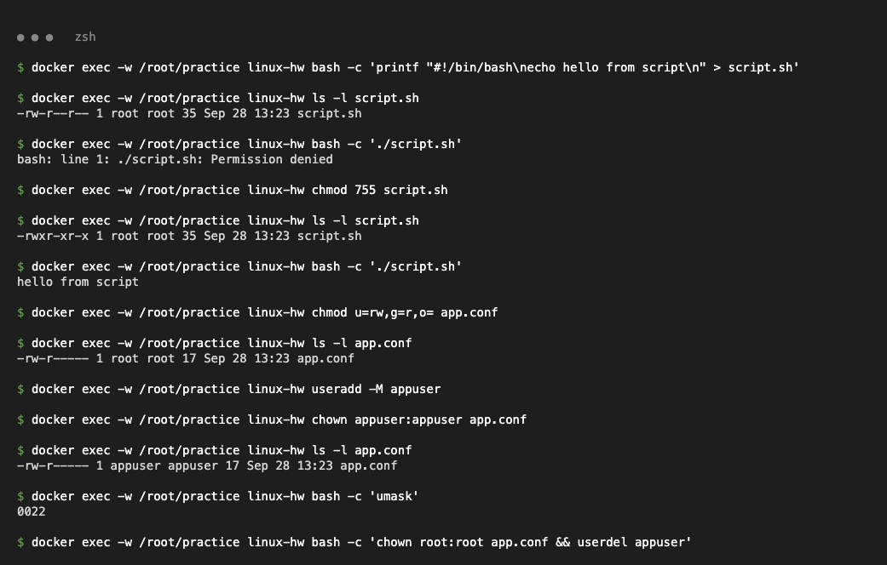

```bash
$ ls -l script.sh
-rw-r--r-- 1 root root 35 Sep 28 13:23 script.sh
$ ./script.sh
bash: line 1: ./script.sh: Permission denied
$ chmod 755 script.sh            # rwx for owner, r-x for group and others
$ ls -l script.sh
-rwxr-xr-x 1 root root 35 Sep 28 13:23 script.sh
$ ./script.sh
hello from script
$ chmod u=rw,g=r,o= app.conf     # symbolic mode = 640
$ ls -l app.conf
-rw-r----- 1 root root 17 Sep 28 13:23 app.conf
$ useradd -M appuser
$ chown appuser:appuser app.conf
$ ls -l app.conf
-rw-r----- 1 appuser appuser 17 Sep 28 13:23 app.conf
$ umask
0022                             # new files 644, new dirs 755
```

Numeric permissions: `r=4, w=2, x=1` → `7=rwx, 6=rw-, 5=r-x, 4=r--`, written as owner/group/others.

### 3. `find`, `grep`, `sed`, `awk`

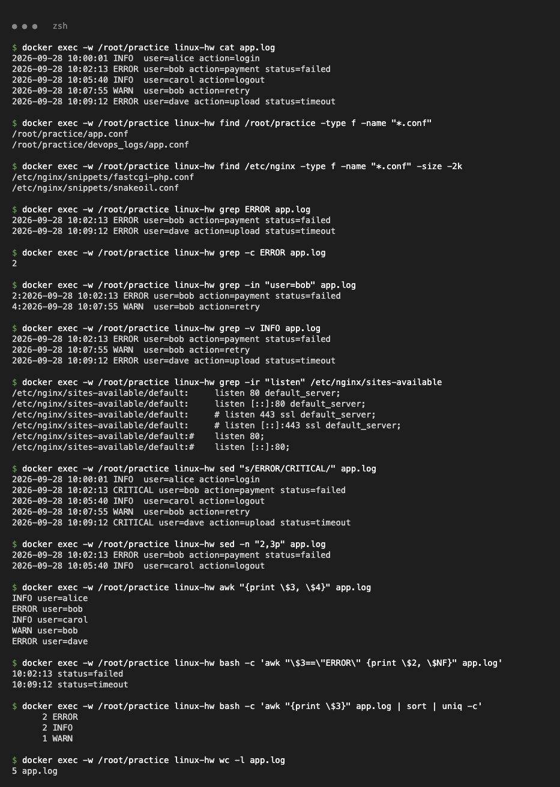

```bash
$ cat app.log
2026-09-28 10:00:01 INFO  user=alice action=login
2026-09-28 10:02:13 ERROR user=bob action=payment status=failed
2026-09-28 10:05:40 INFO  user=carol action=logout
2026-09-28 10:07:55 WARN  user=bob action=retry
2026-09-28 10:09:12 ERROR user=dave action=upload status=timeout

$ find /root/practice -type f -name "*.conf"
/root/practice/app.conf
/root/practice/devops_logs/app.conf
$ find /etc/nginx -type f -name "*.conf" -size -2k
/etc/nginx/snippets/fastcgi-php.conf
/etc/nginx/snippets/snakeoil.conf

$ grep ERROR app.log
2026-09-28 10:02:13 ERROR user=bob action=payment status=failed
2026-09-28 10:09:12 ERROR user=dave action=upload status=timeout
$ grep -c ERROR app.log
2
$ grep -in "user=bob" app.log
2:2026-09-28 10:02:13 ERROR user=bob action=payment status=failed
4:2026-09-28 10:07:55 WARN  user=bob action=retry
$ grep -v INFO app.log
2026-09-28 10:02:13 ERROR user=bob action=payment status=failed
2026-09-28 10:07:55 WARN  user=bob action=retry
2026-09-28 10:09:12 ERROR user=dave action=upload status=timeout
$ grep -ir "listen" /etc/nginx/sites-available
/etc/nginx/sites-available/default:	listen 80 default_server;
/etc/nginx/sites-available/default:	listen [::]:80 default_server;
...

$ sed 's/ERROR/CRITICAL/' app.log
2026-09-28 10:00:01 INFO  user=alice action=login
2026-09-28 10:02:13 CRITICAL user=bob action=payment status=failed
2026-09-28 10:05:40 INFO  user=carol action=logout
2026-09-28 10:07:55 WARN  user=bob action=retry
2026-09-28 10:09:12 CRITICAL user=dave action=upload status=timeout
$ sed -n '2,3p' app.log
2026-09-28 10:02:13 ERROR user=bob action=payment status=failed
2026-09-28 10:05:40 INFO  user=carol action=logout

$ awk '{print $3, $4}' app.log
INFO user=alice
ERROR user=bob
INFO user=carol
WARN user=bob
ERROR user=dave
$ awk '$3=="ERROR" {print $2, $NF}' app.log
10:02:13 status=failed
10:09:12 status=timeout
$ awk '{print $3}' app.log | sort | uniq -c
      2 ERROR
      2 INFO
      1 WARN
$ wc -l app.log
5 app.log
```

### 4. Processes – `ps`, `top`, `pgrep`, `pkill`, `nohup`

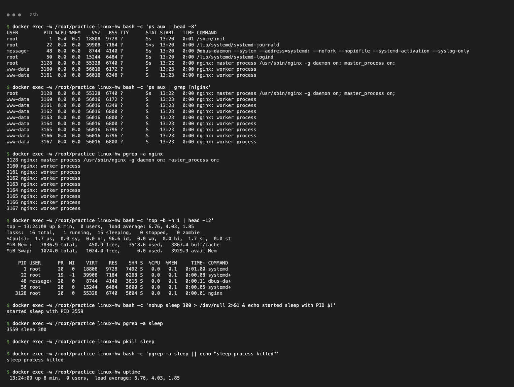

```bash
$ ps aux | head -8
USER         PID %CPU %MEM    VSZ   RSS TTY      STAT START   TIME COMMAND
root           1  0.4  0.1  18808  9728 ?        Ss   13:20   0:01 /sbin/init
root          22  0.0  0.0  39908  7184 ?        S<s  13:20   0:00 /lib/systemd/systemd-journald
...
root        3128  0.0  0.0  55328  6740 ?        Ss   13:22   0:00 nginx: master process /usr/sbin/nginx -g daemon on; master_process on;
www-data    3160  0.0  0.0  56016  6172 ?        S    13:23   0:00 nginx: worker process

$ top -b -n 1 | head -12
top - 13:24:08 up 8 min,  0 users,  load average: 6.76, 4.03, 1.85
Tasks:  16 total,   1 running,  15 sleeping,   0 stopped,   0 zombie
%Cpu(s):  1.7 us,  0.0 sy,  0.0 ni, 96.6 id,  0.0 wa,  0.0 hi,  1.7 si,  0.0 st
MiB Mem :   7836.9 total,    450.9 free,   3518.6 used,   3867.4 buff/cache
...

$ nohup sleep 300 > /dev/null 2>&1 & echo started sleep with PID $!
started sleep with PID 3559
$ pgrep -a sleep
3559 sleep 300
$ pkill sleep
$ pgrep -a sleep || echo "sleep process killed"
sleep process killed
$ uptime
 13:24:09 up 8 min,  0 users,  load average: 6.76, 4.03, 1.85
```

### 5. Disk, memory and archives – `df`, `du`, `free`, `tar`

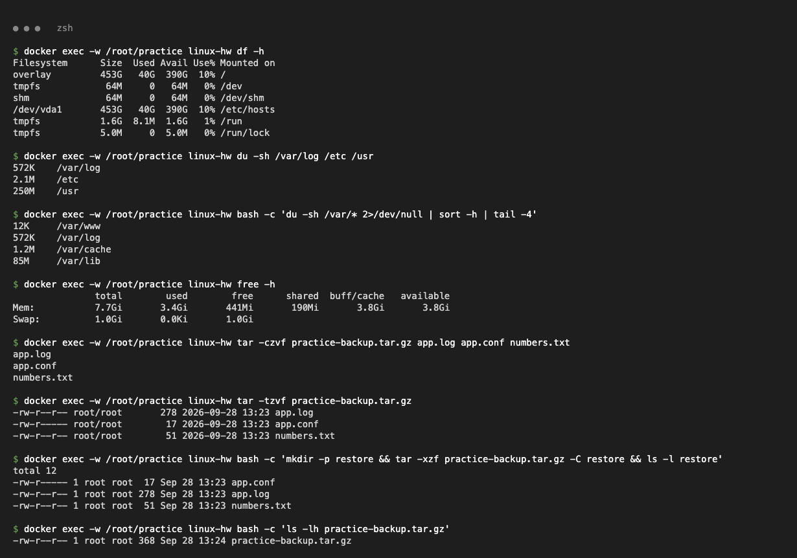

```bash
$ df -h
Filesystem      Size  Used Avail Use% Mounted on
overlay         453G   40G  390G  10% /
tmpfs            64M     0   64M   0% /dev
...
$ du -sh /var/log /etc /usr
572K	/var/log
2.1M	/etc
250M	/usr
$ du -sh /var/* 2>/dev/null | sort -h | tail -4
12K	/var/www
572K	/var/log
1.2M	/var/cache
85M	/var/lib
$ free -h
               total        used        free      shared  buff/cache   available
Mem:           7.7Gi       3.4Gi       441Mi       190Mi       3.8Gi       3.8Gi
Swap:          1.0Gi       0.0Ki       1.0Gi

$ tar -czvf practice-backup.tar.gz app.log app.conf numbers.txt     # c=create z=gzip v=verbose f=file
app.log
app.conf
numbers.txt
$ tar -tzvf practice-backup.tar.gz                                  # t=list
-rw-r--r-- root/root       278 2026-09-28 13:23 app.log
-rw-r----- root/root        17 2026-09-28 13:23 app.conf
-rw-r--r-- root/root        51 2026-09-28 13:23 numbers.txt
$ mkdir -p restore && tar -xzf practice-backup.tar.gz -C restore && ls -l restore   # x=extract
total 12
-rw-r----- 1 root root  17 Sep 28 13:23 app.conf
-rw-r--r-- 1 root root 278 Sep 28 13:23 app.log
-rw-r--r-- 1 root root  51 Sep 28 13:23 numbers.txt
```

### 6. System information & quick network checks

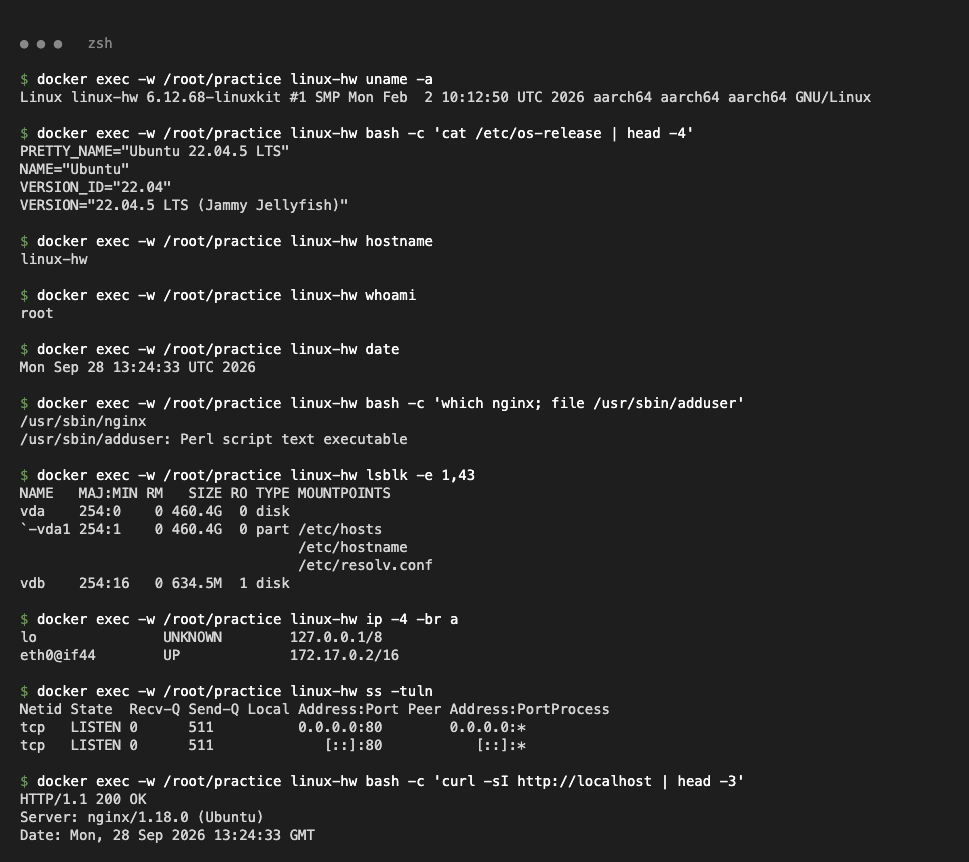

```bash
$ uname -a
Linux linux-hw 6.12.68-linuxkit #1 SMP Mon Feb  2 10:12:50 UTC 2026 aarch64 aarch64 aarch64 GNU/Linux
$ cat /etc/os-release | head -4
PRETTY_NAME="Ubuntu 22.04.5 LTS"
NAME="Ubuntu"
VERSION_ID="22.04"
VERSION="22.04.5 LTS (Jammy Jellyfish)"
$ hostname
linux-hw
$ whoami
root
$ date
Mon Sep 28 13:24:33 UTC 2026
$ which nginx; file /usr/sbin/adduser
/usr/sbin/nginx
/usr/sbin/adduser: Perl script text executable
$ lsblk -e 1,43
NAME   MAJ:MIN RM   SIZE RO TYPE MOUNTPOINTS
vda    254:0    0 460.4G  0 disk
`-vda1 254:1    0 460.4G  0 part /etc/hosts
                                 /etc/hostname
                                 /etc/resolv.conf
vdb    254:16   0 634.5M  1 disk
$ ip -4 -br a
lo               UNKNOWN        127.0.0.1/8
eth0@if44        UP             172.17.0.2/16
$ ss -tuln
Netid State  Recv-Q Send-Q Local Address:Port Peer Address:PortProcess
tcp   LISTEN 0      511          0.0.0.0:80        0.0.0.0:*
tcp   LISTEN 0      511             [::]:80           [::]:*
$ curl -sI http://localhost | head -3
HTTP/1.1 200 OK
Server: nginx/1.18.0 (Ubuntu)
Date: Mon, 28 Sep 2026 13:24:33 GMT
```
