# Monitoring, Observability & GitOps – Assignment

Cluster: minikube profile `k8s-a` (Kubernetes v1.37, containerd, 3 CPU / 3 GB).

| Path | Contents |
| :--- | :--- |
| [`monitoring/`](monitoring) | `values.yaml` (lightweight kube-prometheus-stack), `sample-app.yaml` (podinfo + ServiceMonitor), `alert-rules.yaml` (PrometheusRule), `cpu-stress.yaml` |
| [`gitops/`](gitops) | `app/` (synced by Argo CD), `argocd-application.yaml`, `repo-secret.example.yaml` |
| [`screenshots/`](screenshots) | evidence |

---

## Task 1 – Monitoring demo

### Install Prometheus + Grafana + Alertmanager

```bash
helm repo add prometheus-community https://prometheus-community.github.io/helm-charts
helm install monitoring prometheus-community/kube-prometheus-stack \
  -n monitoring --create-namespace -f monitoring/values.yaml
kubectl apply -f monitoring/sample-app.yaml -f monitoring/alert-rules.yaml
```

`values.yaml` trims resources, enables Grafana anonymous viewer, and disables etcd / scheduler / controller-manager / kube-proxy scraping (not reachable on minikube).

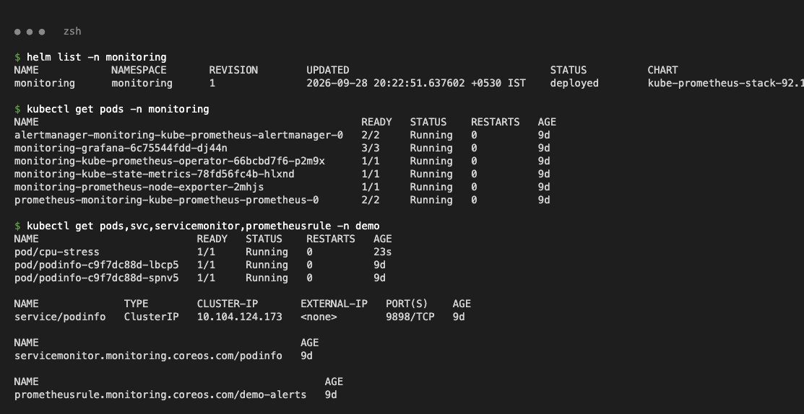

> Pod `AGE` shows `9d` because the host clock was corrected while the demo was running.

### Metrics – all targets UP (podinfo scraped via ServiceMonitor)

```bash
kubectl -n monitoring port-forward svc/monitoring-kube-prometheus-prometheus 9090:9090
kubectl -n monitoring port-forward svc/monitoring-grafana 3000:80
kubectl -n monitoring port-forward svc/monitoring-kube-prometheus-alertmanager 9093:9093
```

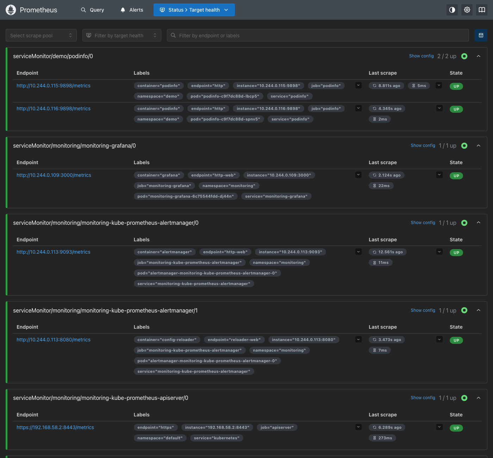

### CPU utilisation (PromQL)

```promql
sum by (pod) (rate(container_cpu_usage_seconds_total{namespace="demo", container!=""}[1m]))
```

`cpu-stress` pod climbs to its 0.5-core limit:

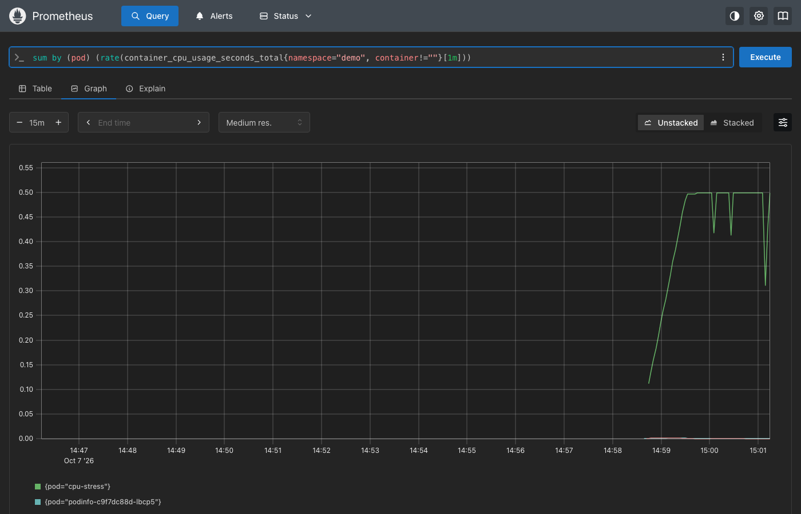

### Memory utilisation (PromQL, MiB)

```promql
sum by (pod) (container_memory_working_set_bytes{namespace="demo", container!=""}) / 1024 / 1024
```

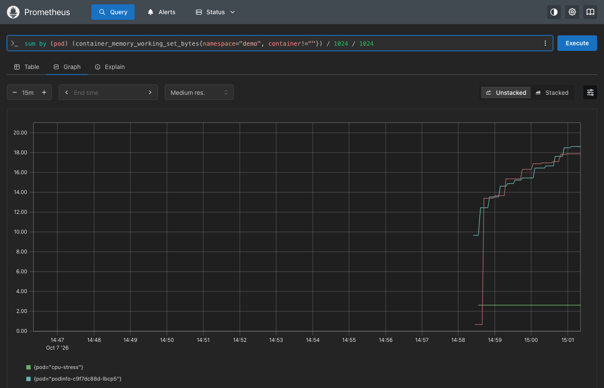

### Grafana dashboard – Kubernetes / Compute Resources / Namespace (Pods), namespace `demo`

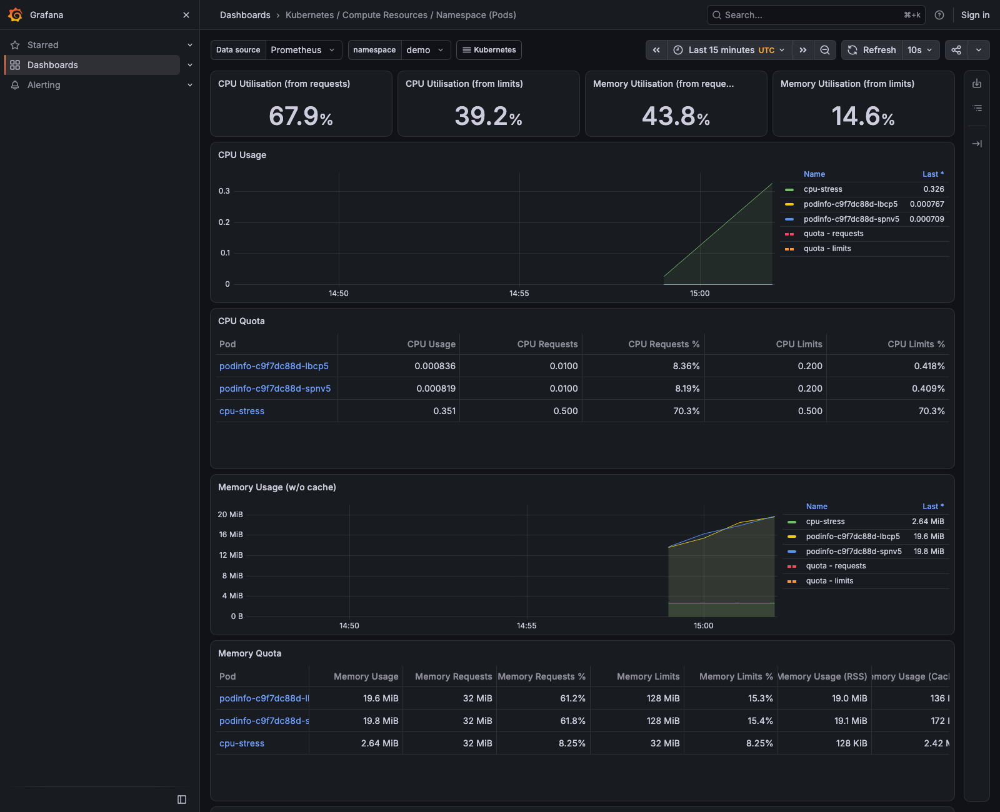

### Alerts

| Alert | Expression | for |
| :--- | :--- | :--- |
| `HighPodCPU` | `sum by (namespace,pod)(rate(container_cpu_usage_seconds_total{namespace="demo",container!=""}[1m])) > 0.1` | 1m |
| `HighPodMemory` | `sum by (namespace,pod)(container_memory_working_set_bytes{namespace="demo",container!=""}) > 100Mi` | 1m |
| `PodinfoDown` | `kube_deployment_status_replicas_available{namespace="demo",deployment="podinfo"} < 1` | 30s |

Trigger high CPU:

```bash
kubectl apply -f monitoring/cpu-stress.yaml   # busy loop, 500m limit
```

`HighPodCPU` firing in Prometheus (value ≈ 0.5 core):

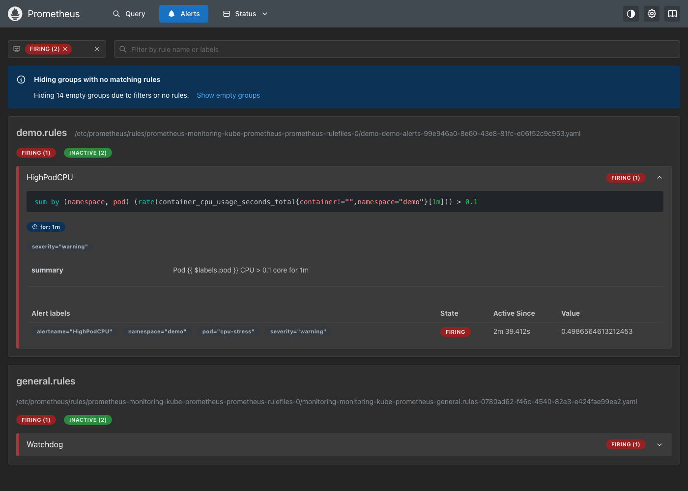

Routed to Alertmanager:

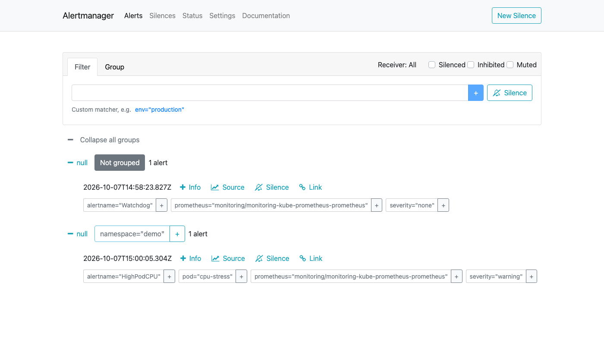

Trigger app down:

```bash
kubectl scale deploy podinfo -n demo --replicas=0
```

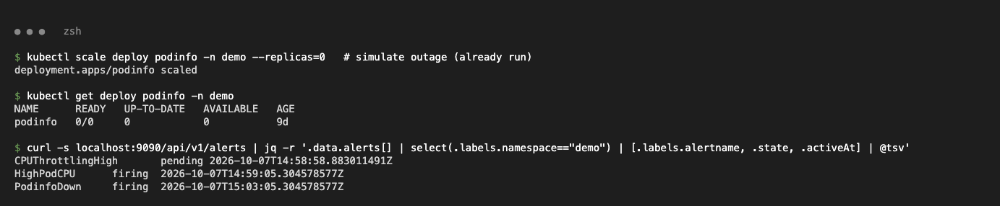
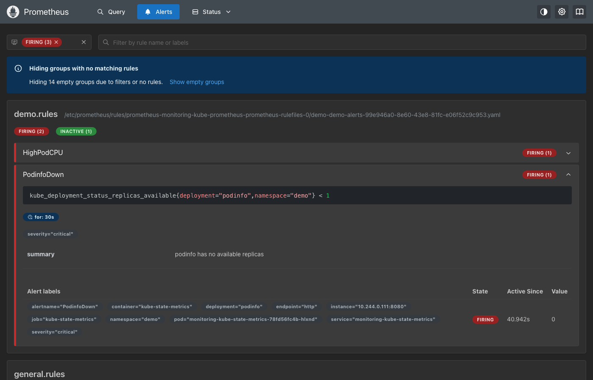

### Application health + logs

Health comes from liveness/readiness probes (`/healthz`, `/readyz`) and the Prometheus `up` metric (1 = target healthy).

```promql
up{job="podinfo"}
```

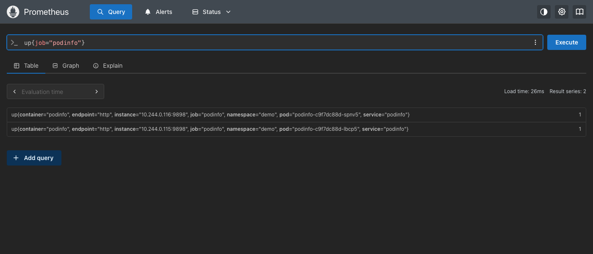

```bash
kubectl logs -n demo deploy/podinfo --tail=5
kubectl logs -n demo cpu-stress
kubectl get events -n demo --sort-by=.lastTimestamp
```

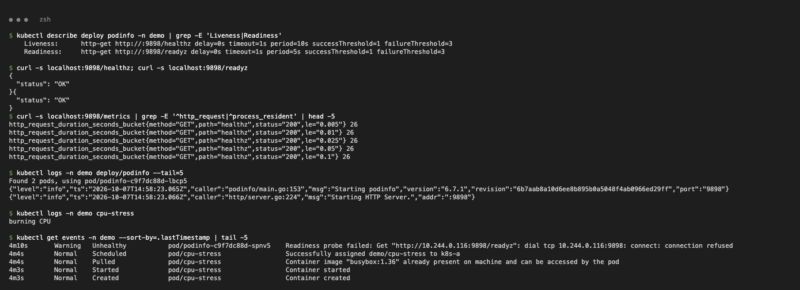

---

## Task 2 – Observability

Observability means understanding a system's internal state from the data it emits. Monitoring tells you *that* something broke; observability helps you find *why*.

| Pillar | What it is | Example | Tools |
| :--- | :--- | :--- | :--- |
| Metrics | Numeric values over time | CPU %, memory, request rate, error rate | Prometheus, Grafana |
| Logs | Timestamped event records | `Starting HTTP Server`, stack traces | `kubectl logs`, Loki, ELK/EFK |
| Traces | One request's path across services, with timings | checkout → payment → DB (320 ms) | Jaeger, Tempo, OpenTelemetry |

**Why it is needed:** distributed, short-lived containers fail in ways you cannot predict ahead of time. Correlated metrics, logs and traces cut the time to detect and fix issues (MTTD / MTTR).

| Category | Tools |
| :--- | :--- |
| Metrics & alerting | Prometheus, Alertmanager, Thanos |
| Dashboards | Grafana |
| Logs | Loki + Promtail, ELK / EFK (Fluentd/Fluent Bit) |
| Tracing | Jaeger, Grafana Tempo, Zipkin |
| Instrumentation | OpenTelemetry |
| SaaS | Datadog, New Relic, Grafana Cloud |

**Kubernetes observability**
* Metrics: kubelet/cAdvisor (containers), kube-state-metrics (object state), node-exporter (nodes), collected by Prometheus through ServiceMonitors.
* Logs: container stdout/stderr (`kubectl logs`), shipped cluster-wide by a DaemonSet (Promtail/Fluent Bit).
* Health: probes, `kubectl get events`, `kubectl top` (metrics-server), and alerts defined as `PrometheusRule` objects.

---

## Task 3 – GitOps with Argo CD

| Concept | Summary |
| :--- | :--- |
| GitOps | Run operations through Git: the desired cluster state lives in a repo and an in-cluster agent applies it. |
| Git as source of truth | Every change is a commit (reviewed, versioned, revertible). No direct `kubectl apply` in normal operations. |
| Declarative config | YAML describes *what* should exist (3 replicas of nginx), not the steps to get there. |
| Continuous reconciliation | The agent keeps comparing Git with the live cluster and fixes drift (`selfHeal`), and removes resources deleted from Git (`prune`). |
| Workflow | edit YAML → commit/PR → merge to `main` → Argo CD detects the new revision → syncs the cluster → reports Synced/Healthy |
| Kubernetes + GitOps | The Kubernetes API is already declarative, so Argo CD/Flux only need to diff and apply manifests (plain, Kustomize, Helm). |

### Install Argo CD and register the private repo (read-only deploy key)

```bash
kubectl create namespace argocd
kubectl apply -n argocd --server-side --force-conflicts \
  -f https://raw.githubusercontent.com/argoproj/argo-cd/stable/manifests/install.yaml

ssh-keygen -t ed25519 -N "" -f argocd-deploy-key
gh repo deploy-key add argocd-deploy-key.pub --repo paradoxicsys/uni-devops --title argocd-demo   # read-only
kubectl -n argocd create secret generic uni-devops-repo --from-literal=type=git \
  --from-literal=url=git@github.com:paradoxicsys/uni-devops.git --from-file=sshPrivateKey=argocd-deploy-key
kubectl -n argocd label secret uni-devops-repo argocd.argoproj.io/secret-type=repository
```

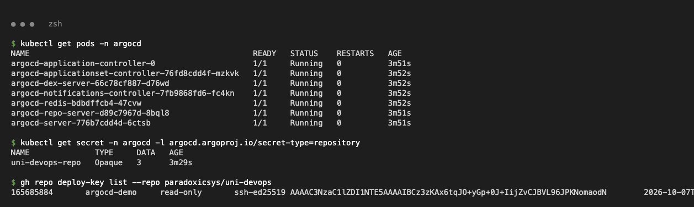

### Application (path `Monitoring-Observability-GitOps-Assignment/gitops/app`, auto-sync + prune + selfHeal)

```bash
kubectl apply -f gitops/argocd-application.yaml
```

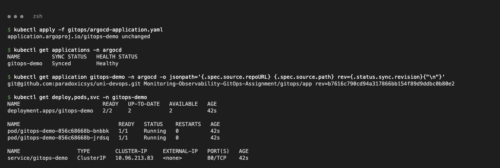
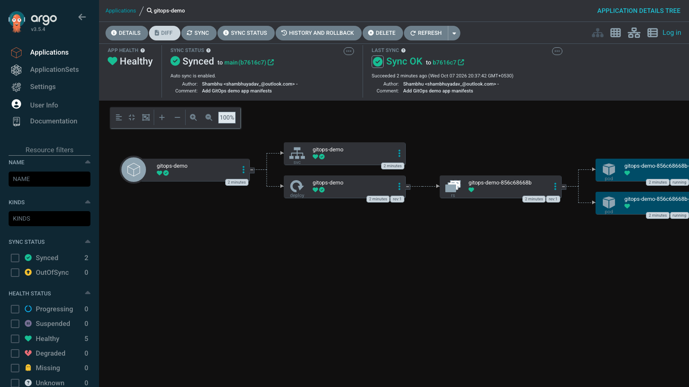

### Change in Git → automatic sync (replicas 2 → 3)

```bash
sed -i '' 's/replicas: 2/replicas: 3/' gitops/app/deployment.yaml
git commit -m "Scale gitops-demo to 3 replicas" gitops/app/deployment.yaml
git push origin main
```

No manual sync or refresh: Argo CD picked up the new revision on its own poll and scaled to 3.

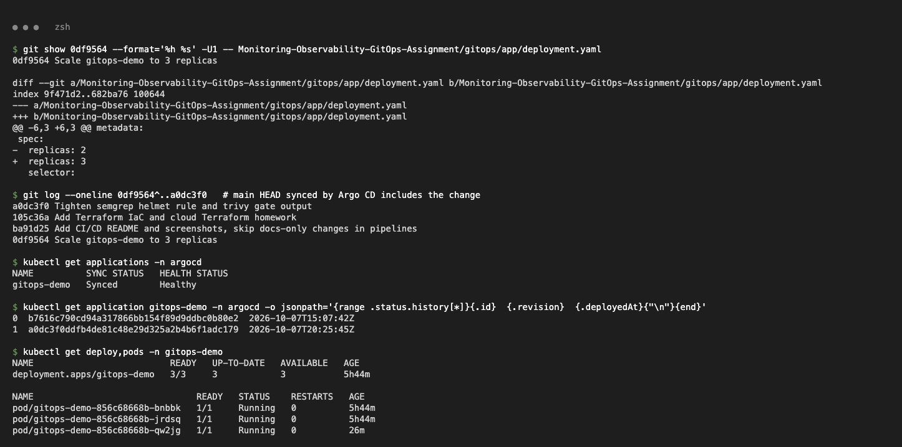
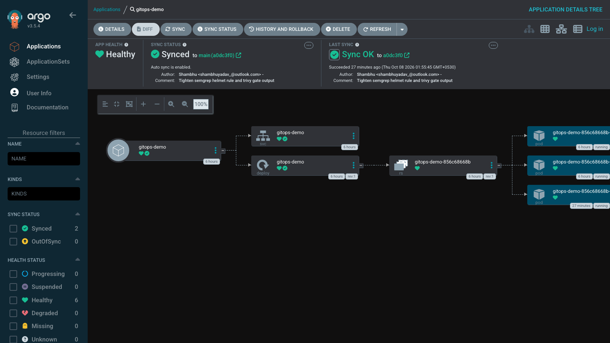

### Self-heal (manual drift is reverted)

```bash
kubectl scale deploy gitops-demo -n gitops-demo --replicas=1
```

Within seconds Argo CD scaled it back to 3 (`initiatedBy automated=true`).

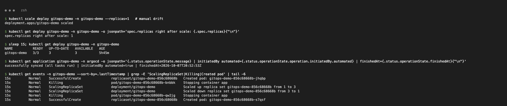

### Cleanup

Removed the Application, Argo CD, the monitoring stack and the GitHub deploy key.

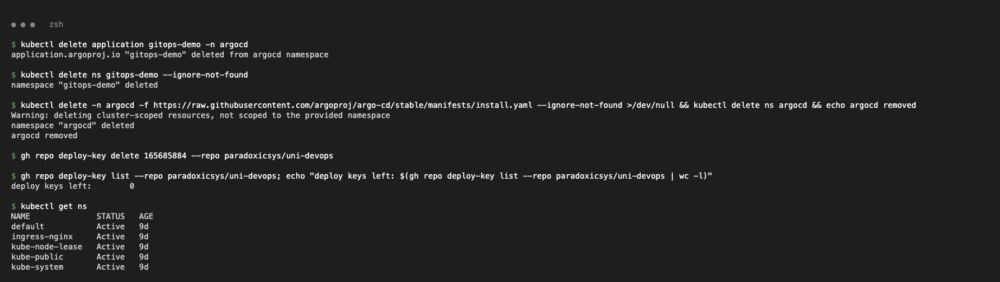
