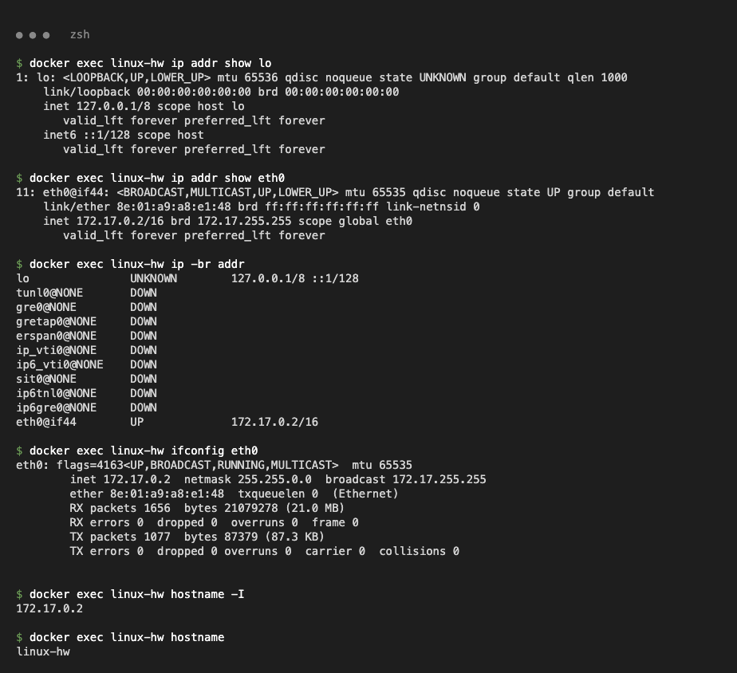
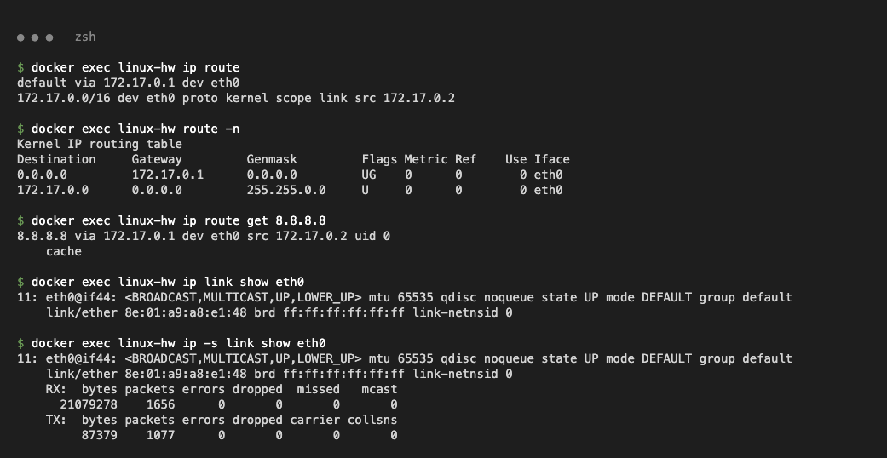
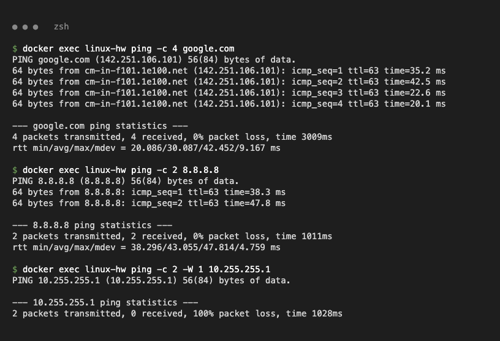
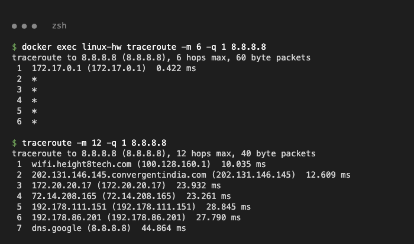
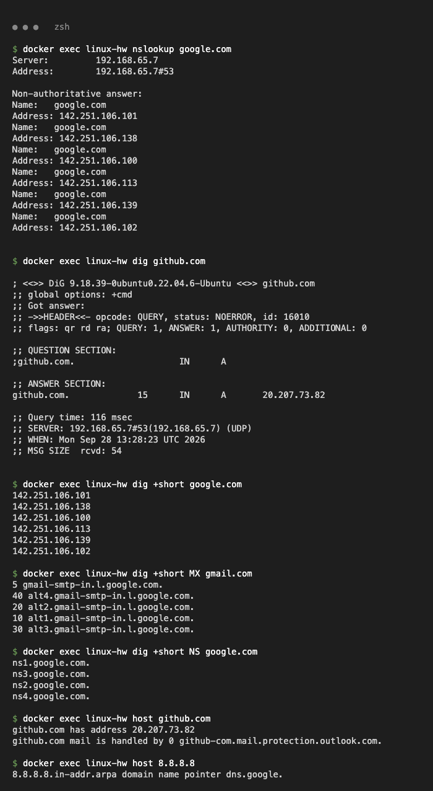
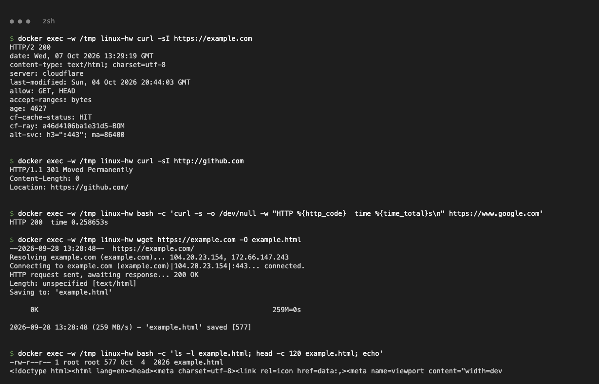
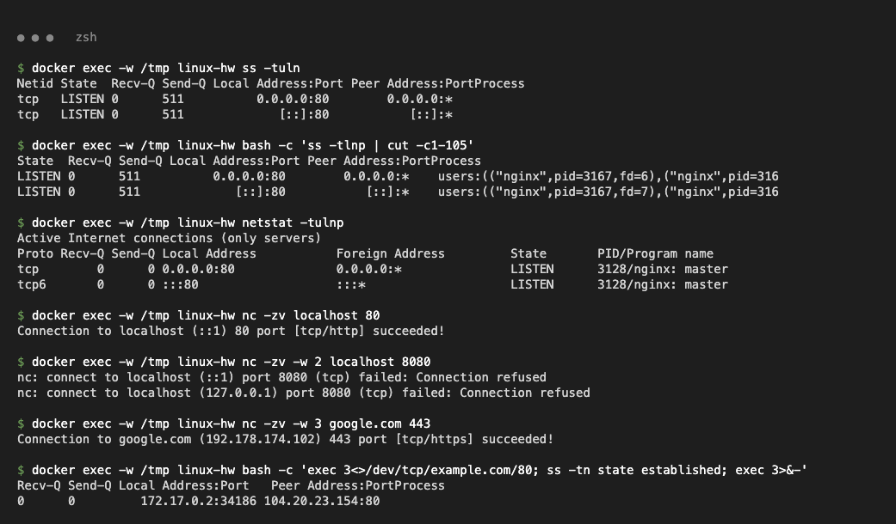
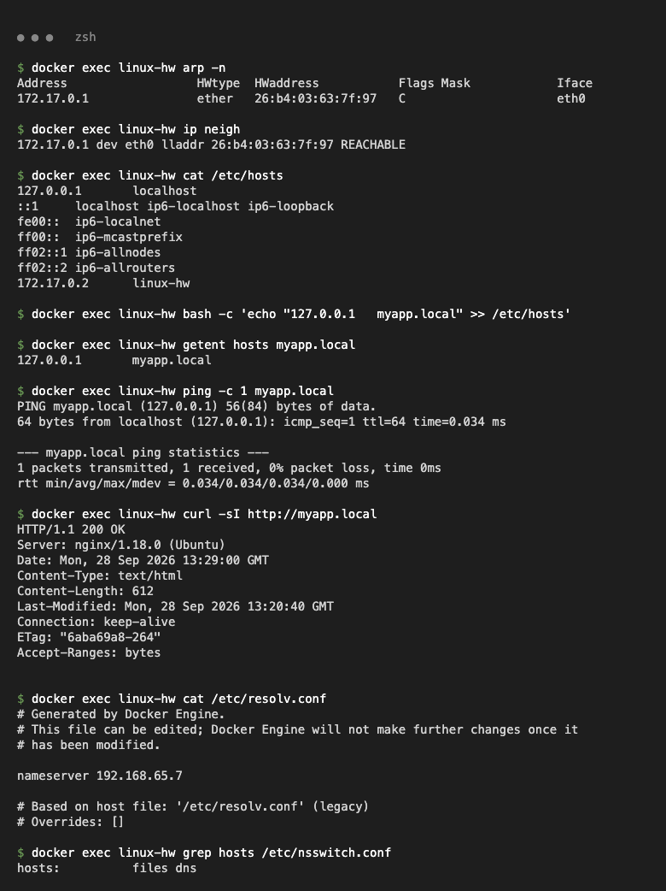
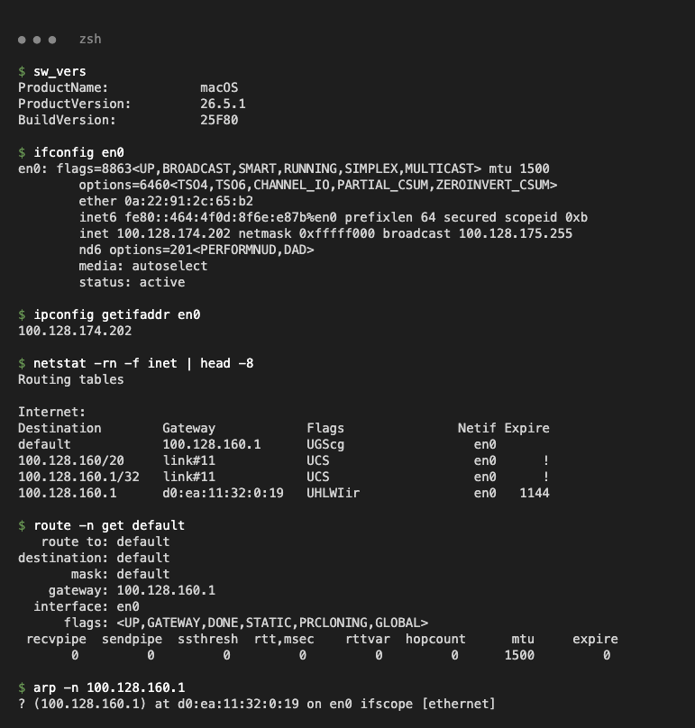
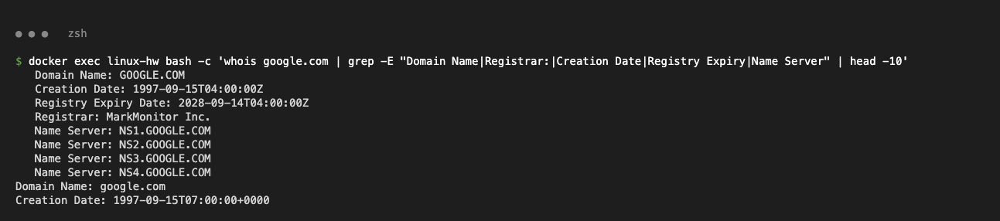

# Networking Assignment

**Task 1:** Practice the networking commands from `session4-networking` (`ip.md`, `resources.md`) and the *Linux Networking Cheat Sheet* (session2-linux).
**Task 2:** Execute the commands, add the output / screenshots and explain what each command does.

Run on **Linux** (Ubuntu 22.04 machine `linux-hw`, IP `172.17.0.2`, nginx on port 80) and the **macOS** host.

| Class | First octet | Default mask | Private range |
|---|---|---|---|
| A | 1 – 126 | 255.0.0.0 (/8) | 10.0.0.0 – 10.255.255.255 |
| B | 128 – 191 | 255.255.0.0 (/16) | 172.16.0.0 – 172.31.255.255 |
| C | 192 – 223 | 255.255.255.0 (/24) | 192.168.0.0 – 192.168.255.255 |

---

## 1. `ip addr`, `ifconfig`, `hostname -I`

```bash
$ ip -br addr
lo               UNKNOWN        127.0.0.1/8 ::1/128
eth0@if44        UP             172.17.0.2/16
$ hostname -I
172.17.0.2
```



- `ip addr` lists interfaces with state, MAC and IP addresses; `ifconfig` is the older equivalent with RX/TX counters.
- `hostname -I` prints only the machine's IP addresses.

## 2. `ip route`, `route`, `ip link`

```bash
$ ip route
default via 172.17.0.1 dev eth0
172.17.0.0/16 dev eth0 proto kernel scope link src 172.17.0.2
$ ip route get 8.8.8.8
8.8.8.8 via 172.17.0.1 dev eth0 src 172.17.0.2 uid 0
```



- `ip route` / `route -n` show the routing table; `default via` is the gateway.
- `ip route get <IP>` shows which route is used for one destination; `ip link` shows MAC, MTU and UP/DOWN state.

## 3. `ping`

```bash
$ ping -c 4 google.com
4 packets transmitted, 4 received, 0% packet loss, time 3009ms
```



- Sends ICMP echo requests to check reachability and latency; `-c` sets the packet count. 100% packet loss means the host is unreachable or blocks ICMP.

## 4. `traceroute`

```bash
$ traceroute -m 12 -q 1 8.8.8.8      # macOS
 1  wifi.height8tech.com (100.128.160.1)  10.035 ms
 ...
 7  dns.google (8.8.8.8)  44.864 ms
```



- Shows every router (hop) on the path to a host; `*` means a hop did not reply. Used to find where a network problem is.

## 5. DNS: `nslookup`, `dig`, `host`

```bash
$ dig +short google.com
142.251.106.101
$ dig +short MX gmail.com
5 gmail-smtp-in.l.google.com.
$ host 8.8.8.8
8.8.8.8.in-addr.arpa domain name pointer dns.google.
```



- `nslookup` does a simple lookup and shows which DNS server answered.
- `dig` gives a detailed answer (status, record type, TTL); `+short` prints only the result, `MX`/`NS` query mail and name servers.
- `host` gives a short answer and also does reverse lookups (IP → name).

## 6. `curl -I` and `wget`

```bash
$ curl -sI http://github.com
HTTP/1.1 301 Moved Permanently
Location: https://github.com/
$ wget https://example.com -O example.html
2026-09-28 13:28:48 (259 MB/s) - 'example.html' saved [577]
```



- `curl -I` sends a HEAD request and shows only response headers and the status code.
- `wget` downloads a file to disk; `-O` sets the output filename.

## 7. `ss`, `netstat`, `nc`

```bash
$ ss -tuln
tcp   LISTEN 0      511          0.0.0.0:80        0.0.0.0:*
$ nc -zv localhost 80
Connection to localhost (::1) 80 port [tcp/http] succeeded!
$ nc -zv -w 2 localhost 8080
nc: connect to localhost (127.0.0.1) port 8080 (tcp) failed: Connection refused
```



- `ss -tulnp` / `netstat -tulnp` list listening ports and the owning process (`ss` is the modern replacement).
- `nc -zv host port` tests whether a TCP port is open.

## 8. ARP, `/etc/hosts`, `/etc/resolv.conf`

```bash
$ ip neigh
172.17.0.1 dev eth0 lladdr 26:b4:03:63:7f:97 REACHABLE
$ echo "127.0.0.1   myapp.local" >> /etc/hosts
$ getent hosts myapp.local
127.0.0.1       myapp.local
$ cat /etc/resolv.conf | grep nameserver
nameserver 192.168.65.7
```



- `arp -n` / `ip neigh` show the IP → MAC cache for the local network.
- `/etc/hosts` is a static name → IP table checked before DNS; `/etc/resolv.conf` lists the DNS servers.

## 9. macOS host: `ifconfig`, routing table, `arp`

```bash
$ ipconfig getifaddr en0
100.128.174.202
$ route -n get default | grep gateway
    gateway: 100.128.160.1
```



- macOS uses BSD tools instead of `ip`: `ifconfig en0` for the Wi-Fi interface, `netstat -rn` / `route get default` for the gateway, `arp` for the router's MAC.

## 10. `whois`

```bash
$ whois google.com | grep -E "Registrar:|Creation Date" | head -2
   Creation Date: 1997-09-15T04:00:00Z
   Registrar: MarkMonitor Inc.
```



- Shows a domain's registrar, creation/expiry dates and name servers.
