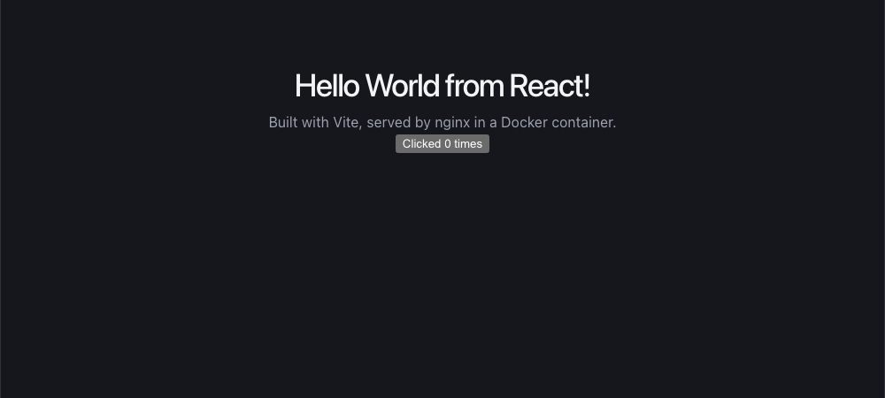

# Docker Homework: Hello World Applications

Six Hello World web apps, each in its own folder with its own Dockerfile. All of them were built and run with Docker and checked in a browser.

| Folder | Stack | Base image(s) | Container port | Host port | Image size |
|---|---|---|---|---|---|
| [`nodejs-app`](nodejs-app) | Node.js + Express | `node:24-alpine` | 3000 | 3000 | 255 MB |
| [`python-app`](python-app) | Python + Flask | `python:3.12-slim` | 5000 | 5001 | 235 MB |
| [`java-app`](java-app) | Java 21 (built-in `HttpServer`) | `eclipse-temurin:21-jdk-alpine` → `21-jre-alpine` | 8080 | 8090 | 286 MB |
| [`Apache-app`](Apache-app) | Apache HTTP Server | `httpd:2.4` | 80 | 8082 | 205 MB |
| [`React-app`](React-app) | React 19 + Vite | `node:24-alpine` → `nginx:alpine` | 80 | 8083 | 93 MB |
| [`nginx-app`](nginx-app) | Nginx | `nginx:alpine` | 80 | 8081 | 93 MB |

Environment: macOS (Apple Silicon), Docker Desktop 4.61.0, Docker Engine 29.2.1.

## How to build and run

Each app follows the same two steps (Docker image names must be lowercase):

```bash
docker build -t <image-name> ./<folder>
docker run -d --name <image-name> -p <host-port>:<container-port> <image-name>
```

Run all six:

```bash
docker build -t nodejs-app ./nodejs-app && docker run -d --name nodejs-app -p 3000:3000 nodejs-app
docker build -t python-app ./python-app && docker run -d --name python-app -p 5001:5000 python-app
docker build -t java-app   ./java-app   && docker run -d --name java-app   -p 8090:8080 java-app
docker build -t apache-app ./Apache-app && docker run -d --name apache-app -p 8082:80   apache-app
docker build -t react-app  ./React-app  && docker run -d --name react-app  -p 8083:80   react-app
docker build -t nginx-app  ./nginx-app  && docker run -d --name nginx-app  -p 8081:80   nginx-app
```

Check that they're running:

```
$ docker ps
NAMES        IMAGE        STATUS          PORTS
react-app    react-app    Up 17 seconds   0.0.0.0:8083->80/tcp
java-app     java-app     Up 1 minute     0.0.0.0:8090->8080/tcp
python-app   python-app   Up 2 minutes    0.0.0.0:5001->5000/tcp
nodejs-app   nodejs-app   Up 2 minutes    0.0.0.0:3000->3000/tcp
apache-app   apache-app   Up 2 minutes    0.0.0.0:8082->80/tcp
nginx-app    nginx-app    Up 3 minutes    0.0.0.0:8081->80/tcp
```

Clean up:

```bash
docker rm -f nodejs-app python-app java-app apache-app react-app nginx-app
```

## Output

### Node.js: http://localhost:3000


### Python: http://localhost:5001


### Java: http://localhost:8090


### Apache: http://localhost:8082


### React: http://localhost:8083


### Nginx: http://localhost:8081


## Notes and things learned

- **Layer caching:** the Node, Python and React Dockerfiles copy the dependency file (`package.json` / `requirements.txt`) and install dependencies *before* copying the source code. When only the code changes, Docker reuses the cached install layer, so rebuilds are fast.
- **`0.0.0.0` vs `127.0.0.1`:** Flask listens on `127.0.0.1` by default, which is only reachable from inside the container. The app binds to `0.0.0.0` so that the `-p` port mapping can reach it.
- **Port 5001 on macOS:** the AirPlay Receiver already uses host port 5000, so the Python app is mapped to `5001:5000`.
- **Multi-stage builds:**
  - **Java:** compiles with the full JDK, then runs on the smaller JRE.
  - **React:** builds with Node, then serves the static `dist/` folder with nginx. Its final image is 93 MB, compared with 255 MB for the Node image, because Node and `node_modules` aren't shipped.
- **`.dockerignore`:** keeps `node_modules`/`dist` out of the build context, which makes builds smaller and faster.
- **No `CMD` in nginx/Apache:** their base images already define the command that starts the server.
- The React project was generated without installing Node locally, by running Node in a throwaway container:
  `docker run --rm -v "$PWD":/app -w /app node:24-alpine npx -y create-vite@latest React-app --template react --no-interactive`
