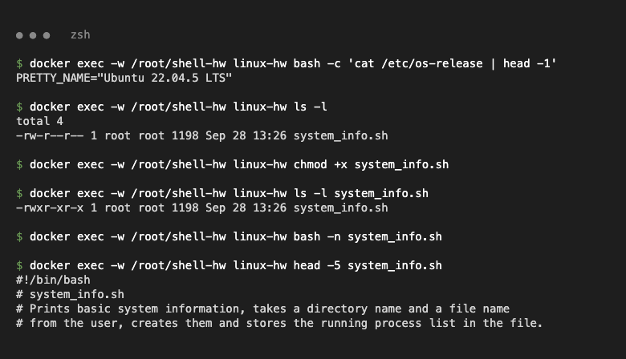
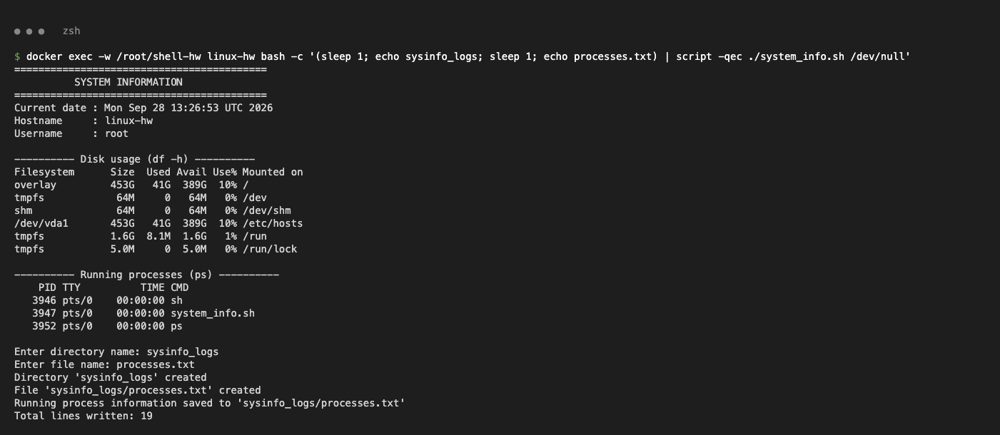
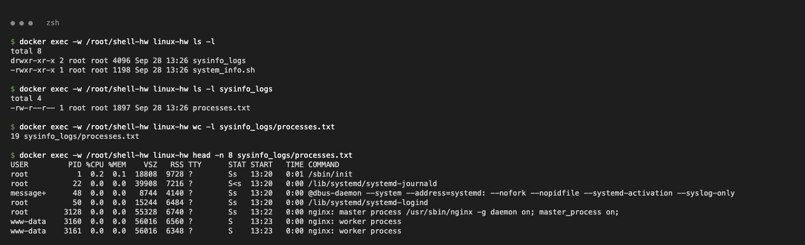

# Shell Scripting Assignment

## Task

Write `system_info.sh` that prints the date, hostname, username, disk usage (`df -h`) and running processes (`ps`), uses variables, reads a directory and file name with `read -p`, creates them with `mkdir`/`touch`, and stores process info in the file with `>`.

Run on **Ubuntu 22.04** (machine `linux-hw`).

## Script: [`system_info.sh`](system_info.sh)

| Requirement | Line(s) in script |
|---|---|
| Date / hostname / username | `current_date=$(date)`, `host_name=$(hostname)`, `user_name=$(whoami)` |
| Disk usage / processes | `df -h`, `ps` |
| Input | `read -p "Enter directory name: " dir_name`, `read -p "Enter file name: " file_name` |
| Create directory / file | `mkdir -p "$dir_name"`, `touch "$dir_name/$file_name"` |
| Store process info | `ps aux > "$dir_name/$file_name"` (`>` overwrites, `>>` appends) |

## 1. Make the script executable

```bash
chmod +x system_info.sh
ls -l system_info.sh
# -rwxr-xr-x 1 root root 1198 Sep 28 13:26 system_info.sh
```



## 2. Run the script

```bash
./system_info.sh
```

```text
Current date : Mon Sep 28 13:26:53 UTC 2026
Hostname     : linux-hw
Username     : root
...
Enter directory name: sysinfo_logs
Enter file name: processes.txt
Directory 'sysinfo_logs' created
File 'sysinfo_logs/processes.txt' created
Running process information saved to 'sysinfo_logs/processes.txt'
Total lines written: 19
```



## 3. Verify the results

```bash
$ ls -l sysinfo_logs
-rw-r--r-- 1 root root 1897 Sep 28 13:26 processes.txt

$ head -n 3 sysinfo_logs/processes.txt
USER         PID %CPU %MEM    VSZ   RSS TTY      STAT START   TIME COMMAND
root           1  0.2  0.1  18808  9728 ?        Ss   13:20   0:01 /sbin/init
root          22  0.0  0.0  39908  7216 ?        S<s  13:20   0:00 /lib/systemd/systemd-journald
```


