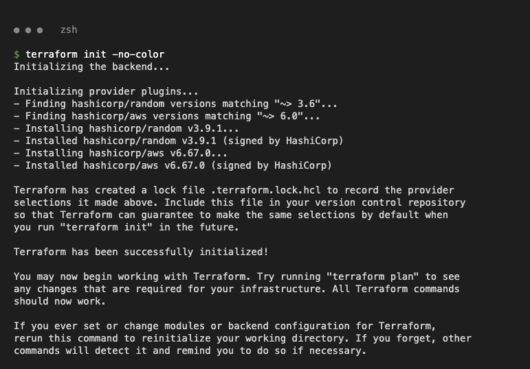
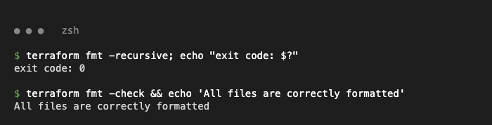
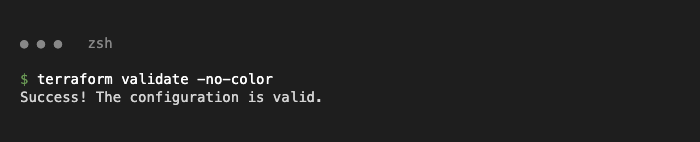
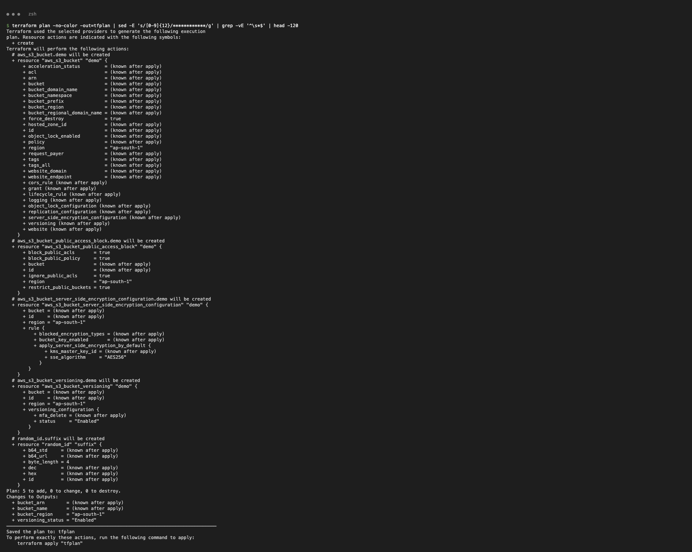
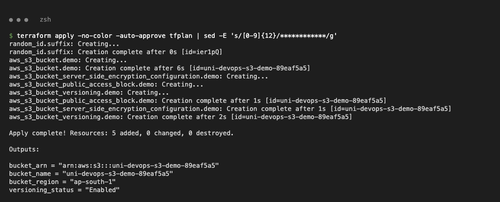
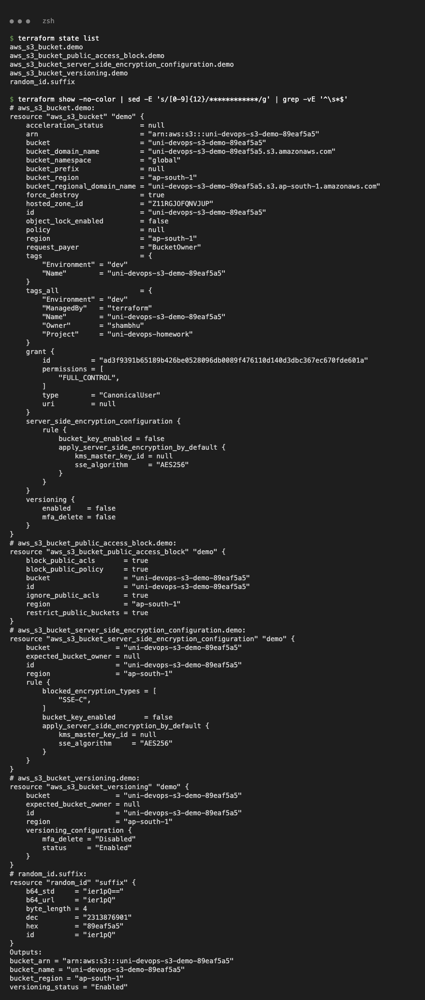
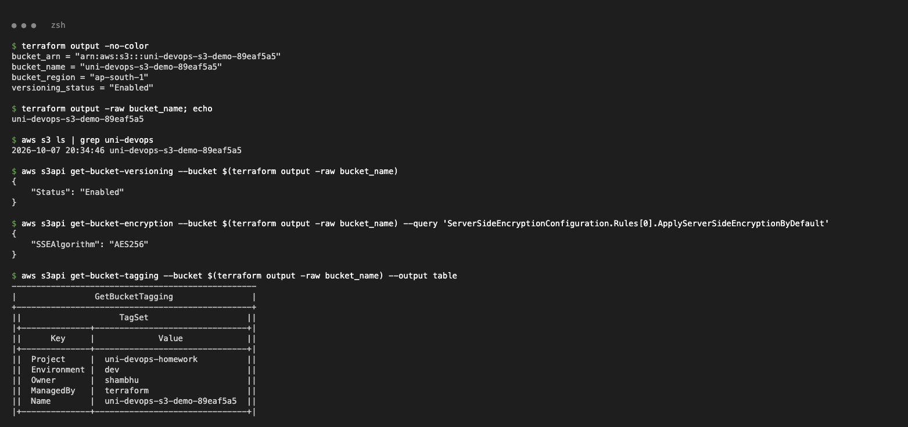
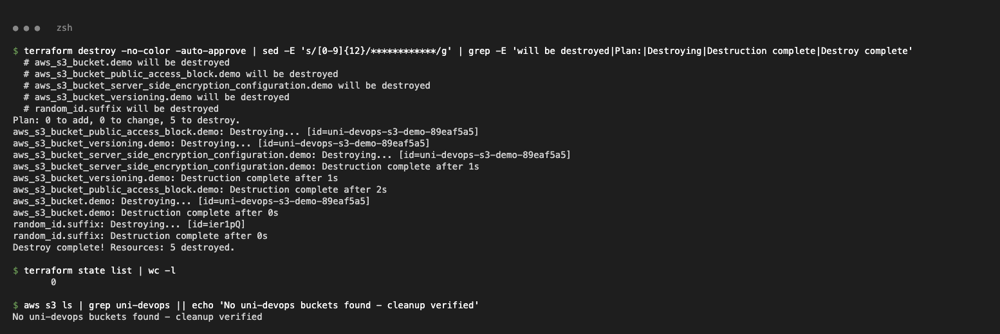

# Task 1 - Terraform S3 Demo

Creates a private, versioned, encrypted S3 bucket with a unique name (`random_id` suffix) in `ap-south-1`.

| File | Purpose |
|------|---------|
| `provider.tf` | Terraform + AWS/random provider versions, AWS provider with `default_tags` |
| `variables.tf` | Input variables (region, bucket prefix, environment, tags) |
| `terraform.tfvars` | Values for the variables |
| `main.tf` | `random_id`, `aws_s3_bucket`, versioning, SSE (AES256), public access block |
| `outputs.tf` | Bucket name, ARN, region, versioning status |

Resources: `random_id.suffix`, `aws_s3_bucket.demo`, `aws_s3_bucket_versioning.demo`, `aws_s3_bucket_server_side_encryption_configuration.demo`, `aws_s3_bucket_public_access_block.demo`.

---

## 1. terraform init

```bash
terraform init
```
```text
- Installed hashicorp/aws v6.67.0 (signed by HashiCorp)
- Installed hashicorp/random v3.9.1 (signed by HashiCorp)
Terraform has been successfully initialized!
```


Downloads the providers and creates `.terraform/` + `.terraform.lock.hcl`.

## 2. terraform fmt

```bash
terraform fmt -recursive
terraform fmt -check
```


Rewrites files into canonical style; `-check` confirms nothing needs changing.

## 3. terraform validate

```bash
terraform validate
```
```text
Success! The configuration is valid.
```


Checks syntax and references without calling AWS.

## 4. terraform plan

```bash
terraform plan -out=tfplan
```
```text
Plan: 5 to add, 0 to change, 0 to destroy.
```


Shows exactly what will be created; saved to `tfplan` so apply runs the same plan.

## 5. terraform apply

```bash
terraform apply tfplan
```
```text
Apply complete! Resources: 5 added, 0 changed, 0 destroyed.
bucket_name = "uni-devops-s3-demo-89eaf5a5"
versioning_status = "Enabled"
```


Creates the bucket and its versioning / encryption / public-access-block settings.

## 6. terraform show

```bash
terraform state list
terraform show
```


Prints every resource attribute stored in the state file.

## 7. terraform output (+ AWS CLI check)

```bash
terraform output
aws s3 ls | grep uni-devops
aws s3api get-bucket-versioning --bucket $(terraform output -raw bucket_name)
aws s3api get-bucket-encryption --bucket $(terraform output -raw bucket_name)
aws s3api get-bucket-tagging    --bucket $(terraform output -raw bucket_name)
```


Outputs match what AWS reports: versioning `Enabled`, `AES256`, required tags present.

## 8. terraform destroy

```bash
terraform destroy
aws s3 ls | grep uni-devops || echo 'No uni-devops buckets found'
```
```text
Plan: 0 to add, 0 to change, 5 to destroy.
Destroy complete! Resources: 5 destroyed.
No uni-devops buckets found - cleanup verified
```


Deletes everything and AWS CLI confirms the bucket is gone.
